# 轮腿机器人控制理论手册

从仿真理解到实机部署的系统性路径  
以五连杆串联腿 + 10维状态空间 LQR + VMC 方案为主

**作者：午安大电牛（.Serene.）**

**编写说明：**

本文档综合整理了各类开源项目、社区资料与工程实践经验，并在此基础上加入了本人对轮腿机器人研发的一些理解与见解。感谢各位开源作者与社区前辈的无私分享，也希望本文档能为各支队伍在轮腿机器人研发、技术积累和工程落地过程中提供一些参考。

本文档主要面向学习交流与工程参考，具体机构参数、控制器增益和实机调试流程仍需结合各队伍自身平台重新建模、验证和调整。本人能力有限，文中难免存在疏漏或错误，欢迎各位批评指正、交流补充。

**安全声明：**

本文档不对任何机器人平台的稳定性、安全性、实机表现或比赛结果作出保证。因参考或使用本文档内容而产生的设备损坏、调试事故、人员伤害或其他后果，均由使用者自行承担责任，与本文档及作者无关。

---

## 目录

1. [前置知识体系](#1)
 - [数学基础](#1-math)
 - [控制理论基础](#1-ctrl)
 - [机器人学基础](#1-robotics)
 - [推荐学习资源](#1-ref)
2. [机械结构与运动学](#2)
 - [2.1 本文档的目标构型：五连杆串联腿](#2.1)
 - [2.1.1 常见轮腿机构构型总览](#2.1.1)
 - [2.1.2 串联腿 vs 并联腿的技术分水岭](#2.1.2)
 - [2.2 串联腿机械结构与坐标定义](#2.2)
 - [2.3 运动学正解（关节空间 → 任务空间）](#2.3)
 - [2.4 运动学逆解（任务空间 → 关节空间）](#2.4)
 - [2.5 雅可比矩阵（关节空间 ↔ 任务空间）](#2.5)
 - [2.6 内部五连杆传动运动学（电机空间 ↔ 关节空间）](#2.6)
3. [动力学建模与线性化](#3)
 - [3.1 10 维整体模型](#3.1)
 - [3.1.1 6 维方案——双腿分开独立建模](#3.1.1)
 - [3.2 非线性动力学方程的建立](#3.2)
 - [3.3 平衡点线性化](#3.3)
 - [3.4 系统可控性与可观测性](#3.4)
 - [3.5 线性化工具链：两种工程实现路径](#3.5)
4. [LQR 最优控制器设计](#4)
 - [4.1 从连续时间到离散时间的完整路径](#4.1)
 - [4.2 ZOH 离散化与离散 LQR](#4.2)
 - [4.3 权重矩阵 Q/R 的设计方法](#4.3)
 - [4.4 DARE 的数值求解验证](#4.4)
5. [增益调度](#5)
 - [5.1 变腿长系统的增益变化规律](#5.1)
 - [5.2 分段线性化策略](#5.2)
 - [5.3 多项式拟合方法](#5.3)
 - [5.4 平衡偏移量补偿](#5.4)
 - [5.5 类MPC前馈补偿——轮端扰动抑制](#5.5)
 - [5.6 二维增益调度——左右腿独立伸缩](#5.6)
6. [VMC 虚拟模型控制](#6)
 - [6.1 虚功原理与雅可比转置](#6.1)
 - [6.2 串联腿 VMC 力矩映射](#6.2)
7. [状态估计](#7)
 - [7.1 IMU 姿态解算——常见算法对比](#7.1)
 - [7.2 轮式里程计——打滑与累积误差](#7.2)
 - [7.3 Kalman 滤波器设计——2 维 vs 全状态](#7.3)
 - [7.4 加速度坐标变换——四元数旋转矩阵](#7.4)
8. [PID 级联控制与力控框架](#8)
 - [8.1 腿长位置-速度级联](#8.1)
 - [8.2 Roll 角稳定控制](#8.2)
 - [8.3 重力前馈补偿与力控综合](#8.3)
 - [8.4 LQR 俯仰方向的附加补偿](#8.4)
9. [地面接触检测与悬空控制](#9)
 - [原理](#9-principle)
 - [离地检测](#9-airborne)
 - [卡腿检测与处理](#9-stuck)
 - [打滑检测与动态卡尔曼滤波](#9-slip)
 - [质心偏移补偿](#9-com)
 - [倒地自救援](#9-self-rescue)
 - [基于腿长的高度分级速度限制](#9-speed-limit)
 - [偏航方向管理](#9-yaw)
10. [跳跃控制——一种基于力控状态机的实现方法](#10)
 - [10.1 状态定义与转移逻辑](#10.1)
 - [10.2 力控综合方程](#10.2)
 - [10.3 空中 LQR 降维](#10.3)
 - [10.4 关键参数与整定原则](#10.4)
11. [仿真平台与对比分析](#11)
 - [11.1 MuJoCo](#11.1)
 - [11.2 Webots](#11.2)
 - [11.3 其他仿真平台](#11.3)
12. [离线计算工具链](#12)
 - [核心任务列表](#12-tasks)
 - [离线计算实现要点](#12-offline-notes)
 - [基于 Python/SymPy 的离线计算路径](#12-python)
 - [MuJoCo 辅助几何参数提取](#12-mujoco-geometry)
 - [二维增益表的 C 语言导出](#12-c-2d)
 - [实机中的 C 数据格式](#12-c-format)
13. [C 语言嵌入式移植](#13)
 - [13.1 模块划分原则](#13.1)
 - [13.2 移植注意事项](#13.2)
 - [13.3 推荐软件架构](#13.3)
14. [实机调试方法](#14)
 - [14.1 分阶段调试流程](#14.1)
 - [14.2 调试工具链](#14.2)
 - [14.3 失败防护](#14.3)
15. [RoboMaster 社区资源索引](#15)
 - [15.1 2026 赛季](#15.1)
 - [15.2 2025 赛季](#15.2)
 - [15.3 2024 赛季](#15.3)
 - [15.4 2023 赛季及更早 / 跨赛季汇总](#15.4)
 - [15.5 仿真项目](#15.5)
 - [15.6 社区教程与文档](#15.6)
16. [学术论文与参考文献](#16)
 - [轮腿机器人控制](#15-wl)
 - [控制理论与算法](#15-ctrl)
 - [机器人学](#15-robotics)

---

## <a id="1"></a>1. 前置知识体系

### <a id="1-math"></a>数学基础

| 领域 | 具体内容 | 在轮腿控制中的应用 |
|------|----------|-----------------|
| 线性代数 | 矩阵运算、特征值分解、正定性 | 状态空间模型、LQR Riccati 方程、Kalman 协方差更新 |
| 微积分 | 偏导数、雅可比矩阵、线性化 | 非线性系统线性化、运动学微分、VMC 推导 |
| 概率论 | 高斯分布、协方差矩阵 | Kalman 滤波、传感器噪声建模 |
| 优化理论 | 二次型优化、Riccati 方程 | LQR 最优控制求解 |

> 概念解释：线性代数在控制中的角色 (Linear Algebra for Control)
>
> 线性代数是描述多变量系统"状态"与"控制"之间关系的基本数学语言。
>
> 核心概念及其控制含义：
>
> - 向量：n 维有序数组，在状态空间模型中表示系统的全状态。轮腿机器人的状态向量 `x ∈ ℝ¹⁰ = [x, ψ, θ, θ_L, θ_R, ẋ, ψ̇, θ̇, θ̇_L, θ̇_R]^T` 包含了描述系统瞬时行为的全部独立变量。
> - 矩阵：线性映射 `ℝⁿ → ℝᵐ` 的代数表示。A 矩阵（10×10 系统矩阵）编码了状态的自然演化动力学——若 A 有正实部特征值，则零输入响应呈指数发散，系统为开环不稳定；B 矩阵（10×4 输入矩阵）编码了控制输入到状态变化率的映射关系，其列空间决定了哪些状态通道可被驱动。
> - 特征值 (Eigenvalue)：满足 `det(A - λI) = 0` 的标量 λ。在连续时间系统中，Re(λ) < 0 意味着对应模态是稳定的（随时间衰减），Re(λ) > 0 意味着不稳定（指数增长）。轮腿机器人的 A 矩阵存在正实部特征值——倒立摆的"鞍点"不稳定性——这正是需要反馈控制的原因。对于离散时间系统，稳定条件为 |λ| < 1。
> - 正定性 (Positive Definiteness)：对称矩阵 M 满足对所有非零向量 x 有 `x^T M x > 0`。在 LQR 中，R 通常要求正定，Q 通常取半正定；在 (A,B) 可稳定、(A,Q^{1/2}) 可检测等标准条件下，Riccati 方程存在唯一稳定化解 P。若 Q 正定，P 通常也是正定的。
>
> 数学表达：
> - 状态方程 `ẋ = A x + B u` 是连续时间线性时不变系统（LTI）的标准形式。A ∈ ℝ¹⁰ˣ¹⁰ 由动力学线性化得到，B ∈ ℝ¹⁰ˣ⁴ 由输入分布得到。
> - 二次型代价 `J = ∫₀^∞ (x^T Q x + u^T R u) dt`：Q ≥ 0（半正定）对各状态通道的偏离施加惩罚，R > 0（正定）对各控制通道的幅值施加惩罚。二次型给出凸的瞬时代价；在系统满足可稳定/可检测条件时，Riccati 方程给出唯一稳定化反馈解。
>
> 在轮腿控制中的应用： 整个 LQR 设计流程以线性代数为框架：A 和 B 矩阵由非线性动力学在平衡点处求雅可比得到，P 矩阵为连续/离散代数 Riccati 方程的解，最优反馈增益 `K = R⁻¹ B^T P` 将 10 维状态通过矩阵乘法映射为 4 维控制指令 `u = -K x`。

> 概念解释：微积分在机器人学中的角色 (Calculus for Robotics)
>
> 微积分提供了分析连续变化系统的基本工具——微分描述瞬时变化率，积分从变化率恢复累积量，偏导数分析多变量函数的局部依赖关系。
>
> 核心概念及其控制含义：
>
> - 导数与积分：位移 x(t) 的一阶导数是速度 ẋ(t)，二阶导数是加速度 ẍ(t)。在刚体动力学中，控制输入是力矩 τ，它通过转动惯量 I 产生角加速度 α = τ/I，角加速度积分得角速度，再积分得角度。这一双重积分关系意味着角度对力矩指令的响应有本质的相位滞后（-180°），是控制系统设计中必须处理的动力学约束。
> - 偏导数与雅可比矩阵：对于多变量函数 `f: ℝⁿ → ℝᵐ`，偏导数 `∂f_i/∂x_j` 量化了第 j 个输入变量对第 i 个输出的独立影响率。将所有 ∂f_i/∂x_j 排列成 m×n 矩阵即得雅可比矩阵 J。在轮腿运动学中，`J = ∂(L, θ_leg)/∂(θ_hip, θ_knee)` ——轮心速度对关节角速度的局部线性映射由 J 的四个偏导数元素完全确定。
> - 一阶泰勒展开与线性化：对于非线性系统 ẋ = f(x, u)，在平衡点 (x_eq, u_eq) 满足 f(x_eq, u_eq) = 0 处做一阶泰勒截断：`f(x_eq + Δx, u_eq + Δu) ≈ ∂f/∂x|_{eq} · Δx + ∂f/∂u|_{eq} · Δu`。其中 ∂f/∂x|_{eq} 即为 A 矩阵，∂f/∂u|_{eq} 即为 B 矩阵。线性化误差为 O(||Δx||²)，在平衡点的小邻域内有效。
>
> 在轮腿控制中的应用： 雅可比矩阵的每个元素都是偏导数，建立了关节空间与任务空间之间的瞬时线性映射；A/B 矩阵的推导依赖在平衡点处对非线性动力学向量场求偏导数（即求系统的雅可比矩阵）。

> 概念解释：概率论在状态估计中的角色 (Probability for State Estimation)
>
> 概率论为处理传感器噪声、模型不确定性和随机扰动提供了严格的数学框架。Kalman 滤波器——轮腿机器人的核心状态估计器——完全建立在概率论基础之上。
>
> 核心概念及其估计含义：
>
> - 高斯分布（正态分布）：连续随机变量的概率密度函数 `p(x) = (2πσ²)⁻¹/² · exp(-(x-µ)²/(2σ²))` 完全由均值 µ 和方差 σ² 参数化。根据中心极限定理，多个独立噪声源的叠加趋向于高斯分布，因此传感器噪声通常建模为零均值高斯白噪声——这是 Kalman 滤波中过程噪声 wₖ ~ 𝒩(0, Q) 和观测噪声 vₖ ~ 𝒩(0, R) 假设的物理基础。
> - 协方差矩阵：对于多维随机向量，协方差矩阵 Σ 的对角元素为各分量的方差 Var(x_i)，非对角元素 Σ_ij = Cov(x_i, x_j) 描述了两个分量之间的统计关联。在 Kalman 滤波中，状态协方差 P 的迹（trace）量化了状态估计的不确定性总能量。P 在预测步增大（模型不确定性累积），在更新步减小（测量信息注入）。
> - 贝叶斯融合：Kalman 滤波本质上是递归贝叶斯估计在线性高斯系统中的解析特解。两个独立高斯估计的融合结果仍为高斯分布，其均值为两者的精度加权平均，方差满足 `1/σ²_fused = 1/σ²₁ + 1/σ²₂`（精度相加）。因此噪声大的传感器（方差大，精度低）在融合中自然获得低权重。
>
> 在轮腿控制中的应用： Kalman 滤波器融合 IMU 加速度积分（短时精度高但有漂移）和轮式里程计（长时无漂移但易受打滑影响）产生位移和速度的最优估计，作为 LQR 状态反馈的 x 和 ẋ 输入。

### <a id="1-ctrl"></a>控制理论基础

| 领域 | 具体内容 | 在轮腿控制中的应用 |
|------|----------|-----------------|
| 经典控制 | PID 控制器、频域分析 | 腿长控制、Roll 稳定 |
| 现代控制 | 状态空间表示、极点配置、LQR | 主要平衡控制器 |
| 最优控制 | 代价函数设计、动态规划 | LQR 权重矩阵 Q/R 设计 |
| 数字控制 | ZOH 离散化、离散 Riccati 方程 | 连续控制律到离散实现的转换 |

> 概念解释：经典控制 vs 现代控制 (Classical vs Modern Control)
>
> 经典控制理论基于传递函数（输入-输出描述，频域），以 SISO 系统为主；现代控制理论基于状态空间模型（内部描述，时域），可以直接处理 MIMO 系统。
>
> 为什么要学这个？ 轮腿机器人同时使用两种范式：PID（经典，SISO）负责解耦后的腿长和 Roll 通道，LQR（现代，MIMO）负责平衡控制中 10 个状态到 4 个控制量的交叉耦合协调。
>
> 技术对比：
>
> - 经典控制（传递函数法）：系统由输入到输出的传递函数 G(s) 描述，控制器设计在拉普拉斯域（频域）进行，主要工具为根轨迹、Bode 图、Nyquist 判据。PID 控制器 `C(s) = K_p + K_i/s + K_d s` 仅利用误差信号 e(t) = r(t) - y(t) 驱动控制量。其局限在于：每一路控制仅能处理一个输出通道，无法表达状态之间的动力学耦合（如机体俯仰角 θ 与腿摆角 θ_L 之间的交互影响）。
> - 现代控制（状态空间法）：系统由一阶向量微分方程 `ẋ = Ax + Bu, y = Cx` 完整描述。控制器设计直接在时域进行，反馈律 `u = -Kx` 利用了全部状态信息，而非仅输出误差。LQR 通过求解 Riccati 方程得到的最优 K 矩阵自动处理了状态之间的交叉耦合——例如 K 矩阵中 θ 对左腿力矩的交叉项（`K[0][2]`）编码了"机体前倾时应通过左腿施加多大虚拟力矩来恢复"的物理关系。
> - 数字控制 (Digital Control)：物理系统是连续时间的（微分方程），嵌入式处理器是离散时间的（差分方程，采样周期 T_s）。数字控制处理的核心问题是将连续控制器等效转换为离散形式：对系统做 ZOH 离散化（A_d = e^{A T_s}, B_d = ∫₀^{T_s} e^{Aτ} B dτ），然后在离散域重新求解控制律（如 `dlqr(A_d, B_d, Q, R)`）。采样定理要求 T_s 远小于系统的主导时间常数，具体采样周期应根据机构尺度、执行器带宽和闭环带宽确定。

> 概念解释：最优控制 (Optimal Control)
>
> 最优控制 = 在给定期望性能指标（代价函数）下，寻找使该指标达到极小的控制律。LQR 是线性二次型最优控制的特例——系统是线性的（ẋ = Ax + Bu），代价是二次型的（J = ∫ x^T Q x + u^T R u dt），最优解具有解析的线性状态反馈形式 u = -Kx。
>
> 代价函数 J 的数学结构：
>
> `J = ∫₀^∞ (x^T Q x + u^T R u) dt` 是无穷时域积分型性能指标。Q 矩阵（半正定）对各状态偏离施加惩罚，R 矩阵（正定）对各控制通道幅值施加惩罚。在系统满足可稳定/可检测条件时，二次型结构和 Riccati 方程共同给出唯一稳定化反馈解。
>
> 这是典型的 trade-off 优化问题：增大 Q 元素 → 惩罚状态偏离 → 控制器更"激进"（K 更大，瞬态响应更快但需要更大控制力矩）；增大 R 元素 → 惩罚控制能量 → 控制器更"保守"（K 更小，响应更平缓但恢复更慢）。Q/R 的相对比值决定性能，绝对缩放不影响 K（因为 K = R⁻¹B^T P 中 R⁻¹ 与 Q 对 P 的影响存在齐次关系）。
>
> LQR 的数学优势在于：在标准可稳定/可检测条件满足时，给定 (A, B, Q, R) 后稳定化 K 由 Riccati 方程确定——不需要在线迭代优化，也不依赖初始猜测。这比手动试凑 PID 参数更系统：设计者通过物理量纲的归一化（如 Brysons 法则）设定 Q 和 R，K 的 40 个元素由 Riccati 方程计算得到。

### <a id="1-robotics"></a>机器人学基础

| 领域 | 具体内容 | 在轮腿控制中的应用 |
|------|----------|-----------------|
| 运动学 | 正/逆运动学、工作空间分析 | 五连杆正解、轮心位置实时计算 |
| 静力学 | 虚功原理、雅可比转置力映射 | VMC 力矩分配 |
| 动力学 | 牛顿-欧拉法、拉格朗日法 | 系统建模与线性化 |
| 状态估计 | Kalman 滤波、互补滤波 | 速度与位移融合 |

> 概念解释：运动学 vs 静力学 vs 动力学 (Kinematics vs Statics vs Dynamics)
>
> 三个领域构成机器人学的递进层次：运动学研究几何关系（位置、速度、加速度之间的映射，不涉及力），静力学研究力在机构中的静态传递（不涉及加速度），动力学研究力与运动之间的因果关系（F = ma / τ = Iα）。
>
> 技术定义与数理基础：
>
> - 运动学 (Kinematics)：研究物体运动的几何性质，回答"若关节角度为 q，末端在何处？"以及"若关节角速度为 q̇，末端速度为多少？"。核心工具是正运动学映射 `x = FK(q)`、逆运动学映射 `q = IK(x)` 和雅可比矩阵 `J(q) = ∂x/∂q`。运动学方程不含质量、力、力矩等物理参数——它是纯几何的。
> - 静力学 (Statics)：研究机构在静止状态下（无加速度，ΣF = 0, Στ = 0）力的传递关系。核心工具是虚功原理：`τ^T · δq = F^T · δx`，在理想约束假设下导出 `τ = J^T F`。这意味着相同的力传递比与速度传递比互为转置——J 将关节速度映射为末端速度，J^T 将末端力映射为关节力矩，这是一对偶关系。
> - 动力学 (Dynamics)：研究力/力矩与运动加速度之间的因果关系。标准刚体动力学方程 `D(q)q̈ + C(q,q̇)q̇ + G(q) = τ` 中，D(q) 为惯量矩阵（正定对称），C(q,q̇)q̇ 为科里奥利力和离心力项（速度的二次函数），G(q) 为保守力（重力）的广义力。
>
> 在轮腿控制中的对应关系：
> - 运动学 → 第 2 章：FK 将关节角度转换为 (L, θ_leg)，IK 将期望轮心位置转换为关节角度指令
> - 静力学 → 第 6 章：VMC 通过 `τ = J^T F` 将任务空间虚拟力映射为关节力矩，基于虚功原理
> - 动力学 → 第 3 章：拉格朗日法或牛顿-欧拉法建立运动方程，导出 A/B 矩阵用于 LQR 设计

### <a id="1-ref"></a>推荐学习资源

- 《线性代数及其应用》David C. Lay —— 前5章，重点掌握特征值分解与二次型
- 《Feedback Control of Dynamic Systems》Gene F. Franklin —— 状态空间与 LQR 章节
- 《Introduction to Robotics: Mechanics and Control》John J. Craig —— 第3-5章（运动学与雅可比）
- 《Probabilistic Robotics》Sebastian Thrun —— 第3章（Kalman 滤波）
- 《Optimal Control Theory》Donald E. Kirk —— 第5章（LQR）
- 《Modern Control Engineering》Katsuhiko Ogata —— 第10章（最优控制导论）

---

## <a id="2"></a>2. 机械结构与运动学

> 概念解释：什么是运动学？(What is Kinematics?)
>
> 运动学研究机构的位置、速度、加速度之间的几何映射关系，不涉及产生运动的力或力矩。它是机器人学中最基础的感知层——将传感器可测的物理量（关节角度）转换为控制器可用的物理量（末端位置）。
>
> 数理定义： 对于串联腿 2-DOF 机构，正运动学映射 `FK: ℝ² → ℝ²` 将关节空间 `q = [θ_hip, θ_knee]^T` 映射到任务空间 `x = [L, θ_leg]^T`。雅可比矩阵 `J(q) = ∂x/∂q ∈ ℝ²ˣ²` 是其微分映射，将关节速度线性映射为末端速度：`ẋ = J(q) · q̇`。
>
> 在轮腿控制中的角色： 电机编码器读数 → 内部五连杆传动正解 → 关节角度 (θ_hip, θ_knee) → 串联 FK → 任务空间 (L, θ_leg)。(L, θ_leg) 及其微分是 LQR 状态向量的直接组成部分（x₃ = θ_L, x₄ = θ_R 及其导数）。运动学是整个控制信息流的感知起点——FK 精度直接决定状态反馈的精度。

### <a id="2.1"></a>2.1 本文档的目标构型：五连杆串联腿

本文档的运动学解算、状态空间建模和控制器设计均以串联腿构型为参照。 其核心特征为：

- 髋关节 + 膝关节独立控制的串联运动链：髋关节由电机经链条传动驱动，可根据机构设计获得较大的运动范围
- 五连杆闭合传动链内置：五连杆机构不作为腿部主结构，而是在关节处构成内部力矩传递链，将电机力矩高效传递至关节
- 10 维状态空间：左右腿整体统一建模，含偏航维度，完整表达 x, ψ, θ, θ_L, θ_R 及其导数
- VMC + LQR 力控框架：在任务空间（虚拟腿长 L + 摆角 θ_leg）实施控制，通过雅可比转置映射至关节力矩

---

### <a id="2.1.1"></a>2.1.1 常见轮腿机构构型总览

以下为 RoboMaster 社区及学术界的主流构型对比，用于理解串联腿在整个技术谱系中的位置：

| 构型 | 代表战队/项目 | 腿部结构特点 | 关键特性 |
|------|-------------|-------------|----------|
| 多连杆/链条串联腿 | 上交云汉交龙、中石大(北京)SPR | 髋关节+膝关节独立控制，五连杆内部构成闭合传动链 | 可倒地自起，单边腿稳定跨越台阶，10维状态空间 |
| 五连杆并联腿 | 哈工程创梦之翼、北科 Reborn、东莞理工 ACE、武汉工程大学、广西大学 ROBOTZ、山海机甲 | 两个电机安装在机身上，通过五连杆闭环链驱动轮端 | 近端驱动，腿部惯量低，刚度高，适合跳跃/空翻；但翻倒自救困难，可采用6维状态空间 |
| 偏置并联腿 | 南航金城学院 Born Of Fire | 在标准五连杆基础上引入偏置（offset）设计，具备完整电控实现 | 并联腿的刚度优势 + 偏置可能改善质心分布 |
| 双连杆串联腿 | 港科大 ENTERPRIZE | 双自由度串联结构，弹跳能力突出 | 结构紧凑；腿部惯量较大 |
| 开链四连杆 | 同济大学 SuperPower | 髋关节+膝关节开链结构 | 运动范围大；受构型制约需要更强控制算法 |
| 并联驱动二连杆 | 上科中登 | 侧面轴系并联驱动的简化二连杆 | 结构紧凑；工作空间和灵活性受限 |
| 二连杆简化 | 早期方案 | 单电机驱动单根连杆 | 最简单，入门首选 |
| 四轮独立腿/轮圈腿 | 北理工（兵工学报）、东大 TDT | 四条独立轮腿或轮圈复合结构 | 冗余度高，越障效率高 |

**关键参考文献：**
- 上交云汉交龙干货分享：[萝马严选](https://rcbbs.top/t/topic/3747) —— 串联腿技术详解
- 上交平衡步兵模型讲解：[B站](https://www.bilibili.com/) —— 上交串联腿理论讲解
- 串联轮腿运动与稳定解耦设计：[CSDN](https://blog.csdn.net/weixin_36299472/article/details/159027929) —— 上交方案详解
- 双连杆串联轮腿结构资料：[轮腿平衡步兵结构资料](https://bbs.robomaster.com/article/54241) —— 含完整 SolidWorks 图纸和 CNC 生产文件
- 同济四连杆报告：[RM2025 开链四连杆轮腿步兵技术报告](https://bbs.robomaster.com/article/769697)
- 五连杆并联轮腿机械资料：[轮腿平衡步兵机械资料](https://bbs.robomaster.com/article/54974)
- 平衡步兵机械资料：[平衡步兵机械资料](https://bbs.robomaster.com/article/9353)
- 轮腿平衡步兵机械资料：[轮腿平衡步兵机械资料](https://bbs.robomaster.com/article/9657)
- 上科中登侧面轴系设计：[RM2024 并联驱动二连杆](https://bbs.robomaster.com/article/28657)
- 串联轮腿电控资料：[轮腿电控资料](https://bbs.robomaster.com/article/1884251)
- 偏置并联腿整车电控资料：[偏置并联腿整车电控资料](https://bbs.robomaster.com/article/1883510) —— 偏置并联腿构型，整车完整电控
- 质心偏移建模资料：[考虑质心偏移的轮腿型机器人建模资料](https://bbs.robomaster.com/article/1448924) —— 将质心偏移纳入动力学建模的完整方法论
- 平衡步兵完整资料：[平衡步兵完整资料](https://bbs.robomaster.com/article/810688) + [各兵种电控](https://bbs.robomaster.com/article/810719)
- 串联轮腿完整设计资料：[串联轮腿完整设计](https://oshwhub.com/ysl050811/infantry-robot) —— 双控制器架构资料

**社区项目构型分类图谱：**

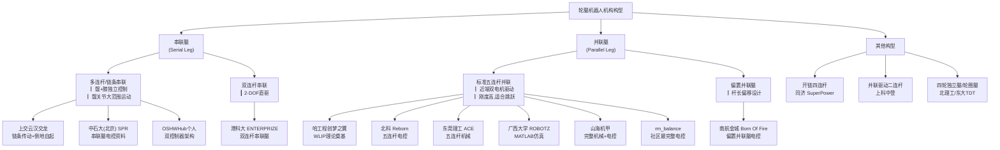

> 上图说明： 其中上交交龙、哈工程 WLIP、rm_balance 为社区影响力较大的核心项目。串联腿以"倒地自起"能力为技术分水岭；并联腿以"高刚度跳跃"为核心优势。两种构型可以共享 VMC+LQR 的上层接口思想，但底层运动学、动力学参数和最终 K 矩阵都需要按具体平台重新推导。

### <a id="2.1.2"></a>2.1.2 串联腿 vs 并联腿的技术分水岭

以上交云汉交龙为代表的串联腿构型在 2024-2025 赛季成为技术分水岭。其核心突破在于：

1. 髋关节大范围运动：电机经链条或同步带等传动形式驱动髋关节，使腿部具备更大的姿态调整空间
2. 倒地自起能力：这是串联腿相较并联腿的重要工程优势。并联腿翻倒后，单边腿支撑时小腿会向后折，难以独立恢复；串联腿凭借髋关节全向旋转，可从多种姿态下恢复站立
3. 单边腿跨越台阶：串联腿的独立膝关节控制使单腿可以直接踏上台阶，而非依赖跳跃
4. 下供弹云台：降低转动惯量，提升射击响应速度

并联腿（五连杆）的主要优势在于刚度——并联闭环结构在结构上具有更高的机械刚度，在跳跃落地、空翻等高冲击动作中承受能力更强。对于需要翻倒恢复、单腿支撑和复杂姿态调整的赛场工况，串联腿通常具备更高的工程适用性。

从控制视角看，两者的核心区别在于运动学解算路径：

| 对比维度 | 并联腿（五连杆直接定位） | 串联腿 |
|----------|--------------------------|--------------------------------|
| 电机→关节映射 | 两电机直驱五连杆，无独立关节概念 | 电机→内部五连杆传动→髋/膝关节角度 |
| 运动学正解 | 五连杆交点求解（几何法） | 串联链FK + 内部传动正解 |
| 运动学逆解 | 三角形分解法 | 串联链IK + 内部传动逆解 |
| 关节空间维度 | 2 电机角度（前后驱动杆） | 2 关节角度（髋 + 膝）→ 4 电机角度（传动冗余） |
| 任务空间 | L, θ_leg（虚拟腿模型） | L, θ_leg（虚拟腿模型，概念一致） |
| 雅可比 | ∂(L, θ_leg)/∂(θ_front, θ_back) | ∂(L, θ_leg)/∂(θ_hip, θ_knee) · ∂(θ_hip, θ_knee)/∂(motor_angles) |
| 状态空间 | 可选 6 维或 10 维（与构型无关） | 可选 6 维或 10 维（与构型无关） |

两种构型在上层 VMC+LQR 力控框架上概念一致——都归结为虚拟腿长 L 和摆角 θ_leg 的控制问题。10 维整体建模与 6 维双腿分开建模是控制架构的选择，不由机械构型单独决定：并联腿（五连杆）也可以采用 10 维 LQR。但运动学雅可比、动力学参数和最终 K 矩阵必须按具体构型重新推导。两种构型真正的区别在于底层的运动学解算路径：并联腿直接通过五连杆交点求解，串联腿需要先经过内部传动链得到关节角度，再做串联链运动学。

### <a id="2.2"></a>2.2 串联腿机械结构与坐标定义

#### 2.2.1 串联运动链结构

串联腿的运动链为典型的串联开链结构（sagittal 平面，x-z 坐标系）：

```
机身 (Body) ──[髋关节 θ_hip]──→ 大腿 (Thigh, l_thigh)
 │
 └──[膝关节 θ_knee]──→ 小腿 (Shin, l_shin)
 │
 └──→ 轮子 (Wheel, 半径 R)
```

**关键机械参数（符号定义）：**

| 参数 | 符号 | 说明 |
|------|------|------|
| 大腿长度 | l_thigh | 髋关节轴到膝关节轴的距离，由机械设计确定 |
| 小腿长度 | l_shin | 膝关节轴到轮心的距离，由机械设计确定 |
| 轮子半径 | R | 由选用的轮毂电机/轮胎决定 |
| 髋关节运动范围 | θ_hip | 取决于传动机构设计与机械限位 |
| 膝关节运动范围 | θ_knee | 反关节构型下由五连杆传动限位决定 |

注意： 串联腿采用反关节构型——膝关节向后弯曲（类似鸟腿），而非仿人腿的前弯。这是 RoboMaster 平衡步兵的主流选择，原因在于反关节构型在压缩腿长时质心更低，且跳跃蓄力行程更长。

#### 2.2.2 内部五连杆传动链

与传统串联腿不同，本方案的串联腿在关节处使用了内置五连杆闭合传动链来传递电机力矩。这不是一个独立的"并联机构"，而是嵌入在串联运动链中的力矩传输机构。

**传动路径：**

```
电机 m1 (机身安装) ──[驱动杆1]──→ 五连杆闭合链 ──→ 髋关节 θ_hip
电机 m2 (机身安装) ──[驱动杆2]──→ 五连杆闭合链 ──→ 膝关节 θ_knee
```

**五连杆传动的作用：**
1. 力矩放大：通过连杆机构的力臂比，将电机力矩放大后作用于关节
2. 近端驱动：电机安装在机身上而非关节处，减小腿部转动惯量
3. 机械限位：五连杆的运动范围可为膝关节提供限位保护

传动正解（电机角度 → 关节角度）和传动逆解（期望关节角度 → 目标电机角度）将在 [2.6 节](#2.6) 单独推导。

#### 2.2.3 坐标系统与角度正方向约定

在 sagittal 平面（x-z 平面，y 轴为轮轴方向）中定义：

| 符号 | 含义 | 正方向 | 零点 |
|------|------|--------|------|
| θ_hip | 髋关节角度 | 大腿相对机身z轴向+x偏转 | 大腿竖直向下 |
| θ_knee | 膝关节角度 | 小腿相对大腿向-x偏转（反关节） | 小腿与大腿共线 |
| θ_leg | 虚拟腿摆角 | 轮子在机身前(x>0)为正 | 轮子竖直位于机身正下方 |
| L | 虚拟腿长 | — | 髋关节到轮心的欧氏距离 |

**角度定义图示（sagittal 平面侧视图）：**

```
         z ↑ (上)
           │
    ┌──────┴──────┐
    │   机身 M    │  ← z 轴穿过髋关节
    └──────┬──────┘
           │
           ●  ← 髋关节 (原点 0,0)
          ╱│
         ╱ │  θ_hip ─ 大腿与 z 轴夹角
        ╱  │
       ╱   │  大腿 l_thigh
      ╱    │
     ╱     │
    ●      │  ← 膝关节
     ╲     │
      ╲    │  θ_knee ─ 小腿与大腿延长线夹角
       ╲   │      反关节构型, θ_knee < 0
        ╲  │  小腿 l_shin
         ╲ │
          ╲│
           ●────────◎  ← 轮心 (x_c, z_c), 轮半径 R
           └─── L ───┘
               θ_leg

  ─────────────────────────────→ x (前进)
```

| 关键几何量 | 公式 | 说明 |
|-----------|------|------|
| 虚拟腿长 | `L = √(x_c² + z_c²)` | 髋关节到轮心的欧氏距离 |
| 虚拟腿摆角 | `θ_leg = atan2(x_c, -z_c)` | 轮心相对竖直向下方向的偏角，前倾为正 |
| 轮心 x 坐标 | `x_c = l_thigh·sin(θ_hip) + l_shin·sin(θ_hip + θ_knee)` | 正运动学 |
| 轮心 z 坐标 | `z_c = -l_thigh·cos(θ_hip) - l_shin·cos(θ_hip + θ_knee)` | 向下为负 |

#### 2.2.4 虚拟腿模型（任务空间定义）

与并联腿方案一致，串联腿同样将足端位置抽象为虚拟腿模型：

$$L = \sqrt{x_c^2 + z_c^2}, \quad \theta_{leg} = \text{atan2}(x_c, -z_c)$$

这个抽象使得两种构型可以使用相同的上层 VMC+LQR 框架——控制器只需要关注 (L, θ_leg) 两个任务空间变量，运动学解算负责将任务空间指令映射到具体的电机力矩。

串联腿独有的能力：由于髋关节可以具备较大的运动范围，θ_leg 的工作空间通常远超并联腿。轮心可以相对机身进入更丰富的姿态区域，这是倒地自起能力的运动学基础。

> 概念解释：虚拟腿模型 (Virtual Leg Model)
>
> 虚拟腿模型将任意腿部机构（串联、并联、混合）在任务空间统一抽象为极坐标 (L, θ_leg)——分别表示髋关节到轮心连线的欧氏距离和该连线相对竖直方向的偏角。这是控制层面与机械层面的解耦接口。
>
> 数理定义： 给定轮心在机体坐标系中的坐标 (x_c, z_c)，虚拟腿参数为 `L = √(x_c² + z_c²)`，`θ_leg = atan2(x_c, -z_c)`。这两个标量完整描述了轮心相对机体的二维位置，与底层机构的自由度数无关。
>
> 解耦意义： 虚拟腿模型在控制架构中扮演"硬件抽象层"（HAL）的角色：
> - 下层（机械层）：不同构型（串联腿的 FK/IK、并联腿的五连杆交点求解）以各自的方式将电机编码器读数映射为 (L, θ_leg)
> - 上层（控制层）：LQR 和 VMC 控制器仅通过 (L, θ_leg) 接口获取状态反馈并输出控制指令
> - 这意味着：控制器的接口和数据流可以复用；但 LQR 的 A/B/K 矩阵、VMC 雅可比和传动映射必须按具体构型与机械参数重新计算，不能只替换底层运动学模块就直接复用参数

### <a id="2.3"></a>2.3 运动学正解（关节空间 → 任务空间）

定义： 已知髋关节角度 θ_hip 和膝关节角度 θ_knee，求解轮心坐标 (x_c, z_c)，进而得到虚拟腿长 L 和摆杆角度 θ_leg。

这是串联腿最基本、最可靠的运动学计算——不涉及任何迭代或方程组求解，直接通过几何关系得到唯一解。

**参考资料：**
1. 上交交龙干货分享：[萝马严选](https://rcbbs.top/t/topic/3747)
2. 上交平衡步兵模型讲解
3. 串联轮腿运动与稳定解耦设计

---

#### 步骤一：计算膝关节位置

髋关节位于机体坐标系原点 (0, 0)，大腿与 z 轴的夹角为 θ_hip：

$$x_{knee} = l_{thigh} \cdot \sin(\theta_{hip})$$

$$z_{knee} = -l_{thigh} \cdot \cos(\theta_{hip})$$

其中 l_thigh 为大腿长度。取 z 轴向上为正，所以向下的分量带负号。

#### 步骤二：计算轮心位置

膝关节到轮心的矢量由小腿方向决定。在反关节构型中，膝关节角度 θ_knee 定义为小腿相对大腿延长线的偏角（向后弯曲为负，即 θ_knee < 0）：

$$x_c = x_{knee} + l_{shin} \cdot \sin(\theta_{hip} + \theta_{knee})$$

$$z_c = z_{knee} - l_{shin} \cdot \cos(\theta_{hip} + \theta_{knee})$$

**展开为完整形式：**

$$x_c = l_{thigh} \sin(\theta_{hip}) + l_{shin} \sin(\theta_{hip} + \theta_{knee})$$

$$z_c = -l_{thigh} \cos(\theta_{hip}) - l_{shin} \cos(\theta_{hip} + \theta_{knee})$$

#### 步骤三：计算虚拟腿参数

$$\begin{gathered}
L = \sqrt{x_c^2 + z_c^2} \\[4pt]
\theta_{leg} = \text{atan2}(x_c,\; -z_c) + \theta_{pitch}
\end{gathered}$$

其中 θ_pitch 是机体俯仰角（来自 IMU），用于将腿相对于机身的偏角转换为绝对角度。

**注意：**
- θ_leg 定义为轮心相对机身竖直向下方向（-z 轴）的偏角。当 x_c > 0（轮子在机身前）时，θ_leg > 0
- 在正常站立姿态（轮子在机身正下方），x_c ≈ 0, z_c ≈ -(l_thigh + l_shin)，此时 θ_leg ≈ 0
- 与并联腿不同，串联腿 FK 不涉及任何三角形交点的选择问题（±√ 分支选择），结果始终唯一

#### 步骤四：计算虚拟腿变化率（用于阻尼控制）

对正解求时间导数，得到任务空间速度与关节空间速度的关系：

$$\dot{L} = \frac{x_c \dot{x}_c + z_c \dot{z}_c}{L}$$

$$\dot{\theta}_{leg} = -\frac{z_c \dot{x}_c - x_c \dot{z}_c}{L^2} + \dot{\theta}_{pitch}$$

其中：

$$
\begin{aligned}
\dot{x}_c &= l_{\text{thigh}} \cos(\theta_{\text{hip}}) \dot{\theta}_{\text{hip}} + l_{\text{shin}} \cos(\theta_{\text{hip}} + \theta_{\text{knee}}) (\dot{\theta}_{\text{hip}} + \dot{\theta}_{\text{knee}}) \\
\dot{z}_c &= l_{\text{thigh}} \sin(\theta_{\text{hip}}) \dot{\theta}_{\text{hip}} + l_{\text{shin}} \sin(\theta_{\text{hip}} + \theta_{\text{knee}}) (\dot{\theta}_{\text{hip}} + \dot{\theta}_{\text{knee}})
\end{aligned}
$$

---

**串联腿正解的工程优势：**

| 特性 | 并联腿（五连杆交点法） | 串联腿 |
|------|------------------------|------------------------|
| 解的唯一性 | 存在 ±√ 分支选择（两种装配构型） | 唯一解 |
| 计算复杂度 | atan2 + sqrt + 三角形几何 | 仅 sin/cos + 加法 |
| 数值稳定性 | BD 杆过短时 C 接近奇异 | 全工作空间稳定 |
| 工作空间边界 | 需检测 A²+B²-C² < 0（五连杆不可达） | 仅受关节限位约束 |

> 概念解释：正运动学 vs 逆运动学 (Forward Kinematics vs Inverse Kinematics)
>
> 正运动学 (FK)：`x = f(q)`，已知关节空间 q，求末端位姿 x——前向映射，解唯一。逆运动学 (IK)：`q = f⁻¹(x)`，已知期望末端位姿 x_des，求关节角度 q——逆向映射，通常存在多解（或零解）。
>
> 两者的数学性质：
>
> | | 正运动学 (FK) | 逆运动学 (IK) |
> |---|---|---|
> | 映射方向 | q → x（关节→任务） | x → q（任务→关节） |
> | 解的唯一性 | 总是唯一（串联链的几何映射是函数） | 2-DOF 串联机构有两解（膝关节前弯/后弯） |
> | 解的数学基础 | 直接代入三角函数（本构方程） | 反三角函数 + 余弦定理（需反解非线性方程） |
> | 奇异性 | 位置 FK 计算无求解奇异；速度雅可比在 `sin(θ_knee)≈0` 或 `L≈0` 时退化 | d = 0 或 d > l_thigh+l_shin 时无解 |
> | 计算复杂度 | O(1)，仅 sin/cos 与加法 | O(1)，但含 arccos 和 atan2 |
>
> 2-DOF 串联机构的解结构： 由余弦定理确定膝关节内角 γ ∈ [0, π]，然后由 γ 导出两组解：
> - "肘向上"（膝关节前弯）：θ_knee > 0，θ_hip = β - α
> - "肘向下"（膝关节后弯/反关节）：θ_knee < 0，θ_hip = β + α
> - 串联腿的反关节设计选择第二组解（膝关节后弯），使得在工作范围内解是确定的
>
> 在轮腿控制中的应用：
> - FK 在控制循环中实时运行——从电机编码器读数经内部传动正解和串联 FK 产生 (L, θ_leg)，是 LQR 状态反馈的数据源
> - IK 在腿长切换、地形适应等运动规划中运行——由期望腿长和摆角反推关节目标角度，频率远低于 FK（仅在规划更新时调用）

### <a id="2.4"></a>2.4 运动学逆解（任务空间 → 关节空间）

定义： 已知期望的轮心坐标 (x_c_des, z_c_des)（或等效的期望虚拟腿长 L_des 和摆角 θ_leg_des），反解出髋关节角度 θ_hip 和膝关节角度 θ_knee。

串联腿 IK 的核心特征： 因为只有 2 个自由度，这是一个标准的平面 2R 机械臂逆运动学问题——存在解析解，不需要并联腿那样的三角形交点迭代。

**实现资料：**
- 标准 2R 平面机械臂逆解
- 上交交龙技术分享中的逆解实现

---

#### 步骤一：将任务空间目标转换为轮心坐标

如果输入是虚拟腿参数 (L_des, θ_leg_des)，先扣除机体俯仰得到腿相对机身的偏角：

$$\theta_{rel} = \theta_{leg\_des} - \theta_{pitch}$$

再转换为轮心坐标：

$$\begin{gathered}
x_{c\_des} = L_{des} \cdot \sin(\theta_{rel}) \\[4pt]
z_{c\_des} = -L_{des} \cdot \cos(\theta_{rel})
\end{gathered}$$

注意：上层控制器中的 θ_leg_des 若为绝对坐标系摆角，必须先减去 θ_pitch 再代入；若输入已经是机体系下的腿摆角，则可直接令 θ_rel = θ_leg_des。

如果输入直接是轮心坐标 (x_c_des, z_c_des)，则跳过此步。

#### 步骤二：可达性检查

**计算目标点到髋关节的距离（即期望腿长）：**

$$d = \sqrt{x_{c\_des}^2 + z_{c\_des}^2}$$

必须满足：

$$|l_{thigh} - l_{shin}| \leq d \leq l_{thigh} + l_{shin}$$

- d 过小：目标点在髋关节附近，超过膝关节的弯曲极限
- d 过大：目标点超出腿的完全伸展长度
- 若不可达，应将目标点沿髋→轮方向缩放到最近的可达点

#### 步骤三：求解膝关节角度 θ_knee

由余弦定理，在大腿—小腿—髋→轮构成的三角形中，膝关节内角 γ 满足：

$$d^2 = l_{thigh}^2 + l_{shin}^2 - 2 \cdot l_{thigh} \cdot l_{shin} \cdot \cos(\gamma)$$

$$\gamma = \arccos\left(\frac{l_{thigh}^2 + l_{shin}^2 - d^2}{2 \cdot l_{thigh} \cdot l_{shin}}\right)$$

反关节构型选择： 串联腿采用反关节设计（膝关节向后弯曲），膝关节角度 θ_knee（小腿相对大腿延长线的偏角）与内角 γ 的关系为：

$$\theta_{knee} = -(\pi - \gamma) = \gamma - \pi$$

即：

$$\theta_{knee} = -\arccos\left(\frac{d^2 - l_{thigh}^2 - l_{shin}^2}{2 \cdot l_{thigh} \cdot l_{shin}}\right)$$

其中 θ_knee ∈ [-π, 0]，始终为负值（反关节弯曲）。

#### 步骤四：求解髋关节角度 θ_hip

**定义髋→轮矢量相对竖直向下方向（-z 轴）的偏角：**

$$\beta = \text{atan2}(x_{c\_des},\; -z_{c\_des})$$

**定义大腿矢量和髋→轮矢量之间的夹角 α（由余弦定理）：**

$$\alpha = \arccos\left(\frac{l_{thigh}^2 + d^2 - l_{shin}^2}{2 \cdot l_{thigh} \cdot d}\right)$$

在反关节构型中，膝关节位于髋→轮连线的 "前方"（+x 方向），因此：

$$\theta_{hip} = \beta + \alpha$$

---

**解的构成：**

理论上，2R 串联机构存在两组解：
- "肘向上"（膝关节前弯，正 θ_knee）：θ_hip = β - α, θ_knee > 0
- "肘向下"（膝关节后弯，反关节）：θ_hip = β + α, θ_knee < 0

串联腿的反关节设计唯一选择第二组解。

---

**逆解在控制中的应用：**
- 地形适应：根据地面高度确定期望的轮心 z 坐标
- 腿长切换：给定目标腿长 L_des，计算对应的关节角度
- 倒地自起：规划从倒地姿态到站立姿态的关节轨迹

---

**与并联腿 IK 的对比：**

| 特性 | 并联腿（三角形分解法） | 串联腿 |
|------|------------------------|------------------------|
| 解析解 | 两个三角形独立求解，各有 2 分支 | 单个三角形，2 分支，反关节选 1 |
| 多解处理 | 需验证机构装配构型 | 反关节装配限定唯一分支 |
| 奇异点 | 腿完全伸直时五连杆退化 | 伸直/折叠边界（`sin(θ_knee)≈0`），以及 `L≈0` 的极坐标退化 |
| 计算量 | 较复杂（两次三角形求解） | 简单（一次 arccos + atan2） |

### <a id="2.5"></a>2.5 雅可比矩阵（关节空间 ↔ 任务空间的速度映射）

> 概念解释：雅可比矩阵 (Jacobian Matrix)
>
> 雅可比矩阵 `J(q) ∈ ℝ²ˣ²` 是运动学从速度层面到力层面的核心连接：`J = ∂x/∂q` 将关节空间速度映射为任务空间速度，`J^T` 将任务空间力映射为关节空间力矩。这一"速度-力对偶性"源自虚功原理。
>
> 几何定义： J 的第 i 行第 j 列元素 `J_ij = ∂x_i/∂q_j` 量化了"仅移动第 j 个关节时，第 i 个任务空间坐标的瞬时变化率"。对于 2-DOF 串联腿，J 是 2×2 矩阵：
> - J[0,:] = [∂L/∂θ_hip, ∂L/∂θ_knee]：髋/膝关节角度变化对 L 的影响
> - J[1,:] = [∂θ_leg/∂θ_hip, ∂θ_leg/∂θ_knee]：髋/膝关节角度变化对 θ_leg 的影响
>
> 力传递的物理基础（J^T 映射）： 虚功原理表明，在理想约束下，关节空间与任务空间的机械功率相等：`τ^T · q̇ = F^T · ẋ`。将运动学关系 ẋ = J·q̇ 代入左侧，利用虚位移 δq 的任意性，得到 `τ = J^T · F`。这导出 VMC 的基本力矩映射公式：给定任务空间虚拟力 `F = [f_l, t_l]^T`（f_l 为沿虚拟腿的推力，t_l 为绕髋关节的扭矩），关节力矩为 `[τ_hip, τ_knee]^T = J^T · [f_l, t_l]^T`。
>
> 姿态依赖性： J 的四个元素均为当前姿态 q 的函数（含 sin(θ_hip)、cos(θ_hip+knee) 等）。这意味着在 VMC 中，同样的任务空间力 F 在不同姿态下会产生完全不同的关节力矩分配——J^T 自动根据当前腿的姿态调整力矩映射。在腿完全伸展或完全折叠（`sin(θ_knee)→0`）时，J 的列向量趋向于共线；在 `L→0` 时极坐标角度本身退化。这些都是串联腿的运动学奇异区域。

**雅可比矩阵 J 将关节空间速度映射到任务空间速度：**

$$\dot{x}_{task} = J \cdot \dot{q}_{joint}$$

其中：

$$x_{task} = [L,\ \theta_{leg}]^T,\quad q_{joint} = [\theta_{hip},\ \theta_{knee}]^T$$

J 是 2×2 矩阵。根据虚功原理，关节力矩 τ 和任务空间力 F 的关系为：

$$\tau = J^T F,\quad \tau = [\tau_{hip},\ \tau_{knee}]^T,\quad F = [f_l,\ t_l]^T$$

---

#### 2.5.1 串联腿雅可比解析推导

由正解表达式求偏导，J 矩阵的各元素有闭合形式的解析式：

**轮心速度对关节角速度的偏导数：**

$$\begin{aligned}
\frac{\partial x_c}{\partial \theta_{hip}} &= l_{thigh}\cos\theta_{hip} + l_{shin}\cos(\theta_{hip}+\theta_{knee}) \\[4pt]
\frac{\partial x_c}{\partial \theta_{knee}} &= l_{shin}\cos(\theta_{hip}+\theta_{knee}) \\[4pt]
\frac{\partial z_c}{\partial \theta_{hip}} &= l_{thigh}\sin\theta_{hip} + l_{shin}\sin(\theta_{hip}+\theta_{knee}) \\[4pt]
\frac{\partial z_c}{\partial \theta_{knee}} &= l_{shin}\sin(\theta_{hip}+\theta_{knee})
\end{aligned}$$

**腿长变化率（L̇）的雅可比行：**

$$J_{0,0} = \frac{\partial L}{\partial \theta_{hip}} = \frac{x_c \frac{\partial x_c}{\partial \theta_{hip}} + z_c \frac{\partial z_c}{\partial \theta_{hip}}}{L}$$

$$J_{0,1} = \frac{\partial L}{\partial \theta_{knee}} = \frac{x_c \frac{\partial x_c}{\partial \theta_{knee}} + z_c \frac{\partial z_c}{\partial \theta_{knee}}}{L}$$

**腿摆角变化率（θ̇_leg）的雅可比行：**

由 θ_leg = atan2(x_c, -z_c) + θ_pitch，对时间求导：

$$\dot{\theta}_{leg} = -\frac{z_c \dot{x}_c - x_c \dot{z}_c}{L^2} + \dot{\theta}_{pitch}$$

因此：

$$J_{1,0} = -\frac{z_c \frac{\partial x_c}{\partial \theta_{hip}} - x_c \frac{\partial z_c}{\partial \theta_{hip}}}{L^2}$$

$$J_{1,1} = -\frac{z_c \frac{\partial x_c}{\partial \theta_{knee}} - x_c \frac{\partial z_c}{\partial \theta_{knee}}}{L^2}$$

---

#### 2.5.2 VMC 力矩映射（关节空间）

将任务空间控制力 F = [f_l, t_l]^T 映射为髋/膝关节力矩：

$$\begin{bmatrix} \tau_{hip} \\ \tau_{knee} \end{bmatrix} = J^T \begin{bmatrix} f_l \\ t_l \end{bmatrix} = \begin{bmatrix} J_{0,0} & J_{1,0} \\ J_{0,1} & J_{1,1} \end{bmatrix} \begin{bmatrix} f_l \\ t_l \end{bmatrix}$$

**展开为：**

$$\begin{aligned}
\tau_{hip} &= f_l \cdot \frac{\partial L}{\partial \theta_{hip}} + t_l \cdot \frac{\partial \theta_{leg}}{\partial \theta_{hip}} \\[4pt]
\tau_{knee} &= f_l \cdot \frac{\partial L}{\partial \theta_{knee}} + t_l \cdot \frac{\partial \theta_{leg}}{\partial \theta_{knee}}
\end{aligned}$$

**与控制系统的集成：**

在主循环中：
1. PID 输出：f_l = 腿长 PID 输出 + 常值重力前馈
2. LQR 输出：t_l = LQR 计算出的该腿虚拟力矩
3. VMC 映射：(τ_hip, τ_knee) = J^T · (f_l, t_l)
4. 内部传动逆解：(τ_hip, τ_knee) → 电机目标力矩（见 2.6 节）

---

#### 2.5.3 数值验证方法

在开发阶段，建议用数值差分验证解析雅可比：

```python
eps = 1e-6
# 数值 J (对正解输出做小扰动)
J_num = np.zeros((2, 2))
L_nom, theta_leg_nom = forward_kinematics(hip, knee)
for col, (d_hip, d_knee) in enumerate([(eps, 0), (0, eps)]):
 L_p, t_p = forward_kinematics(hip + d_hip, knee + d_knee)
 J_num[0, col] = (L_p - L_nom) / eps
 J_num[1, col] = (t_p - theta_leg_nom) / eps
# 与解析 J 对比
assert np.allclose(J_analytic, J_num, atol=1e-4)
```

这是移植到 C 之前必须完成的验证步骤——J^T 符号错误是导致 VMC 力矩映射失效的最常见 bug。

---

**串联腿 vs 并联腿的雅可比对比：**

| 特性 | 并联腿（五连杆） | 串联腿 |
|------|-------------------|------------------------|
| J 的物理含义 | ∂(L,θ_leg)/∂(θ_front,θ_back) | ∂(L,θ_leg)/∂(θ_hip,θ_knee) |
| 解析式复杂度 | 复杂（含 atan2 链式求导 + sin/cos 差角公式） | 简单（多项式级 sin/cos 偏导） |
| J^T 的闭合形式 | 需展开为含 sin(φ_front-φ_back) 分母的复杂分式 | 直接代入偏导即可 |
| 奇异条件 | sin(φ_front - φ_back) ≈ 0（前后被动杆共线） | `sin(θ_knee)≈0` 或 `L≈0` |
| 验证难度 | 较高（易出现 sin/cos 排列错误） | 较低 |

### <a id="2.6"></a>2.6 内部五连杆传动运动学（电机空间 ↔ 关节空间）

> 概念解释：五连杆机构 (Five-Bar Linkage)
>
> 五连杆是一种平面闭环运动链，由五根连杆通过转动副首尾相连构成。与开链机构（自由度 = 关节数）不同，平面五连杆闭环机构的自由度 = 3×(5-1) - 2×5 = 2（Grübler 公式），即恰好需要两个主动输入才能唯一确定构型。
>
> 技术动机（为什么用五连杆传动而非直驱）：
>
> 1. 近端驱动减惯量：电机安装在机身上（近端），而非关节处（远端）。腿部绕髋关节的转动惯量为 I_leg ∝ ∫ r² dm，电机质量越远离髋关节，I_leg 越大。将电机迁移至机身可显著降低腿部转动惯量，改善控制的动态响应。
> 2. 力矩放大：五连杆的瞬时传动比（电机力矩 : 关节力矩 = ∂θ_joint/∂θ_motor）由当前构型和连杆尺寸决定。通过连杆力臂比可以实现几何放大，无需额外减速器。
> 3. 机械限位：五连杆闭环的几何可达边界为膝关节提供物理限位保护，防止过伸展导致机构损伤。
>
> 开链 vs 闭链的运动学差异：
>
> | | 开链（串联腿主结构） | 闭链（五连杆传动） |
> |---|---|---|
> | 运动学映射 | FK/IK 均为解析函数（三角函数复合） | 需闭环方程求解（交点法, 含 ±√ 分支） |
> | 解的唯一性 | 唯一（不考虑反解的两分支） | 两解（两种装配构型，需按实际选） |
> | 奇异性 | `sin(θ_knee)→0` 或 L → 0（轮心接近髋关节） | 前后驱动杆共线时 sin(φ_f - φ_b) → 0 |
> | 计算量 | O(1)，仅 sin/cos/atan2 | O(1)，但含 arccos 和 sqrt |
>
> 在本方案中的角色： 五连杆不作为腿部主结构（腿部为髋→膝的串联开链），而是嵌入在关节处作为电机→关节的力矩传输层。腿部运动链是串联的（髋+膝 2-DOF），但每个关节由五连杆闭环链驱动——这构成了"开链运动 + 闭链传动"的混合架构。运动学数据流为：电机编码器 → 五连杆传动正解 → 关节角度 → 串联 FK → 任务空间。

串联腿的独特之处在于：髋关节和膝关节不由电机直驱，而是通过嵌入在关节处的五连杆闭合传动链来传递力矩。 这构成了一个中间映射层——电机空间到关节空间再到任务空间。

#### 2.6.1 传动链的结构角色

```
                        内部五连杆传动
电机 m_front ──────────→ [五连杆闭合链] ──→ 髋关节 θ_hip
电机 m_back  ──────────→ [五连杆闭合链] ──→ 膝关节 θ_knee
                               │
                    传动正解/逆解（本节）
                               │
                               ↓
                    关节空间：θ_hip, θ_knee
                               │
                    串联运动学（2.3/2.4 节）
                               │
                               ↓
                    任务空间：L, θ_leg
```

**五连杆传动的核心作用：**
1. 力矩放大：利用连杆力臂比，将电机力矩放大数倍作用在关节上
2. 运动耦合：单电机运动可能同时影响髋和膝关节（耦合传动），具体取决于五连杆参数
3. 近端驱动：电机安装在机身上而非关节处，大幅降低腿部转动惯量

#### 2.6.2 传动正解（电机角度 → 关节角度）

与 2.3 节的五连杆运动学正解类似——给定前后电机转角 θ_m_front 和 θ_m_back，通过五连杆几何关系求解出髋关节角度 θ_hip 和膝关节角度 θ_knee。

传动正解的计算步骤与并联腿的五连杆正解采用同一套几何方法，区别在于输出端的含义不同：
- 并联腿：五连杆输出 = 轮心坐标 (x_c, z_c)
- 串联腿：五连杆输出 = 关节角度 (θ_hip, θ_knee)

传动正解应独立推导并验证几何约束，确保公式与当前机构的杆长、零点和坐标系一致。

#### 2.6.3 传动逆解（期望关节角度 → 目标电机角度）

给定上层控制器在关节空间算出的期望关节角度 (θ_hip_des, θ_knee_des)，需要通过五连杆逆解计算出对应的电机目标角度 (θ_m_front_cmd, θ_m_back_cmd)。

对于简单的解耦传动设计（如链条传动髋关节），这一步可能退化为线性缩放关系：
$$\theta_{m\_front\_cmd} = k_{ratio} \cdot \theta_{hip\_des}$$

对于五连杆耦合传动，需要求解五连杆逆解（与 2.4 节的三角形分解法一致）。

#### 2.6.4 完整运动学解算流程（总结）

将上述所有子模块串联起来，得到串联腿的完整运动学数据流：

**完整运动学与控制数据流全景图：**

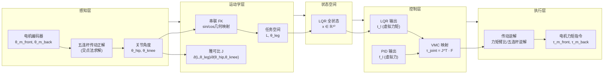

> 上图说明： 串联腿的完整数据流经过感知层—运动学层—状态空间—控制层—执行层五个层次。与并联腿相比，串联腿在感知层和执行层各多了一层"传动正解/逆解"——这是五连杆传动链嵌入关节处带来的结构特点。

**关键工程提示：**

1. J^T 映射在关节空间执行：VMC 的 J^T 映射将任务空间力 (f_l, t_l) 映射到关节力矩 (τ_hip, τ_knee)，而非电机力矩。需要再经过传动逆解（或力臂比缩放）才能得到电机力矩指令。

2. 内部五连杆参数标定：五连杆传动的杆长参数因机械加工和装配差异而异，需要在实机上标定。通常通过测量已知关节角度下的电机编码器读数，反向拟合杆长参数。

3. 仿真中可简化：在 MuJoCo 等仿真环境中，可先用理想关节力矩驱动（跳过传动层），待关节层控制验证通过后再加入传动层模型。

4. 传动链的雅可比：完整的雅可比包含两层——从电机速度到关节速度的传动雅可比 J_trans，以及从关节速度到任务速度的 J。在实机 VMC 计算中，可通过链式法则将两层合并：

$$\tau_{motor} = J_{trans}^T \cdot J^T \cdot F$$

或者分步计算：先由 J^T 得到关节力矩，再通过传动逆解得到电机力矩。后者在工程上更清晰、更易调试。

---

## <a id="3"></a>3. 动力学建模与线性化

这是从"机械结构"到"控制器设计"的关键桥梁。理解这一步才能明白 LQR 的 A、B 矩阵从何而来，以及为什么可以/需要线性化。

> 概念解释：什么是动力学？(What is Dynamics?)
>
> 动力学建立了力/力矩与运动加速度之间的因果关系。标准刚体动力学方程 `D(q)q̈ + C(q,q̇)q̇ + G(q) = B u` 给出了广义坐标 q 的加速度 q̈ 如何由惯性力、科里奥利力、重力和广义主动力共同决定。
>
> 数理结构：
>
> - D(q) ∈ ℝⁿˣⁿ：质量/惯量矩阵，对称正定。D_ij 表示第 j 个广义坐标的加速度对第 i 个方程中惯性力的贡献。D(q) 依赖于当前姿态 q（腿长不同，转动惯量不同）——这是增益调度的物理根源。
> - C(q,q̇)q̇ ∈ ℝⁿ：科里奥利力和离心力向量。C 矩阵的元素是 q̇ 的线性函数，因此 C(q,q̇)q̇ 是 q̇ 的二次项。在低速运动（q̇ ≈ 0）时此项近似为零，但在腿快速伸缩时会显著影响动力学。
> - G(q) ∈ ℝⁿ：重力向量，G_i = ∂V/∂q_i，其中 V 为系统总重力势能。G(q) 随姿态剧烈变化——当腿完全伸展（质心最高）时 G 中与机体俯仰相关的元素最大，这是开环不稳定性的来源。
> - B ∈ ℝⁿˣᵐ：输入分布矩阵，将 m 维控制输入 u 映射到 n 个广义坐标的广义力空间。
>
> 在 LQR 设计中的角色： 动力学方程是 A/B 矩阵的来源。通过对 ẋ = f(x,u)（x 包含 q 和 q̇）在平衡点处做雅可比线性化，A = ∂f/∂x 直接来自 D⁻¹ 和 ∂G/∂q（重力劲度矩阵），B = ∂f/∂u 直接来自 D⁻¹B。

### <a id="3.1"></a>3.1 10 维整体模型

10 维状态空间是一种控制架构选择，与机械构型（串联/并联）无关。 无论是串联腿还是并联腿，都可以选用 6 维（双腿分开独立控制）或 10 维（整体统一控制）方案。10 维方案的核心特征是将机体位移/偏航/俯仰和左右腿摆角全部纳入一个状态向量，通过单一的 4×10 K 矩阵实现耦合控制。

并联腿（五连杆）也可以采用 10 维 LQR，Q/R 矩阵维度需要与状态向量和控制输入维度一致。

本文档以 10 维方案为标准，因其在非对称工况（非平坦地形、单腿离地、倒地自起）下能通过 K 矩阵的交叉耦合项自然处理左右腿的不对称性。

**10 维状态向量：**

| 维度 | 符号 | 物理量 | 传感器来源 | 设计考量 |
|------|------|--------|-----------|----------|
| 0 | x | 水平位移 | Kalman 融合（轮式里程计 + IMU 加速度） | 世界坐标系 |
| 1 | ψ | 偏航角 (yaw) | IMU 陀螺积分或磁力计 | 用于转向 LQR |
| 2 | θ | 机体俯仰角 (pitch) | IMU quaternion → Euler | 姿态稳定关键状态 |
| 3 | θ_L | 左腿摆杆角度 | 串联 FK → 虚拟腿 θ_leg（见 2.3 节） | 左腿 |
| 4 | θ_R | 右腿摆杆角度 | 串联 FK → 虚拟腿 θ_leg（见 2.3 节） | 右腿 |
| 5 | ẋ | 水平速度 | Kalman 融合 | — |
| 6 | ψ̇ | 偏航角速度 | IMU gyro z | — |
| 7 | θ̇ | 机体俯仰角速度 | IMU gyro y | — |
| 8 | θ̇_L | 左腿摆杆角速度 | 数值微分 + 低通滤波 | 微分放大噪声 |
| 9 | θ̇_R | 右腿摆杆角速度 | 数值微分 + 低通滤波 | 微分放大噪声 |

**4 维控制向量：**

| 维度 | 符号 | 物理量 | 后续处理 |
|------|------|--------|----------|
| 0 | τ_L | 左腿虚拟力矩 | VMC → J^T → 髋膝关节力矩 → 传动逆解 → 电机力矩 |
| 1 | τ_R | 右腿虚拟力矩 | VMC → J^T → 髋膝关节力矩 → 传动逆解 → 电机力矩 |
| 2 | T_wL | 左轮毂力矩 | 直接输出 |
| 3 | T_wR | 右轮毂力矩 | 直接输出 |

**10 维方案的特点：**
- K 矩阵维度：4×10 = 40 个增益元素，每个都随腿长 L 调度（24 采样点 × 4 阶多项式拟合）
- 左右腿在同一个 LQR 问题中求解，K 矩阵会包含左右腿之间的交叉耦合项
- 适用于需要统一协调控制的场景：非平坦地形、单腿离地、倒地自起等
- 数学上完备，但 40 条增益曲线的调试工作量显著

---

### <a id="3.1.1"></a>3.1.1 6 维方案——双腿分开独立建模

可以将每条腿独立建模为一个 6 维轮腿倒立摆系统，两条腿各自运行独立的 LQR 控制器。

**6 维状态向量（单腿）：**

$$x_{6D} = [\theta,\ \dot{\theta},\ x,\ \dot{x},\ \phi,\ \dot{\phi}]^T$$

| 维度 | 符号 | 物理量 | 说明 |
|------|------|--------|------|
| 0 | θ | 该腿摆杆相对竖直倾角 | 串联 FK → θ_leg |
| 1 | θ̇ | 该腿摆杆角速度 | 数值微分 |
| 2 | x | 该腿轮子水平位移 | 轮式里程计 |
| 3 | ẋ | 该腿轮子水平速度 | 轮式里程计 |
| 4 | φ | 机体俯仰角 | IMU（两条腿共享同一值） |
| 5 | φ̇ | 机体俯仰角速度 | IMU gyro（两条腿共享同一值） |

**2 维控制向量（单腿）：**

$$u_{6D} = [T_{wheel},\ \tau_{virtual}]^T$$

**6 维方案的特点：**
- K 矩阵维度：2×6 = 12 个增益元素
- 左右腿各跑一个独立的 LQR，两条腿之间不交叉耦合
- 偏航控制需额外叠加差速 PD，不纳入 LQR
- 工程调试简单、极性排查直观，适合入门和快速原型
- 缺点：无法表达左右腿之间的动力学耦合，非对称工况（单腿离地等）需额外切换逻辑

由哈工程创梦之翼首次在社区完整推导并公开的轮腿倒立摆模型（WLIP），正是 6 维单腿方案的理论基础，后续被广西大学 ROBOTZ、山海机甲、rm_balance、极客日志等多个项目采纳。

**三个组成体：**

| 组成体 | 符号 | 关键物理参数 |
|--------|------|-------------|
| 驱动轮 | Wheel | 半径 R，质量 m_w，绕轮心转动惯量 I_w |
| 摆杆/虚拟腿 | Pendulum | 等效长度 L（运动学正解实时算出），质量 m_p，绕轮轴的转动惯量 I_p |
| 机体 | Body | 质量 M，绕自身质心的转动惯量 I_M，质心到铰点距离 l |

**广义坐标与正方向约定：**

| 变量 | 含义 | 正方向 | 平衡点值 |
|------|------|--------|----------|
| x | 轮子水平位移 | 前进方向 | 0 |
| θ | 摆杆相对竖直倾角 | 前倾 | 0 |
| φ | 机体相对竖直俯仰角 | 前倾 | 0 |

---

**10 维（整体）vs 6 维（分开）的对比与取舍：**

| 特性 | 6 维（双腿分开独立建模） | 10 维（整体统一建模） |
|------|------------------------------|-------------------------------------|
| 控制架构 | 左右腿各跑独立 LQR | 单一 LQR 同时输出四路控制量 |
| 左右腿耦合 | 无交叉耦合（各管各的） | K 矩阵直接包含交叉耦合项 |
| 偏航轴 | 额外叠加差速 PD | 纳入 LQR 状态反馈 |
| K 矩阵维度 | 2×6（每腿） | 4×10 |
| 计算量 | 每条腿 (2×6) 次乘加 | (4×10) 次乘加 |
| 增益调度 L 因子数 | 每腿 12 条曲线 | 40 条曲线（每个 K 元素一条） |
| 适用场景 | 平坦地面，左右对称运动 | 非平坦/台阶/斜坡/倒地自起 |
| 离地处理 | 需额外逻辑切换控制器 | θ_L ≠ θ_R 可自然表达不对称 |
| 调试难度 | 低 | 高（极性排查量大） |
| 社区代表 | rm_balance, 山海机甲, 极客日志 | 上交交龙, 广西大学(部分) |

社区经验表明：平坦地面上 6 维双腿分开方案已足够稳定；需要独立腿协调控制的复杂场景（如倒地自起、单腿跨台阶）才必须使用 10 维整体方案。建议在 6 维方案稳定运行后，再升级至 10 维方案。

**6维 vs 10维 状态空间架构对比图：**

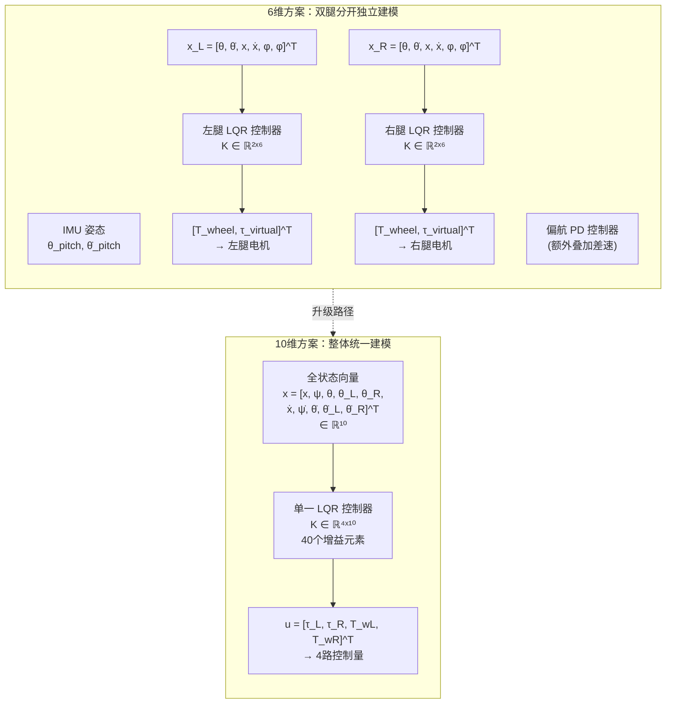

> 上图说明： 6 维方案每腿独立运行 2×6 的 LQR（12 条增益曲线），偏航控制需额外 PD；10 维方案用单一 4×10 的 LQR（40 条增益曲线），把左右腿耦合和偏航控制一并纳入反馈。推荐从 6 维起步，稳定后升级至 10 维。

**K 矩阵（4x10）结构和每个元素的物理含义：**

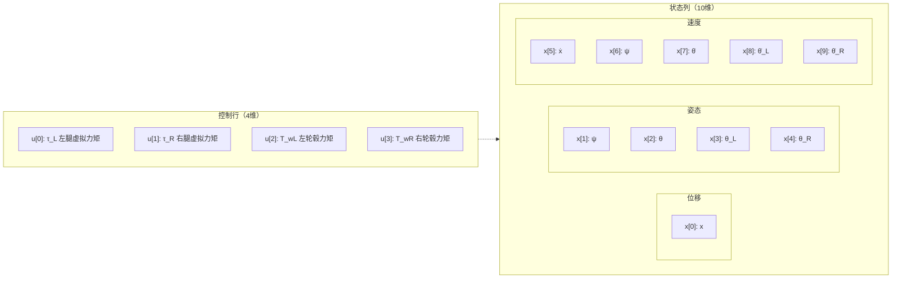

|  | x[0]:x | x[1]:ψ | x[2]:θ | x[3]:θ_L | x[4]:θ_R | x[5]:ẋ | x[6]:ψ̇ | x[7]:θ̇ | x[8]:θ̇_L | x[9]:θ̇_R |
|---|--------|--------|--------|----------|----------|--------|--------|--------|----------|----------|
| u[0]:τ_L | K00 | K01 | K02 | K03 | K04 | K05 | K06 | K07 | K08 | K09 |
| u[1]:τ_R | K10 | K11 | K12 | K13 | K14 | K15 | K16 | K17 | K18 | K19 |
| u[2]:T_wL | K20 | K21 | K22 | K23 | K24 | K25 | K26 | K27 | K28 | K29 |
| u[3]:T_wR | K30 | K31 | K32 | K33 | K34 | K35 | K36 | K37 | K38 | K39 |

| 列分组 | 列范围 | 物理作用 |
|--------|--------|----------|
| 位移 | K[*][0] | 抑制相对目标位置的偏差；若存在常值扰动或模型偏差，需积分环节或前馈补偿才能保证零静差 |
| 姿态 | K[*][1~4] | 姿态稳定通道，用于约束俯仰角与腿摆角偏差 |
| 速度 | K[*][5~9] | 阻尼抑制振荡 |

> K 矩阵阅读指南： 列 = 状态通道（哪个状态被反馈），行 = 控制通道（输出到哪个执行器）。K[2][2]（即 K22）= 机体俯仰 θ → 左轮毂力矩——描述机体前倾时左轮应施加的修正力矩。非对角元素（如 K[0][4]）= 右腿摆角对左腿力矩的交叉耦合——这正是 10 维方案相较 6 维方案的核心优势。40 个 K 元素各自拟合为关于腿长 L 的 n 阶多项式，运行时通过 Horner 方法实时求值。

### <a id="3.2"></a>3.2 非线性动力学方程的建立

> 概念解释：牛顿-欧拉法 vs 拉格朗日法 (Newton-Euler vs Lagrangian Methods)
>
> 建立多刚体动力学方程的两大方法论。两者在数学上等价，给出相同的运动方程，但推导路径截然不同。牛顿-欧拉法从矢量力学出发（对每个刚体列写力/力矩平衡，消去约束力），拉格朗日法从分析力学出发（基于标量能量函数和变分原理，约束力不会显式出现在方程中）。
>
> 方法一：牛顿-欧拉法 (Newton-Euler Method) — 矢量力学
>
> 推导流程：
> 1. 分解系统：将机器人拆分为独立刚体（轮子 ×2、大腿 ×2、小腿 ×2、机身）
> 2. 自由体图：对每个刚体标注全部外力——重力 mg（作用于质心）、关节约束力 N_x/N_z（相邻刚体通过铰链施加的接触力）、电机驱动力矩 τ
> 3. 平动方程（每个刚体 2 个标量方程，x 和 z 方向）：`ΣF = m · a_cm`——所有力之和 = 质量 × 质心加速度
> 4. 转动方程（每个刚体 1 个标量方程，绕质心）：`Στ = I_cm · α`——所有力矩之和 = 绕质心的转动惯量 × 角加速度
> 5. 消去约束力：约束力 N, P（铰链处的未知接触力）出现在多体方程中，但在最终的运动方程中不应出现（因为它们不是独立的——它们通过铰链的运动学约束被确定）。消去过程是对联立方程组做代数消元：将各刚体的运动量用广义坐标 q 表示，然后逐一代入消去未知约束力。
>
> 优点：每步推导具有直接的物理含义，正负号可通过物理直觉验证。缺点：约束力消元的代数复杂度随刚体数指数增长——10 维系统手工推导极易出错。
>
> 方法二：拉格朗日法 (Lagrangian Method) — 分析力学
>
> 核心思想：基于 Hamilton 原理/最小作用量原理。定义一个标量函数——拉格朗日量 L = T - V（动能减势能），运动方程由 Euler-Lagrange 方程自动生成：
>
> $$\frac{d}{dt}\left(\frac{\partial L}{\partial \dot{q}_i}\right) - \frac{\partial L}{\partial q_i} = Q_i$$
>
> 其中 Q_i 为非保守广义力（电机力矩等主动力在各广义坐标方向上的投影）。
>
> 约束力被消去的数学原理：理想约束（光滑铰链）在系统虚位移上做的虚功总和为零——达朗贝尔-拉格朗日原理（d'Alembert's principle）：`Σ (F_i - m_i a_i) · δr_i = 0`。将笛卡尔坐标 r_i 用广义坐标 q 表达，经变分运算后约束力项自动消去，只留下广义坐标的二阶微分方程。因此你只需关心标量量 T 和 V——无需处理矢量约束力。
>
> 推导流程（系统化步骤）：
>
> 1. 定义广义坐标：q = [x, ψ, θ, θ_L, θ_R]^T（5 个独立坐标唯一确定系统构型）
> 2. 导出各质心的位置与速度：利用运动学正解将每个刚体质心的笛卡尔坐标表示为 q 的函数，链式求导得速度：`v_i(q, q̇) = (∂r_i/∂q) · q̇`。这是计算动能的前提——运动学在此处进入动力学建模。
> 3. 计算动能 T：`T = Σ (½ m_i ||v_i||² + ½ I_i ω_i²)`——平动动能 + 转动动能
> 4. 计算势能 V：`V = Σ m_i g h_i(q)`——各部件重力势能之和，仅为 q 的函数
> 5. 构造 L = T - V 并代入 Euler-Lagrange 方程，逐坐标计算 ∂L/∂q̇_i 和 ∂L/∂q_i
> 6. 整理为标准形式 `D(q)q̈ + C(q,q̇)q̇ + G(q) = B u`，其中各项的解析表达式由上述求导自动产生
>
> 对比总结：
>
> | | 牛顿-欧拉法 | 拉格朗日法 |
> |---|---|---|
> | 推导复杂度 | 随刚体数 n 增长，O(n) 的消元工作 | O(n²) 的偏导数运算但可符号自动完成 |
> | 约束力 | 显式出现需消去 | 从方程结构中自动消去（达朗贝尔原理） |
> | 对轮腿的适用性 | 6 维单腿（≤4 刚体） | 10 维整体（≥5 刚体） |
> | 工程工具 | 手工推导可行（简单系统） | MATLAB Symbolic / Python SymPy 推荐 |
>
> 工程建议： 对于 10 维轮腿系统，推荐使用 MATLAB Symbolic Math Toolbox 走拉格朗日路线，让符号引擎完成偏导和代换，输出可直接数值计算的 A/B 矩阵表达式。

**方法一：牛顿-欧拉法**

对每个刚体列写力平衡和力矩平衡，消去内部约束力。以左侧为例展开关键方程。

**驱动轮平动 + 转动，消去摩擦力 N_f：**

$$(m_w + I_w/R^2)\,\ddot{x}_l = T_{wl}/R - N_l$$

**摆杆 x 和 z 方向的平动：**

$$m_p\,\ddot{x}_{p,l} = N_l - N_M,\quad m_p\,\ddot{z}_{p,l} = P_l - P_M - m_p g$$

**摆杆转动：**

$$I_p\,\ddot{\theta}_l = (P_l L + P_M L_M)\sin\theta_l - (N_l L + N_M L_M)\cos\theta_l - T_{wl} + \tau_l$$

**机体平动（含质心偏移 l）：**

$$M\,\frac{d^2}{dt^2}[x + (L+L_M)\sin\theta - l\sin\phi] = N_M$$

$$M\,\frac{d^2}{dt^2}[(L+L_M)\cos\theta + l\cos\phi] = P_M - M g$$

**机体转动方程：**

$$I_M\,\ddot{\phi} = \tau + N_M l\cos\phi + P_M l\sin\phi$$

其中 N, P 为轮-腿约束力，N_M, P_M 为腿-体约束力。理论上需消去所有约束力才能得到仅含广义坐标的方程。

**方法二：拉格朗日法**

对于多刚体系统，拉格朗日法从能量角度建立动力学方程。其优势在于不需要显式求解关节约束力，而是通过广义坐标、动能、势能和广义力直接得到系统的二阶微分方程。对于轮腿机器人，拉格朗日法的目标不是手工展开完整矩阵，而是建立一套可复现的推导链路：由机构几何得到质心位置，由质心速度构造动能，由质心高度构造势能，再通过 Euler-Lagrange 方程整理出状态空间模型。

拉格朗日法的求解步骤如下。

**定义广义坐标和状态顺序：**

对于 10 维整体模型：

$$q = [x,\ \psi,\ \theta,\ \theta_L,\ \theta_R]^T,\quad X = [q^T,\ \dot{q}^T]^T$$

其中 x 为机体或底盘参考点水平位移，ψ 为偏航角，θ 为机体俯仰角，θ_L/θ_R 为左右虚拟腿摆角。状态顺序必须与后续 A/B/K 矩阵一致。推导中常见的问题不是公式本身，而是状态顺序、输入顺序或左右腿符号定义前后不一致。

**用运动学表达各刚体质心位置：**

将轮子、左右腿等效杆、机体质心都写成广义坐标的函数：

$$p_i(q) = [s_i(q),\ h_i(q)]^T$$

然后通过雅可比得到速度：

$$v_i = \frac{\partial p_i}{\partial q}\dot{q} = J_{p_i}(q)\dot{q}$$

若使用五连杆机构，质心位置和转动惯量应先由五连杆几何解算得到，再进入动力学模型；不要把五连杆质量简单等效到轮心，否则会丢失腿长变化带来的惯量变化。

**构造动能 T 和势能 V：**

系统总动能由各刚体平动动能和转动动能组成：

$$T = \sum_i \left(\frac{1}{2}m_i v_i^T v_i + \frac{1}{2}\omega_i^T I_i \omega_i\right)$$

系统势能通常只考虑重力势能：

$$V = \sum_i m_i g h_i(q)$$

其中 h_i(q) 是第 i 个刚体质心的竖直坐标。对于平衡步兵，机体电池、云台、弹舱等质量分布对 h_body(q) 和机体转动惯量影响显著，建模时应使用与本机结构一致的质量、质心和惯量参数。

**将电机力矩写成广义力 Q：**

拉格朗日方程右端不是电机力矩原值，而是广义力。可由虚功关系得到：

$$\delta W = Q^T\delta q$$

若 q 中不直接包含轮毂角 θ_w，则轮毂力矩需通过无滑滚动约束映射到 x 和 ψ 通道；腿部虚拟力矩或关节力矩需通过对应的运动学映射进入 θ_L、θ_R 通道。对 10 维整体模型，可写成：

$$Q = B_q u,\quad u = [\tau_L,\ \tau_R,\ T_{wL},\ T_{wR}]^T$$

B_q 的列顺序必须与控制向量 u 一致。若后续 VMC 已经把虚拟腿力映射为关节力矩，则 B_q 应接收关节/虚拟腿等效后的输入，避免重复映射。

**代入 Euler-Lagrange 方程并整理矩阵：**

令拉格朗日量：

$$\mathcal{L}(q,\dot{q}) = T - V$$

对每个广义坐标写：

$$E_i = \frac{d}{dt}\left(\frac{\partial \mathcal{L}}{\partial \dot{q}_i}\right) - \frac{\partial \mathcal{L}}{\partial q_i} - Q_i = 0$$

将 E 按 q̈ 收集，可得到：

$$D(q)\ddot{q} + h(q,\dot{q}) = B_q u$$

其中：

$$D(q) = \frac{\partial E}{\partial \ddot{q}}$$

$$h(q,\dot{q}) = E - D(q)\ddot{q} + Q$$

**也可以进一步拆成：**

$$D(q)\ddot{q} + C(q,\dot{q})\dot{q} + G(q) = B_q u$$

推导时不一定要显式构造 C 矩阵，也可以直接求解 q̈ 的显式表达式：

$$\ddot{q} = D(q)^{-1}\left(B_q u - h(q,\dot{q})\right)$$

得到 q̈ 后即可构造状态方程的下半部分。

**转为状态空间并线性化：**

定义：

$$X = [q^T,\dot{q}^T]^T,\quad \dot{X} = f(X,u) = [\dot{q}^T,\ddot{q}^T]^T$$

在平衡点处求雅可比：

$$A = \left.\frac{\partial f}{\partial X}\right|_{X_{eq},u_{eq}},\quad B = \left.\frac{\partial f}{\partial u}\right|_{X_{eq},u_{eq}}$$

常用平衡点为竖直静止状态：

$$\theta = 0,\quad \theta_L = 0,\quad \theta_R = 0,\quad \dot{q}=0$$

若模型中已经通过腿长支撑抵消重力，u_eq 可取 0；若输入定义为实际电机力矩而非偏差量，则需要先求静态支撑力矩 u_eq，再对 Δu = u - u_eq 线性化。这个区别会直接影响 B 矩阵和实机平衡点补偿。

**进入 LQR 前的模型验证：**

进入 `lqr` 或 `dlqr` 前建议至少检查：

- D(q_eq) 是否对称且正定；若不正定，通常是质心位置、惯量或坐标符号错误
- `rank(ctrb(A,B))` 是否等于状态维度
- A 的右半平面不稳定模态是否符合倒立摆直觉；若全部稳定或发散维度异常，应回查重力项符号
- B 的每一列是否只对应预期执行器通道；若左右腿/左右轮列互换，K 矩阵在实机上会表现为极性错误
- 同一腿长下，LQR 线性模型的小扰动响应应与非线性模型的响应方向一致

上述流程比直接粘贴完整符号矩阵更适合作为理论推导路径。完整 10 维 D/C/G/A/B 矩阵展开后可读性很低，且不同机器人的质量、质心、腿长定义和输入映射都会改变矩阵元素；因此应重点说明如何从具体机构参数生成矩阵，而不是给出一套不可直接复用的固定矩阵。

建模过程中的两个工程要点：

力矩方向与电机安装关系：列写牛顿-欧拉方程时需注意电机定子/转子的安装位置——轮毂电机的定子装在摆杆上、转子装在轮子上，关节电机的定子装在机体上、转子装在摆杆上。力矩正负号取决于参考系选择（对定子或转子取矩），符号错误会导致 K 矩阵极性反转。

联立方程的消元策略：多刚体建模得到的联立方程组中，未知约束力数量通常多于广义坐标数量。在通过符号工具做线性化之前，建议先选取方程组的子集消去中间约束力变量——仅保留直接关联状态变量和控制输入的方程，其余方程仅作为中间代换使用。这可以显著简化后续线性化过程中雅可比矩阵的规模，减少符号推导的计算开销和出错概率。

**质心偏移的考虑：**

惯性参数可先由 CAD 或质量属性工具估算，但实机电池、云台、弹舱等模块会导致质心偏移。建模时应引入质心偏移参数 (δx, δz)，并将其纳入 D、G 矩阵。质心偏移会改变最优 K 矩阵中与机体俯仰相关的元素，这解释了不同平台即使腿长相同，K 矩阵仍可能存在显著差异——质心位置是隐含的关键变量。

### <a id="3.3"></a>3.3 平衡点线性化

> 概念解释：线性化 (Linearization) — 非线性系统在平衡点的局部线性近似

> 线性化是连接非线性真实动力学与线性控制理论之间的数学桥梁。轮腿机器人的完整动力学方程是非线性的（含 sin θ, cos θ, q̇² 等项），但 LQR 设计要求系统为线性时不变形式 ẋ = Ax + Bu。线性化在平衡点的局部邻域用一阶泰勒截断近似原始非线性系统。
>
> 数学定义： 对于非线性系统 ẋ = f(x, u)，在平衡点 (x_eq, u_eq)（满足 f(x_eq, u_eq) = 0）处：
> $$A = \left.\frac{\partial f}{\partial x}\right|_{x_{eq}, u_{eq}}, \quad B = \left.\frac{\partial f}{\partial u}\right|_{x_{eq}, u_{eq}}$$
> A ∈ ℝ¹⁰ˣ¹⁰ 的每个元素 A_ij = ∂f_i/∂x_j 量化了"第 j 个状态增大一单位对第 i 个状态变化率的独立影响"。B ∈ ℝ¹⁰ˣ⁴ 的每个元素 B_ik = ∂f_i/∂u_k 量化了"第 k 个控制通道对第 i 个状态变化率的影响"。
>
> 小角度近似的数学基础： 在平衡点附近（|θ| ≪ 1 rad），利用 sin θ = θ - θ³/6 + O(θ⁵) ≈ θ 和 cos θ = 1 - θ²/2 + O(θ⁴) ≈ 1，以及略去速度二次项（科里奥利力的离心部分在低速时与线性项相比为高阶小量），非线性项退化为线性项+高阶误差。误差随偏离平衡点的幅度增大而增大，因此线性模型的有效范围需要通过仿真和实机测试确认。
>
> 线性化的适用范围： 线性化的 A/B 矩阵仅在平衡点的局部邻域内有效。当机器人姿态严重偏离线性化点时，sin θ ≈ θ 的近似失效，基于线性化 A/B 的 LQR 反馈开始偏离最优解。这是增益调度（第 5 章）的另一个动机——不仅腿长 L 改变动力学，严重偏离直立姿态本身也使当前线性化点失效。在严重倾斜工况下，应考虑保护性控制逻辑（如急停）而非继续依赖 LQR。

非线性方程在平衡点（竖直静止，x=0, u=0）处一阶泰勒展开：

$$\dot{x} \approx f(0,0) + \frac{\partial f}{\partial x}\Big|_{eq} x + \frac{\partial f}{\partial u}\Big|_{eq} u = A x + B u$$

利用小角度近似（sin α ≈ α, cos α ≈ 1）和忽略速度平方项，可得到 A、B 的解析形式。

A (10×10) 分块结构：左上 5×5 = 0（无直接反馈），右上 5×5 = I（运动学积分关系），左下 5×5 包含倒立摆不稳定动力学（特征值在右半平面），右下 5×5 ≈ 0（忽略速度阻尼）。

A 矩阵元素随腿长 L 增大而显著增长——腿越长则质心越高，系统越不稳定，需要的 K 矩阵增益也越大。

工具链： 使用 MATLAB Symbolic Toolbox 或 Python SymPy 可自动完成符号推导与数值代入，生成对应具体机械参数的 A/B 矩阵。

> 概念解释：状态空间模型 (State-Space Model)
>
> 状态空间表示 ẋ = Ax + Bu, y = Cx + Du 是现代控制理论的时域基础。系统完全由状态向量 x（n 个独立变量，n 为系统阶数）描述——x(t) 包含预测系统未来行为所需的全部信息。
>
> 状态的定义： 在经典力学中，二阶微分方程 q̈ = D⁻¹(Bu - Cq̇ - G) 可转化为一阶形式 ẋ = f(x,u)，其中 x = [q; q̇] ∈ ℝ¹⁰（q 为 5 个广义坐标，q̇ 为 5 个广义速度）。此转化将 n/2 个二阶 ODE 变为 n 个一阶 ODE——方便应用线性系统理论的标准工具（特征值分析、可控性检验、LQR 设计）。
>
> A 矩阵的结构化解读： 对于标准力学系统，A 的上半部分体现"运动学积分器"（ẋ₁:₅ = x₆:₁₀，即速度积分成位置），A 的下半部分体现"动力学"（ẋ₆:₁₀ = D⁻¹(-K_grav · x₁:₅) + ...，即力产生加速度）。考察下半部分的 5×5 子块：
> - 对角元素：各通道的"重力劲度"——姿态角偏离平衡点时的恢复/发散力矩。倒立摆的对应特征值为正实数（不稳定），摆的对应特征值通常也为正实数
> - 非对角元素：通道间的耦合——例如机体俯仰角的偏离如何通过耦合动力学影响左腿摆角的角加速度
>
> 在 LQR 设计中的角色： (A, B) 对是 LQR 的输入参数。A 的特征值分布（正实数→不稳定模态，负实数→稳定阻尼模态，共轭复数→振荡模态）直接决定了 K 矩阵的元素量级——不稳定模态需要大幅增益来镇定，耦合通道需要非对角增益来解耦。

> 概念解释：平衡点 (Equilibrium Point)
>
> 平衡点是状态空间中满足 ẋ = 0 且 u = 0 的点。在平衡点处，所有广义力（保守力和非保守力）恰好平衡——系统处于静止状态且无主动控制输入。
>
> 数学条件： 对于动力学系统 ẋ = f(x, u)，平衡点 x_eq 满足 f(x_eq, 0) = 0。对于轮腿机器人，竖直静止姿态是物理平衡点——机体竖直（θ = φ = 0），双腿竖直（θ_L = θ_R = 0），所有速度为零，无控制输入（u = 0）。在此姿态，重力对每个刚体质心的力矩恰好为零（质心在关节轴正下方），系统处于"静不稳定"平衡——任何微小偏离都会被重力矩放大而不是衰减。
>
> 稳定性分类：
> - 稳定平衡（如不倒翁）：平衡点处 A 的所有特征值 Re(λ) < 0 → 扰动后系统自然回到平衡态 → 不需要反馈控制
> - 不稳定平衡（如倒立摆/轮腿机器人）：A 存在 Re(λ) > 0 → 微扰后偏离指数增长 → 必须有反馈控制
> - 临界稳定（如无摩擦单摆最低点）：纯虚数特征值 → 扰动后等幅振荡
>
> 线性化必须在平衡点进行，因为泰勒展开消除常数项的前提是 f(x_eq, u_eq) = 0。如果展开点不是平衡点，则 f(x_eq) ≠ 0 → 线性化后会有常数偏置项，破坏 LTI 系统标准形式。

### <a id="3.4"></a>3.4 系统可控性与可观测性

> 概念解释：可控性与可观测性 (Controllability & Observability)
>
> 可控性：是否存在控制序列 u(t) 能在有限时间内将系统从任意初始状态 x(t₀) 驱动到任意终端状态 x(t_f)？可观测性：能否通过有限时长的输出测量 y(t) 唯一确定系统的初始状态 x(t₀)？
>
> 可控性的线性代数判据： 构造可控性矩阵 `C_ctrb = [B, AB, A²B, ..., A⁹B] ∈ ℝ¹⁰ˣ⁴⁰`（10×40）。若 rank(C_ctrb) = 10（满行秩），则系统完全可控——4 个控制输入的线性组合可以覆盖 10 维状态空间的任意方向。物理含义：每个控制通道（左腿力矩、右腿力矩、左轮力矩、右轮力矩）通过动力学耦合（A 矩阵的重复相乘）将自身的影响传播到全部状态通道。不可控模态对应 B 矩阵零空间中无法被任何控制量触及的状态方向。
>
> 可观测性的线性代数判据： 构造可观测性矩阵 `O_obs = [C; CA; CA²; ...; CA⁹]^T ∈ ℝ¹⁰ᵐˣ¹⁰`（其中 m 为传感器数目）。若 rank(O_obs) = 10（满列秩），则系统完全可观测——通过传感器读数 y(t) 及其导数可以唯一还原全部 10 个状态。物理含义：尽管不能直接测量水平位移 x（没有 GPS），但 IMU 的加速度 + 陀螺仪 + 电机编码器通过动力学模型（A 和 C 的乘积链）间接包含了足够的位移信息来重构它。
>
> 在轮腿控制中的工程意义：
> - 可控性 = 满秩 → LQR 能达成的性能无理论障碍（若 rank < 10, 某些状态方向无法被控制）
> - 可观测性 = 满秩 → Kalman 滤波器理论上可以收敛到真实状态（若 rank < 10, 某些状态是"不可见的"）
> - 这两个秩条件是设计控制器之前必须验证的结构性质——如果不满足，任何控制器设计都是徒劳的

可控性： 构造可控性矩阵 C_ctrb = [B, AB, A²B, ..., A⁹B]。若 rank(C_ctrb) = 10（满秩），则系统完全可控。4 个控制输入可将 10 个状态从任意初值驱动到任意终值；若秩不足，则说明某些状态通道无法被当前执行器组合有效控制。

可观测性： 构造可观测性矩阵 O_obs = [C; CA; CA²; ...; CA⁹]。传感器配置（IMU + 电机编码器）通常使系统完全可观测（rank = 10）。Kalman 滤波器即依赖此性质，通过有限传感器测量重构全状态。

验证工具： MATLAB `ctrb(A,B)`, `obsv(A,C)`, `rank()`；Python `scipy.linalg.ctrl_rank`, `numpy.linalg.matrix_rank`。

### <a id="3.5"></a>3.5 线性化工具链：两种工程实现路径

轮腿机器人 10 维状态空间模型的线性化存在两种工程实现路径，二者在拉格朗日建模框架上一致，但在几何参数获取和数值线性化方法上存在差异。

**路径一：纯解析线性化**

使用 MATLAB Symbolic Math Toolbox 完成全流程符号推导。该路径的核心特征为：

1. 符号拉格朗日建模：在 MATLAB 中定义符号变量（广义坐标 q、广义速度 q̇、广义加速度 q̈），构造动能 T 和势能 V，由 Euler-Lagrange 方程导出五组运动方程，通过 `solve` 求解加速度显式表达式。
2. 解析几何近似：腿部件质心位置和转动惯量通过简化解析公式计算。五连杆腿的质心参数（c_x, c_h, θ_p）由大腿杆长 l_b、小腿杆长 l_s 和各自质量 m_b, m_s 通过余弦定理解析导出——这是对实际复杂五连杆质心分布的几何近似。
3. 平衡点求解：将系统拉格朗日量中的速度项置零，对 θ, θ_L, θ_R 三个角度变量求偏导建立平衡方程，使用 `solve` 或 `vpasolve` 求解静态平衡点。
4. 泰勒线性化：在平衡点处对 10 维状态向量 `z = [x, ψ, θ, θ_L, θ_R, ẋ, ψ̇, θ̇, θ̇_L, θ̇_R]` 做一阶泰勒展开（`taylor(..., 'Order', 2)`），通过 `equationsToMatrix` 提取 A 和 B 矩阵。
5. 数据导出：将 A, B, C, D 保存为 `.mat` 文件，供 Python 仿真程序加载和后续离散化。

该路径的优势在于线性化过程完全独立于物理引擎——A/B 矩阵的生成仅依赖解析几何公式和符号运算，不引入仿真器的数值误差。其局限在于五连杆质心参数依赖简化几何近似（将五连杆等效为两连杆），当腿长在工作范围内大幅变化时，该近似的误差可能累积。

**路径二：混合数值-解析线性化**

使用 Python SymPy 完成拉格朗日量的符号构造，但在几何参数获取阶段引入 MuJoCo 作为辅助几何解算器。该路径的核心特征为：

1. 符号拉格朗日建模：使用 SymPy 定义与 MATLAB 路径相同结构的拉格朗日量（动能含 sqrt(d² + sin²(θ_l)·L_l²) 等精确项），通过 `linear_eq_to_matrix` 提取质量矩阵 M(q) 和输入分布矩阵 B_q 的符号表达式，并使用 `lambdify` 编译为可数值调用的 Python 函数。
2. MuJoCo 辅助几何提取：这是该路径与路径一的关键差异。引入 `LegPoseSolver` 类——在每一个腿长采样点，使用 MuJoCo 的 `least_squares` 优化求解五连杆闭环约束（四个 equality connect 约束），找到当前腿长对应的实际五连杆姿态。然后从 MuJoCo 模型数据中直接读取各连杆的 `body_mass` 和 `xipos`（质心局部坐标），计算腿部质心的径向距离 `r_com` 和切向偏置 `c_x`。这两个参数直接传入拉格朗日量的参数向量——等效于用物理引擎的高保真模型替代解析几何近似。
3. 平衡点求解：使用 `scipy.optimize.fsolve` 对重力势能 V(q) 的数值梯度 dV/dq 进行寻零，得到静态平衡角度。
4. 数值线性化：A 矩阵的上半部分为运动学积分器（ẋ₁:₅ = x₆:₁₀），下半部分的动力学部分由 `A[5:10, 0:5] = -M⁻¹·K_grav` 构造，其中 K_grav（重力劲度矩阵 5×5）通过势能 V 对广义坐标的二阶中心差分（步长 ε = 1e-5，四采样点公式）数值计算；同时构造人工阻尼项 `A[5:10, 5:10] = -M⁻¹·D_damp` 以补偿被省略的速度相关非线性阻尼。
5. 数据流：A/B 矩阵直接在 Python 内存中传递给 ZOH 离散化（`scipy.linalg.expm` 矩阵指数）和 DARE 求解器，无需经过文件 I/O。

**两种路径的技术对比：**

| 对比维度 | 路径一（MATLAB 纯解析） | 路径二（SymPy + MuJoCo 混合） |
|----------|--------------------------|-----------------------------------|
| 符号引擎 | MATLAB Symbolic Toolbox | Python SymPy |
| 几何参数来源 | 解析几何近似（两连杆等效质心公式） | MuJoCo 模型实际质心与惯量数据 |
| 数值线性化方法 | 符号泰勒展开 → `equationsToMatrix` | 一阶/二阶有限差分 + 解析质量矩阵 |
| 五连杆质心建模 | 由 l_b, l_s, m_b, m_s 解析近似 | 从 MuJoCo 各连杆 body 数据直接读取 |
| 阻尼项 | 依赖 MuJoCo XML 中的 joint damping | 人工对角阻尼矩阵 D_damp |
| 数据传递 | .mat 文件 → Python `loadmat` | Python 内存中直接传递 |
| 对外部工具依赖 | MATLAB + Symbolic Toolbox（商业许可） | Python + SymPy + SciPy + MuJoCo（全开源） |
| 几何模型保真度 | 受解析近似公式精度限制 | 与 MuJoCo 仿真模型一致 |

**工程建议：**

路径一适合机械设计已定型、需要将线性化流程固化到商业工具链中的团队。其 MATLAB 符号工具箱的交互式调试体验优于 Python 脚本，且 `.mat` 文件的通用性便于跨平台传递。

路径二适合需要与实际 MuJoCo 仿真模型几何保持严格一致、且倾向于全开源工具链的团队。MuJoCo 辅助几何提取免去了手工推导五连杆质心解析公式的工作——当机械参数（杆长、质量分布）调整时，仅需更新 XML 模型，线性化管线自动跟随模型几何变化。

两种路径的拉格朗日量结构（动能含 sqrt 精确项、势能含 atan2 质心偏置角）在数学上等价，差异仅在于几何参数的获取方式。在相同的物理参数和 Q/R 设置下，两种路径生成的 K 矩阵应在同一数量级且具有一致的符号模式——这是交叉验证线性化工具链正确性的有效手段。

---

## <a id="4"></a>4. LQR 最优控制器设计

> 概念解释：LQR (Linear Quadratic Regulator) — 线性二次型最优调节器
>
> LQR 是线性二次型最优控制问题的解析解。对于系统 ẋ = Ax + Bu，寻找反馈律 u = -Kx 使得无穷时域二次型代价 J = ∫₀^∞ (xᵀQx + uᵀRu) dt 最小化。在 (A,B) 可稳定、(A,Q^{1/2}) 可检测等标准条件下，稳定化 K 由代数 Riccati 方程的解 P 给出：K = R⁻¹BᵀP。
>
> 名称的精确含义：
> - Linear：受控系统为线性时不变（LTI）形式 ẋ = Ax + Bu → 需先对非线性动力学做平衡点线性化
> - Quadratic：代价函数中状态和控制均为二次项 → 瞬时代价为凸二次型；结合系统可稳定/可检测条件后，Riccati 方程给出唯一稳定化反馈解
> - Regulator：控制目标是驱动状态回到零（平衡点）→ x → 0，而非跟踪时变轨迹
>
> 代价函数 J 的权重设计含义：
> - Q 矩阵（半正定，通常取对角形式）：Q_ii 越大 → 对该状态通道的偏差惩罚越重 → K 中与该状态相关的元素幅值增大 → 对该状态偏差的瞬态响应更快
> - R 矩阵（正定，通常取对角形式）：R_jj 越大 → 对该控制通道的能耗惩罚越重 → K 中与该控制相关的元素幅值减小 → 控制动作更保守
> - 二次惩罚特性：偏差增大 1 倍，代价增大 4 倍（因为 (2δ)² = 4δ²）→ LQR 的代价函数对大偏差更敏感，对小幅偏差的惩罚相对温和
>
> 从机械参数到 K 矩阵的完整工程流程：
>
> 1. 机械设计参数（l_thigh, l_shin, R, m_w, m_p, M, I_w, I_p, I_M, 质心位置）→
> 2. 拉格朗日法/牛顿-欧拉法建立运动方程 → `D(q)q̈ + C(q,q̇)q̇ + G(q) = Bu` →
> 3. 在平衡点 (x_eq = 0, u_eq = 0) 处对 ẋ = f(x,u) 求雅可比 → A ∈ ℝ¹⁰ˣ¹⁰, B ∈ ℝ¹⁰ˣ⁴ →
> 4. Brysons 法则或其他方法设计 Q ∈ ℝ¹⁰ˣ¹⁰, R ∈ ℝ⁴ˣ⁴ →
> 5. 求解连续代数 Riccati 方程（CARE）→ P ∈ ℝ¹⁰ˣ¹⁰（对称正定）→
> 6. 计算最优反馈增益 K = R⁻¹BᵀP ∈ ℝ⁴ˣ¹⁰（40 个增益元素）→
> 7. 对每个腿长 L_i 重复 2-6，多项式拟合 K_ij(L) → 生成 4×10×(n+1) 系数表 →
> 8. 嵌入式运行时：读取当前 L → Horner 多项式求值 → 得到 K → u = -K·(x - x_target)

LQR 控制器设计全流程图：

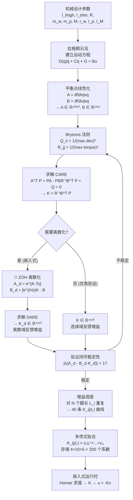

> 上图说明： 这是从机械设计参数到嵌入式运行时实现的完整路径。关键分支在"连续 vs 离散"——仿真中可用连续 LQR 验证概念（`lqr(A,B,Q,R)`），但嵌入式必须走 ZOH 离散化 + 离散 LQR（`dlqr(Ad,Bd,Q,R)`）路径。闭环极点验证是必做步骤——|λ| ≥ 1 意味着反馈律无法镇定系统，需重新设计 Q/R。

### <a id="4.1"></a>4.1 从连续时间到离散时间的完整路径

LQR 的设计遵循"连续系统建模 → 离散化 → 离散 LQR 求解"的路径。理解每一步的数学原理和数值方法，是正确设计 K 矩阵的前提。

**连续时间 LQR 问题：**

对于线性时不变系统 ẋ = A x + B u，寻找状态反馈 u = -K x 使二次型代价最小：

$$J = \int_0^\infty (x^T Q x + u^T R u)\,dt$$

其中 Q ≥ 0（半正定）为状态权重，R > 0（正定）为控制权重。

**最优解的数学结构：**

$$K = R^{-1} B^T P$$

其中 P 是连续代数 Riccati 方程（CARE）的稳定化对称解：

$$A^T P + P A - P B R^{-1} B^T P + Q = 0$$

CARE 求解的数值方法：MATLAB `care(A,B,Q,R)` 或 `lqr(A,B,Q,R)`；Python `scipy.linalg.solve_continuous_are(A,B,Q,R)`。

> 概念解释：Riccati 方程 (Riccati Equation) — LQR 的数学核心
>
> 代数 Riccati 方程是 LQR 最优解的核心条件。连续代数 Riccati 方程（CARE）AᵀP + PA - PBR⁻¹BᵀP + Q = 0 的稳定化对称解 P 给出反馈增益 K = R⁻¹BᵀP。该方程是二次矩阵方程——未知量 P 以线性和二次项同时出现——通常以 Schur 分解法或牛顿迭代法数值求解。
>
> P 矩阵的物理含义（代价-to-go）： V(x) = xᵀPx 为最优代价函数（最优控制下的无穷时域总代价）。P_ij 量化了状态 i 和 j 同时偏离时对最优总代价的联合贡献。P 的迹 trace(P) 可直观理解为"单位初始偏离的平均代价"。
>
> 方程各项的贡献：
> - AᵀP + PA：Lyapunov 算子——若 A 有正实部特征值（不稳定），该项使 P 增大以对抗指数发散
> - -PBR⁻¹BᵀP：控制减益项——R 增大（控制变贵）→ 该项绝对值减小 → P 增大 → K 减小. Q/R 的相对比值决定 K 的幅值
> - +Q：状态惩罚直接注入——Q_ii 增大 → P 的对应行/列增大 → K 对应元素增大
>
> 离散版本（DARE）：`P = A_dᵀPA_d - A_dᵀPB_d(B_dᵀPB_d + R)⁻¹B_dᵀPA_d + Q`，可通过反向迭代求解直至 `||P_{k+1} - P_k||/||P_k|| < tol`。

### <a id="4.2"></a>4.2 ZOH 离散化与离散 LQR

> 概念解释：连续控制 vs 离散控制 + ZOH (Continuous vs Discrete + Zero-Order Hold)
>
> 物理系统是连续时间微分方程 ẋ = Ax + Bu，嵌入式控制器是离散时间差分方程 x_{k+1} = A_d x_k + B_d u_k（采样周期 T_s）。零阶保持（ZOH）假设：在一个采样周期内控制输入保持恒定 u(t) = u_k, t ∈ [kT_s, (k+1)T_s)，作为连续与离散之间的数学桥梁。
>
> ZOH 离散化的数学定义：
> $$A_d = e^{A T_s} = \sum_{n=0}^{\infty} \frac{(A T_s)^n}{n!}$$
> $$B_d = \left(\int_0^{T_s} e^{A\tau} d\tau\right) B$$
>
> 矩阵指数 e^{A T_s} 编码了连续动力学在一个采样周期 T_s 内的累积——A_d 的每个元素给出"第 j 个状态在 T_s 时长后对第 i 个状态的总影响"。B_d 中的积分编码了"保持恒定的控制量在 T_s 内的累积效应"。
>
> 连续 K 不可直接用于离散反馈： K_c = lqr(A, B, Q, R) 作用于连续系统保证 A-BK_c 稳定（Re(λ) < 0），但 A_d-B_dK_c 的特征值可能仍位于单位圆外。必须用 dlqr(A_d, B_d, Q, R) 在离散域重新求解得到 K_d，确保 |λ(A_d-B_dK_d)| < 1。T_s 越小，K_d → K_c（连续极限）。
>
> 采样周期 T_s 的工程选取： 采样频率应显著高于闭环带宽，并根据机构尺度、执行器带宽、传感器刷新率和计算开销共同确定。T_s 过大将引入明显离散化误差和相位滞后，T_s 过小则会提高计算与通信压力。

**ZOH 离散化（零阶保持）：**

假设控制输入在一个采样周期内保持不变：

$$A_d = e^{A \Delta t},\quad B_d = \left(\int_0^{\Delta t} e^{A \tau} d\tau\right) B$$

**离散 LQR 问题：**

$$J = \sum_{k=0}^{\infty} (x_k^T Q x_k + u_k^T R u_k)$$

反馈律 u_k = -K x_k，其中：

$$K = (B_d^T P B_d + R)^{-1} B_d^T P A_d$$

P 满足离散代数 Riccati 方程（DARE）：

$$P = A_d^T P A_d - A_d^T P B_d (B_d^T P B_d + R)^{-1} B_d^T P A_d + Q$$

**迭代求解 vs 直接求解：**

**社区中有两种主流做法：**

| 方法 | 工具 | 特点 |
|------|------|------|
| 反向迭代求解 DARE | Python `for` 循环 / C | 灵活可控，适合嵌入；需足够迭代次数并验证收敛 |
| 直接调用库函数 | MATLAB `dlqr()` / Python `solve_discrete_are()` | 单次求解，精度高；依赖矩阵运算库 |

收敛验证： 计算闭环系统矩阵 A_cl = A_d - B_d·K 的特征值，确保所有 |λ_i| < 1（稳定性条件）。特征值越接近原点，响应越快但可能震荡；越接近单位圆，响应越平稳但恢复慢。

### <a id="4.3"></a>4.3 权重矩阵 Q/R 的设计方法

Q 和 R 的相对比值（而非绝对值）决定 LQR 性能。

**Brysons 法则（初始值选取的实用方法）：**

$$Q_{ii} = \frac{1}{(\text{max acceptable deviation})^2},\quad R_{jj} = \frac{1}{(\text{max available torque})^2}$$

根据各状态允许的最大偏差和控制量的最大可用力矩，反算 Q 和 R 的对角元素。例如，若允许机体俯仰 θ 最大偏差为 Δθ_max，则 Q_θ = 1/Δθ_max²。

**Q 矩阵权重设计原则：**

| 状态类别 | 相对权重 | 设计理由 |
|----------|----------|----------|
| 机体俯仰角 θ | 最大 | 机体姿态稳定直接决定闭环安全边界，应限制在较小允许偏差范围内 |
| 腿摆角 θ_L, θ_R | 较大 | 腿角度直接影响质心位置和系统稳定性 |
| 水平位移 x | 中等偏小 | 位移跟踪可通过速度跟踪和外环目标间接约束 |
| 偏航角 ψ | 较小 | 偏航控制通常在平衡闭环稳定后启用 |
| 所有速度量 | 阻尼整形权重 | 主要用于改善阻尼比和抑制振荡 |

R 矩阵设计原则： 控制量（轮毂力矩和虚拟腿力矩）的权重越大，控制器越保守（力矩更小、响应更慢）。通常取对角形式 R = r·I。

**Brysons 法则的本质：**

是对性能指标 J 中出现变量的归一化缩放，确保各项的"最大可接受值"被统一到同一尺度。这在状态变量和控制变量数值差异巨大的情况下尤其重要——例如机体倾角和水平位移的单位不同、允许范围不同，直接使用等权 Q 矩阵会导致 LQR 对某些状态通道的关注度严重失衡。

状态变量的最大可接受值： 每个状态变量代表系统的某种状态（位置、速度、倾角等），设计者需要为其设定一个可接受的最大范围。若超出此范围，系统可能进入不安全或无效状态。例如，机体倾角过大则容易失衡摔倒，这个角度就是该状态的最大可接受值。

控制输入的最大可接受值： 对应控制器的物理限制——电机的最大输出力矩。超过此值可能导致电机损坏或控制器失效。

**调参经验法则：**
- Brysons 法则通常给出良好的起点，但往往只是设计过程的开始
- 之后需要通过试错迭代来获得期望的闭环特性
- 增大 Q 中某元素的权重 → 对该状态的偏差响应更强、恢复更快，但可能震荡
- 增大 R 中某元素的权重 → 对该控制通道的使用更保守、力矩更小，但响应更慢
- Q/R 的比值（不是绝对值）决定控制性能；同比例缩放 Q 和 R 不影响 K
- 实机调试时从低增益开始，逐步增大直至震荡，再回退作为最终值

> 概念解释：Brysons 法则 — Q/R 归一化设计方法
>
> Brysons 法则：`Q_ii = 1/(x_i^max)²`, `R_jj = 1/(u_j^max)²`。本质是将不同物理量纲的状态量和控制量统一归一化为无量纲的"偏差比例"，使得当所有状态同时达到各自的最大允许值时，它们在 J 中贡献的代价恰好相等。
>
> 归一化的必要性： 状态向量中各分量的物理量纲和量级差异可能很大。若 Q = I（单位阵），则不同单位的状态量会被机械地等权相加，无法表达“姿态偏差”和“位移偏差”在安全性上的差异。Brysons 归一化用每个状态的最大允许值缩放，使 Q 的对角元素自动补偿量纲差异。
>
> 计算形式：
> - θ（机体俯仰）：max = θ_max → Q_θ = 1/θ_max²
> - x（水平位移）：max = x_max → Q_x = 1/x_max²
> - θ_L（腿摆角）：max = θ_L_max → Q_θL = 1/θ_L_max²
> - τ_L（左腿虚拟力矩）：max = τ_L_max → R_τL = 1/τ_L_max²
>
> 权重差异不是简单表达“某个状态更重要”，而是将不同物理量的允许范围和安全代价统一映射到同一个二次型指标中。Brysons 法则把这种物理判断量化为可计算的 Q/R 矩阵初值。

> 概念解释：DARE (Discrete Algebraic Riccati Equation)
>
> DARE 是离散时间 LQR 的核心方程：`P = A_dᵀPA_d - A_dᵀPB_d(B_dᵀPB_d + R)⁻¹B_dᵀPA_d + Q`。它是连续 CARE 的离散对应。在可稳定/可检测条件满足时，DARE 的稳定化解 P 使离散闭环系统 A_d - B_dK 的所有特征值满足 |λ| < 1（离散稳定条件）。
>
> CARE vs DARE 的关键区别： CARE 保证连续闭环 A-BK 在左半平面（Re(λ) < 0），DARE 保证离散闭环在单位圆内（|λ| < 1）。两者并不直接等价——需要先将 (A, B) 通过 ZOH 离散化为 (A_d, B_d)，再对离散系统求解 DARE 得到 K_d。在嵌入式离散控制实现中，应优先使用离散系统对应的 K_d（而非直接使用连续系统的 K_c），因为执行机构在采样间期保持恒定（ZOH 行为）。

### <a id="4.4"></a>4.4 DARE 的数值求解验证

闭环极点验证： eig(A_d - B_d·K) 的所有特征值必须在单位圆内。

K 矩阵量级检查： 若 K 中某元素量级异常大（如远超 10⁶），说明该通道增益过大，需检查 Q/R 设置或 A/B 矩阵的正确性。

收敛判断： 当 ||P_k - P_{k-1}|| / ||P_{k-1}|| < tol 时可停止迭代。足够的迭代次数可确保充分的收敛裕度。

**迭代求解方法（以 Python 为例）：**

```python
for i in range(0, n): # n 取足够大以确保收敛
 F = np.linalg.inv(Bd.T @ P @ Bd + R) @ (Bd.T @ P @ Ad)
 P = (Ad - Bd @ F).T @ P @ (Ad - Bd @ F) + F.T @ R @ F + Q
```

这是离散 Riccati 方程的反向迭代求解。初值为 P_0 = S（终端代价），经过足够多次迭代后，P → P_ss（稳态解），F → F_ss（稳态反馈增益）。

收敛判断： 当 ||P_k - P_{k-1}|| / ||P_{k-1}|| < tol 时可停止迭代。足够的迭代次数可确保充分的收敛裕度。

**MATLAB 对应函数：**
- `[K, P, e] = dlqr(Ad, Bd, Q, R)` —— 直接求解离散 LQR
- `[K, P, e] = lqr(A, B, Q, R)` —— 连续时间 LQR（需自行离散化）

可同时使用连续时间和离散时间 LQR 求解函数进行交叉验证，重点检查离散化方式、K 矩阵量级和闭环特征值是否一致。

**验证： 求解后应验证：**
1. 闭环系统矩阵 (Ad - Bd·K) 的所有特征值在单位圆内（|λ_i| < 1）—— 稳定性
2. K 矩阵的元素量级合理（不应出现过大的增益值，如 |K_ij| > 10^6）

---

## <a id="5"></a>5. 增益调度

> 概念解释：增益调度 (Gain Scheduling)
>
> 增益调度是处理参数变化系统（LPV, Linear Parameter-Varying）的标准方法。轮腿机器人的动力学参数（质心高度、转动惯量）随腿长 L 变化，导致线性化后的 (A, B) 是 L 的函数。固定 K 矩阵仅在一个 L 值处最优——增益调度通过 K = K(L) 将控制器参数也变为 L 的函数以保持全工作范围内的最优性。
>
> 物理根源： L 增大 → 质心升高 → 倒立摆的"重力劲度"（gravity stiffness，∂G/∂θ 的元素幅值）增大 → A 矩阵中与姿态角对应的不稳定特征值位置右移 → 需要更大的状态反馈增益来镇定。L 减小 → 质心降低 → 系统更稳定 → A 的特征值左移 → 若 K 不变则"过度控制"导致振荡。
>
> 三步工程流程：
> 1. 采样：在 [L_min, L_max] 均匀取 N 个点，步长 ΔL = (L_max - L_min)/(N-1)
> 2. 定常设计：对每个 L_i 独立推导动力学 → 线性化得 (A_i, B_i) → 求解 LQR 得 K_i ∈ ℝ⁴ˣ¹⁰
> 3. 拟合：对 40 个 K 元素各自拟合 K_ij(L) 的多项式，运行时由当前 L 实时计算 K
>
> 理论保证（启发式）： 若在每个格点 L_i 处闭环系统 A_{cl}(L_i) = A_i - B_i K_i 的所有特征值稳定，且格点间 L 的变化速率远慢于闭环系统的收敛速率（即"准静态假设"），则增益调度系统在时变 L(t) 下可保持局部稳定性。

> 概念解释：多项式拟合与 Horner 方法 (Polynomial Fitting & Horner's Method)
>
> 将 N 个离散样本点 (L_i, K_ij) 用 n 阶多项式 K_ij(L) = Σ_{k=0}^{n} c_k Lᵏ 拟合。Horner 方法将多项式的直接求值从 O(n²) 次乘法降至 O(n) 次——利用嵌套形式 p(L) = (((c₀ L + c₁)L + c₂)...)L + c_n。
>
> 多项式 vs 查表的工程权衡：
> - 查表+插值：需存储 4×10×N 个 float，运行时做线性插值
> - 多项式拟合：仅需存储 4×10×(n+1) 个系数，运行时用 Horner（n 次乘法+加法/元素）
> - 多项式通常更省存储，计算量也可控；查表+插值更稳健、不会出现高阶拟合在采样点之间振荡的问题。工程上应比较拟合残差、闭环极点和 float32 误差后再选。
>
> Horner 方法的计算量： 每个 K 元素按 n 阶多项式求值，整体计算量随 K 元素数量和多项式阶数线性增长，通常远小于控制周期预算。

**增益调度完整流程图：**

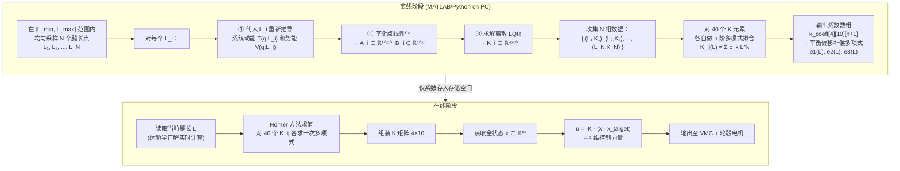

> 上图说明： 离线阶段计算量巨大（每个 L_i 需完整推导动力学+线性化+Riccati 求解），但只需执行一次。在线阶段仅需读取腿长→多项式求值→矩阵乘法，计算量通常远小于控制周期预算。关键难点：离线阶段若修改机械参数（如更换电机导致质心偏移），必须重新走完整离线流程——A/B 矩阵和 K 矩阵都会变化。

> 概念解释：模型预测控制 (MPC) 的前馈思想
>
> MPC 在每一采样时刻求解一个有限时域最优控制问题（通常为带约束的二次规划），将优化出的控制序列的第一个元素施加于系统，下一时刻重复此过程（滚动时域，receding horizon）。LQR 是 MPC 在无穷时域、无约束、线性系统条件下的解析特例——K 矩阵等效于 MPC 中不变的最优反馈律。
>
> 本方案中的"类 MPC 前馈补偿"（5.5 节）：仅预测一步 x̂_{k+1} = A_d x_k + B_d u_k，与实际传感器观测 x_{k+1} 比较，残差 e = x_{k+1} - x̂_{k+1} 被解释为"未建模扰动"，通过补偿通道 K_comp·e 修正轮毂力矩。这不涉及在线优化，严格说更接近一步模型残差补偿/扰动观测，而不是标准 MPC。

### <a id="5.1"></a>5.1 变腿长系统的增益变化规律

轮腿机器人的关键特征：腿长 L 在工作过程中会变化（变化范围 [L_min, L_max]，取决于机械设计）。腿长变化显著改变系统动力学：
- L 增大 → 质心升高 → 倒立摆的"不稳定性"增强 → 需要更大的反馈增益
- L 减小 → 质心降低 → 系统更稳定 → 过大的增益反而导致震荡

这意味着固定的 K 矩阵无法在全腿长范围内提供良好性能。

增益调度的基本思想： 根据当前腿长 L，在线调整 K 矩阵。K = K(L)。

### <a id="5.2"></a>5.2 分段线性化策略

**操作步骤：**

1. 在腿长变化范围 [L_min, L_max] 内选取 N 个采样点（N 取决于所需拟合精度和腿长范围，步长 ΔL 均匀分布）
2. 对每个采样点 L_i：
 - 建立该腿长下的非线性动力学方程
 - 在平衡点处线性化，得到 (A_i, B_i)
 - 求解 LQR，得到 K_i
3. 得到 N 组数据点：(L_i, K_i)，i = 1, ..., N

数据格式： N 组 K 矩阵以文本格式存储（N 为采样点数），经脚本解析后用于多项式拟合。

**实现要点：**
- 使用符号变量表示系统动力学，对每个 L 值自动代入并求解 LQR
- 输出每个采样腿长对应的 K 矩阵，作为后续多项式拟合的数据源
- 固定导出格式，避免脚本解析时出现状态顺序或控制量顺序错误

### <a id="5.3"></a>5.3 多项式拟合方法

对 K 矩阵中每个元素 K_ij (共 4×10 = 40 个)，用 n 阶多项式拟合其随 L 的变化：

$$K_{ij}(L) = c_{0,ij} L^n + c_{1,ij} L^{n-1} + \cdots + c_{n-1,ij} L + c_{n,ij}$$

多项式阶数的选择需在拟合精度和过拟合之间平衡：阶数过低则拟合不够精确；阶数过高可能在采样点之间震荡。选择足够使拟合残差可忽略的最低阶数即可。

`k_coeff` 是一个 (4 × 10 × (n+1)) 的三维数组（4 行 K × 10 列 K × (n+1) 阶系数）。运行时调用 `get_K(L)`：
- 对每个 K_ij，计算 n 阶多项式值
- 返回完整的 4×10 K 矩阵

在线计算的效率： 使用 Horner 方法（嵌套乘法）减少乘法和加法次数：

$$p(L) = (((c_0 \cdot L + c_1) \cdot L + c_2) \cdot L + \cdots) \cdot L + c_n$$

每次 K 矩阵更新仅需对每个增益元素做一次多项式求值，计算开销随 K 矩阵规模和多项式阶数线性增长。

> 概念解释：多项式拟合与 Horner 方法 (Polynomial Fitting & Horner's Method)
>
> 多项式拟合就是"用一条光滑曲线串起散落各处的点"。N 个腿长点各有一个 K 值 → 用一条多项式曲线把这些点连起来 → 在线时只需代入当前腿长 L，即可得到对应的 K 值，不需要再解 LQR。
>
> 为什么用多项式而不是"查表+插值"？ 多项式在嵌入式平台的计算量极小——一次多项式求值只需 n 次乘法和 n 次加法（Horner 方法）。相比之下，多维查表需要存储所有 N 个点的 K 矩阵（4×10×N = 40N 个 float），内存占用是不小的开销。
>
> Horner 方法的效率魔法：
> 原始多项式：`p(L) = c₀Lⁿ + c₁Lⁿ⁻¹ + ... + cₙ`
> Horner 重排：`p(L) = (...((c₀·L + c₁)·L + c₂)... )·L + cₙ`
>
> Horner 重排后，每个元素只需按多项式阶数进行乘加运算，属于很低的在线计算量。

> 概念解释：模型预测控制 (MPC) 的前馈思想
>
> 本方案中的"类 MPC 前馈补偿"（5.5 节）仅预测一步（`x̂_{k+1} = A_d x_k + B_d u_k`），与实际传感器观测 x_{k+1} 比较，残差 e = x_{k+1} - x̂_{k+1} 被解释为"未建模扰动"，通过补偿通道 K_comp·e 修正轮毂力矩。这不涉及在线优化，严格说更接近一步模型残差补偿/扰动观测，而不是标准 MPC。

### <a id="5.4"></a>5.4 平衡偏移量补偿

不同腿长不仅影响 K 矩阵，还影响静态平衡姿态。当 L 改变时，机体俯仰角 θ 和左右腿角 θ_l/r 的平衡点（零点）可能会略微偏移。

通过三个 4 阶多项式进行补偿，集成到目标向量中：

$$x_{target} = [x_{tgt}-e_1(L),\; \psi_{tgt},\; θ_{tgt}-e_2(L),\; θ_{l,tgt}-e_{3L}(L),\; θ_{r,tgt}-e_{3R}(L),\; \cdots]^T$$

其中：
- e_1(L)：水平位移平衡偏移
- e_2(L)：机体俯仰平衡偏移
- e_3L(L)、e_3R(L)：左右腿角度平衡偏移（对称平台可共用同一个 e_3(L)）

这些补偿项的系数应来自标定，并作为在线控制参数参与计算。

### <a id="5.5"></a>5.5 类MPC前馈补偿——轮端扰动抑制

驱动轮在实际运行中可能遇到光滑地面、突起、坡度变化等，导致轮端受力突变。单纯的 LQR 反馈控制在这种场景下响应滞后。

核心思路： 利用系统的 A、B 矩阵，根据当前状态和控制输入，预测下一时刻的期望状态。比较预测值与实际传感器观测值的差异，对驱动轮输出力矩进行前馈补偿。

**预测-补偿流程：**

1. 由当前状态 x_k 和控制量 u_k，通过离散模型预测下一时刻状态：
 $$\hat{x}_{k+1} = A_d(L) \cdot x_k + B_d(L) \cdot u_k$$

2. 下一周期获取传感器观测值 x_{k+1}，计算预测误差：
 $$e = x_{k+1} - \hat{x}_{k+1}$$

3. 将预测误差折算为等效轮端扰动，叠加到 LQR 输出的轮毂力矩上：
 $$T_{wheel\_comp} = T_{wheel\_LQR} + K_{comp} \cdot e$$

由于 A、B 矩阵随腿长 L 变化，A、B 矩阵也需要像 K 矩阵一样进行增益调度——对每个 A、B 元素拟合关于 L 的多项式，运行时根据当前腿长实时计算。

适用条件： 类MPC 补偿主要针对轮毂力矩通道（控制量维度 2 和 3），因为轮端扰动直接反映在轮子的平动动力学中。腿部虚拟力矩通道（维度 0 和 1）的扰动通常通过 LQR 的交叉耦合反馈已能有效处理。

### <a id="5.6"></a>5.6 二维增益调度——左右腿独立伸缩

当系统允许左右腿独立伸缩时，动力学参数同时依赖于左腿长 L_l 和右腿长 L_r 两个变量。此时 K 矩阵和平衡点偏移量需拟合为关于 (L_l, L_r) 的二元函数。

采样策略：在腿长变化范围内对左右腿长各取 N 个采样点，对 N×N 个组合分别进行动力学建模、线性化和 LQR 求解，得到 N×N 组 (K, θ_eq) 样本。

拟合方法：对 K 矩阵的 40 个元素和 3 个平衡角偏移（左腿 θ_l^eq、右腿 θ_r^eq、机体俯仰 θ_b^eq），各自拟合为关于 (L_l, L_r) 的二次曲面（poly22）：

$$f(L_l, L_r) = p_{00} + p_{10} L_l + p_{01} L_r + p_{20} L_l^2 + p_{11} L_l L_r + p_{02} L_r^2$$

拟合结果存储为两个系数数组：K_Fit_Coefficients（40×6，每个 K 元素的 6 个 poly22 系数）和 Offset_Fit_Coefficients（3×6，3 个平衡角的 poly22 系数）。在线运行时，代入当前左右腿长即可得到当前姿态下的 K 矩阵和平衡点偏移量。

与一维方案（§5.2-§5.3）的对比：

| 特性 | 一维方案 K(L) | 二维方案 K(L_l, L_r) |
|------|-------------|-------------------|
| 采样点数 | N | N×N |
| 系数数量 | 40×(n+1) | 40×6（poly22 固定 6 个系数） |
| 适用场景 | 双腿近似等长 | 非对称站姿、单腿跨越、台阶地形 |
| 拟合阶数 | n 阶可调 | 二阶（曲面） |
| 离线计算量 | N 次线性化+LQR | N×N 次线性化+LQR |

一维方案足够应对双腿同步伸缩的常规工况；二维方案在左右腿长差异显著的场景下能提供更精确的交叉耦合补偿。工程上应评估左右腿独立伸缩的需求频率和离线计算预算后再选定方案。

拟合阶数的选择： poly22（6 系数）是最小规模的二维拟合，存储和在线计算开销最低，适合 MCU 资源受限或腿长变化范围较窄的场景。当腿长变化范围较大（如 L ∈ [0.10, 0.37] m）且对增益精度要求较高时，可采用更高阶的二维多项式（如 6 阶，28 项单项式）以降低拟合残差。更高阶的拟合意味着更多的离线采样点（N×N 网格，N ≥ 14）、更大的系数存储（1120 个 float32）和更高的在线计算开销——详见第 12 章的二维增益表 C 语言导出。

需要额外注意的是：腿长变化不仅改变 K 矩阵，还改变系统的静态平衡姿态。不同腿长组合下，平衡方程 g(q_eq) = 0 的解（θ_l^eq, θ_r^eq, θ_b^eq）通常不为零。将非零平衡角纳入状态偏差计算中（u = -K·(X - X_eq)），是消除稳态角度偏移的关键。这部分内容的数学细节见质心偏移补偿方法文档的第 3-4 章。

---

## <a id="6"></a>6. VMC 虚拟模型控制

> 概念解释：虚拟模型控制 (Virtual Model Control — VMC)
>
> VMC 将任务空间（操作空间）中的虚拟力/力矩通过雅可比转置映射为关节空间的实际力矩：τ = JᵀF。控制器设计者在直觉层面设计虚拟弹簧-阻尼器网络（如"在轮子上装一个弹簧，把轮子拉向 L_des"），VMC 通过 Jᵀ 将虚拟力自动分配到各关节。
>
> 技术优势： VMC 解耦了控制设计与机构几何。控制器只需输出任务空间量 `F = [f_l, t_l]^T`（沿虚拟腿方向的推力和绕髋关节的扭矩）——这两个标量对并联腿和串联腿具有相同的物理含义。底层的力矩分配由 Jᵀ 根据当前姿态自动完成。当腿的姿态变化时（如从蹲姿到站姿），同一 f_l 会经由姿态依赖的 Jᵀ 产生不同的关节力矩组合——这是 VMC 自动处理姿态依赖的数学机制。
>
> 控制架构中的位置： VMC 是上层力控指令（LQR 输出的虚拟力矩 t_l + PID 输出的虚拟力 f_l）和下层电机力矩指令之间的映射层——它不涉及动力学、不依赖质量参数、不需要求解微分方程。

### <a id="6.1"></a>6.1 虚功原理与雅可比转置

> 概念解释：虚功原理 (Principle of Virtual Work)
>
> 虚功原理（达朗贝尔-拉格朗日原理的特例）是 VMC 中 τ = JᵀF 的数学基础。在理想（光滑）约束下，系统在任意虚位移上做的总虚功为零。应用于静力学：关节空间虚功 τᵀδq 等于任务空间虚功 Fᵀδx。由运动学关系 δx = Jδq 及 δq 的任意性，导出 τ = JᵀF。
>
> 虚位移的数学定义： 虚位移 δq 是满足瞬时几何约束的无穷小位移（与时间无关的变分）。它区别于实际位移 dq：dq 是真实运动在时间 dt 内的增量，δq 是满足约束的"容许试探位移"——可以由任何满足约束的假想构型变更产生，不一定对应实际运动。
>
> 关键性质——约束力不做虚功： 理想约束（光滑铰链、无摩擦滑动副）的约束力方向始终与约束面法向一致，而容许虚位移方向始终与约束面相切。因此约束力在任意虚位移上的投影为零 → 约束力在虚功方程中不出现 → 只有主动力（电机力矩 τ 和任务空间外力 F）贡献虚功。这就是为什么 τ = JᵀF 的推导不需要消去约束力——虚功原理在推导的第一步就自动消去了它们。
>
> 从虚功到力矩映射的推导：
> 1. 虚功等式：`Fᵀ·δx = τᵀ·δq——`任务空间（虚拟力做的功）= 关节空间（电机力矩做的功）
> 2. 运动学约束：`δx = J·δq——`任务空间虚位移与关节空间虚位移由雅可比关联
> 3. 代入：`Fᵀ·J·δq = τᵀ·δq →` `(JᵀF - τ)ᵀ·δq = 0`
> 4. δq 的任意性 → `τ = JᵀF`——必须对所有满足约束的方向成立，因此向量 JᵀF - τ = 0
>
> 该结论不依赖动力学、不涉及质量/惯量参数、不需要加速度信息——仅依赖几何（J 矩阵）和能量守恒假设。这使得 VMC 在计算上极其高效：实时力矩映射只需一次 2×2 矩阵-向量乘法。

**VMC 的设计哲学：**

相比直接在关节空间设计控制器（「电机 m1 输出 X Nm」），在任务空间设计更符合物理直觉（「左腿施加 Y N 推力，同时提供 Z Nm 的扶正力矩」）。VMC 的角色就是将任务空间的虚拟力映射为关节电机力矩。

**VMC 控制原理与完整力矩流：**

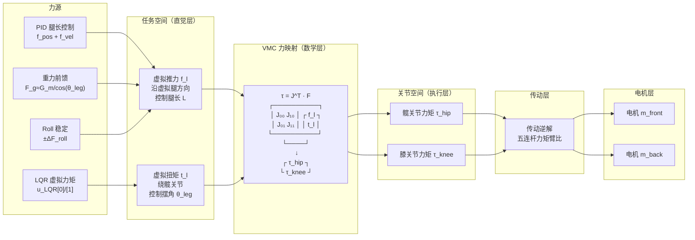

> 上图说明： VMC 的精髓在于"在任务空间设计控制器，在关节空间执行力矩"——J^T 将两者解耦。腿长 PID、重力前馈、Roll 力差和跳跃脉冲叠加到轴向推力 f_l；LQR 的腿部输出作为摆腿虚拟力矩 t_l。两者组成 F = [f_l, t_l]^T，经 J^T 一次映射得到关节力矩，再经传动逆解得到电机指令。J^T 映射不涉及动力学参数（质量、惯量），仅依赖几何（当前姿态 q）——这是 VMC 相比逆动力学方法的本质优势。

**虚功原理的数学表达：**

任务空间虚位移 δx 所做的虚功等于关节空间虚位移 δq 所做的虚功：

$$F^T \cdot \delta x = \tau^T \cdot \delta q$$

由运动学微分关系 δx = J·δq（J 为 2×2 雅可比矩阵），代入得：

$$F^T J \delta q = \tau^T \delta q$$

由于 δq 任意非零：

$$\tau = J^T F$$

这就是 VMC 的数学核心：关节力矩 = 雅可比转置 × 任务空间力。

**串联腿中 J 的物理含义：**

J 是 2×2 矩阵，将关节空间速度映射到任务空间速度：

$$\begin{bmatrix} \delta L \\ \delta\theta_{leg} \end{bmatrix} = \begin{bmatrix} \partial L/\partial\theta_{hip} & \partial L/\partial\theta_{knee} \\ \partial\theta_{leg}/\partial\theta_{hip} & \partial\theta_{leg}/\partial\theta_{knee} \end{bmatrix} \begin{bmatrix} \delta\theta_{hip} \\ \delta\theta_{knee} \end{bmatrix}$$

- J[0,0] = ∂L/∂θ_hip：髋关节角度变化对腿长的影响
- J[0,1] = ∂L/∂θ_knee：膝关节角度变化对腿长的影响
- J[1,0] = ∂θ_leg/∂θ_hip：髋关节角度变化对摆杆角度的影响
- J[1,1] = ∂θ_leg/∂θ_knee：膝关节角度变化对摆杆角度的影响

J 各元素的解析表达式已在 [2.5 节](#2.5) 推导。与并联腿不同，串联腿 J 的元素均为 sin/cos 的简单组合，不含复杂的分式结构。

**J 的两种求解方式：**

| 方法 | 实现 | 优点 | 缺点 |
|------|------|------|------|
| 解析求导 | 对正解公式链式求导 | 精确，计算快 | 推导繁琐，需验证 |
| 数值差分 | 对正解施加 ε 扰动，ΔL/ε, Δθ/ε | 简单可靠 | 计算量大，ε 选择有讲究 |

开发流程建议：先用数值法得到 J，再用解析法和数值法交叉验证。这是 VMC 力矩映射中最容易出错的环节——如果 sin/cos 排列或符号错误，四路力矩全部异常，机器人无法平衡。

### <a id="6.2"></a>6.2 串联腿 VMC 力矩映射

**定义任务空间力：**

$$F = [f_l,\ t_l]^T$$

其中 f_l 为沿虚拟腿方向的推力（用于控制腿长），t_l 为绕虚拟腿铰点的力矩（用于控制摆杆角度）。

**VMC 映射（关节空间）：**

将任务空间力映射为髋/膝关节力矩：

$$\tau_{hip} = J_{0,0} \cdot f_l + J_{1,0} \cdot t_l$$

$$\tau_{knee} = J_{0,1} \cdot f_l + J_{1,1} \cdot t_l$$

其中 J 矩阵的各元素见 [2.5 节](#2.5) 的解析推导。展开后：

$$\begin{aligned}
\tau_{hip} &= f_l \cdot \frac{x_c \frac{\partial x_c}{\partial \theta_{hip}} + z_c \frac{\partial z_c}{\partial \theta_{hip}}}{L} + t_l \cdot \left(-\frac{z_c \frac{\partial x_c}{\partial \theta_{hip}} - x_c \frac{\partial z_c}{\partial \theta_{hip}}}{L^2}\right) \\[6pt]
\tau_{knee} &= f_l \cdot \frac{x_c \frac{\partial x_c}{\partial \theta_{knee}} + z_c \frac{\partial z_c}{\partial \theta_{knee}}}{L} + t_l \cdot \left(-\frac{z_c \frac{\partial x_c}{\partial \theta_{knee}} - x_c \frac{\partial z_c}{\partial \theta_{knee}}}{L^2}\right)
\end{aligned}$$

**与控制系统的集成（串联腿完整力矩流）：**

在主循环中：
1. 轴向推力：f_l = 腿长位置 P + 速度 P + 重力前馈 + Roll 力差 + 跳跃脉冲
2. 摆腿力矩：t_l = LQR 计算出的该腿虚拟力矩
3. VMC 映射（关节空间）：(τ_hip, τ_knee) = J^T · (f_l, t_l)
4. 传动逆解（关节→电机）：(τ_motor_front, τ_motor_back) = 五连杆传动逆解(τ_hip, τ_knee)
 - 对于链传动的简单情况：τ_motor = τ_joint / gear_ratio
 - 对于五连杆耦合传动：需通过传动雅可比转置 (J_trans)^T 映射

**验证方法：**
1. 先用 Python 数值差分验证解析 J（见 2.5.3 节）
2. 再单独验证传动逆解的正确性
3. 最后端到端验证：给定 (f_l, t_l)，检查最终电机力矩指令的符号和量级
4. 在移植到 C 之前必须完成所有验证步骤——VMC+传动逆解中的符号错误是最常见的实机调试失败原因

**与并联腿 VMC 的对比：**

| 特性 | 并联腿 VMC | 串联腿 VMC |
|------|-----------|---------------------------|
| J 维度 | 2×2 | 2×2（相同维度） |
| J 复杂性 | 复杂分式（含 sin(φ_front-φ_back) 分母） | 简单 sin/cos 组合 |
| 输出目标 | 直接输出电机力矩 | 先输出关节力矩，再经传动逆解 |
| 奇异条件 | sin(φ_front-φ_back)≈0 | `sin(θ_knee)≈0` 或 `L≈0` |
| 调试粒度 | 一层映射 | 两层映射（J^T + 传动逆解），可分层调试 |

---

## <a id="7"></a>7. 状态估计

LQR 需要全部 10 个状态作为反馈。但并非所有状态都可以直接测量——姿态（θ）可由 IMU 获取，但位移（x）和速度（ẋ）不能直接测量，需要传感器融合。

> 概念解释：状态估计 (State Estimation)
>
> 状态估计是从含噪声的传感器测量中重构系统全状态的过程。LQR 需要全部 10 个状态（x = [x, ψ, θ, θ_L, θ_R, ẋ, ψ̇, θ̇, θ̇_L, θ̇_R]^T）作为反馈。其中姿态角（θ, ψ）和各角速度（θ̇, ψ̇, θ̇_L, θ̇_R）可从 IMU 直接或间接获取，但水平位移 x 和水平速度 ẋ 无法直接测量——需要状态估计器（Kalman 滤波器）融合多传感器数据来重构。
>
> 纯 IMU 积分的漂移问题： 理论上 x(t) = ∬₀ᵗ a_world(τ) dτ²。但 IMU 加速度计输出的是机体系下的比力，必须先经姿态旋转并扣除重力，才得到世界系线加速度。加速度计零偏 b（bias）和随机噪声 w 会被积分放大：积分一次产生速度漂移，积分两次产生位置漂移。因此纯惯性积分的误差会随时间快速累积，必须用轮式里程计提供长期位置约束来抑制漂移。Kalman 滤波器通过将 IMU 线加速度作为过程输入（预测步）和轮式里程计作为观测（更新步），自动权衡两者的不确定性实现融合。

**全状态估计数据流图：传感器 → 估计器 → LQR 反馈：**

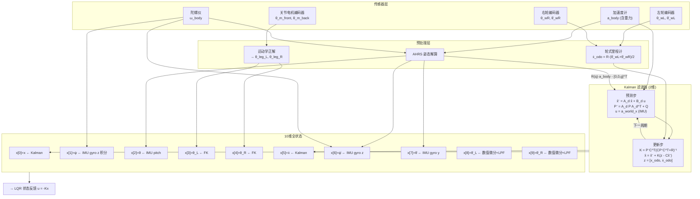

> 上图说明： 10 个状态来自 3 条路径——① Kalman 滤波器融合 IMU 加速度和轮式里程计产生 x[0] 和 x[5]（唯一需要融合的状态），② IMU + 运动学直接产生 6 个状态（x[1~4], x[6~7]），③ 数值微分 + 低通滤波产生 2 个状态（x[8~9]，因微分放大噪声需加 LPF）。Kalman 滤波器子图表示"预测-更新"循环——这是唯一有动态收敛过程的状态估计环节。

### <a id="7.1"></a>7.1 IMU 姿态解算——常见算法对比

| 方案 | 传感器条件 | 算法 | 特点 |
|------|--------|------|------|
| VQF | 六轴 IMU | 双四元数 + Kalman 在线零偏估计 + 静止检测 | Yaw 漂移极低，抗运动加速度干扰强，pitch/roll 收敛速度适中，综合效果优于 Mahony 和 EKF |
| Mahony 互补滤波 | 六轴 IMU | PI 修正器 + 陀螺零偏估计 | 轻量，无矩阵运算，pitch/roll 收敛最快，但抗运动干扰能力差、波形噪声大 |
| Madgwick AHRS | 六轴或九轴 IMU | 梯度下降优化的四元数估计 | 比 Mahony 精度更高，计算量相当，对磁力计融合扩展性好 |
| EKF 姿态估计 | 噪声特性已标定的 IMU | 扩展 Kalman | 依赖精确噪声模型，Yaw 轴可观性弱导致易漂移，需额外配合卡方检测、渐消滤波等手段，调参复杂 |
| INS 任务解算 | 板载或外置 IMU | 加速度/角速度直接积分 | 最简单但漂移最快，无修正机制 |

所有方案共通的任务：从加速度计读数中分离重力分量和运动加速度，作为 Kalman 水平加速度估计的输入（见 7.4）。

在轮腿控制中的选型建议：VQF 在 Yaw 漂移抑制和抗运动干扰方面优于 Mahony 和 EKF，建议作为主算法。Mahony 可作为计算资源极度受限时的备选。Madgwick 在需要融合磁力计的场景（九轴 IMU）下更有优势，对于仅需六轴 IMU 的轮腿平衡控制，VQF 的运动干扰鲁棒性和低 Yaw 漂移更契合需求。

> 概念解释：IMU (惯性测量单元) 的基本原理
>
> IMU 包含三轴加速度计（测量"比力"——单位质量所受的非引力外力，不是已经扣除重力后的坐标加速度）和三轴陀螺仪（测量绕各轴的角速度 ω_x, ω_y, ω_z, 单位 rad/s）。
>
> 传感器工作原理：
> - 加速度计（MEMS 电容式）：微机械质量块通过弹性梁悬挂，加速度使质量块相对固定电极产生位移 → 电容变化 → 电压信号。静止水平时，加速度计通常读到与重力大小相同、方向取决于传感器坐标约定的比力，因此可用于估计重力方向。运动时读数同时包含线加速度和重力补偿项，必须结合姿态矩阵得到世界系线加速度。
> - 陀螺仪（MEMS 振动式）：利用科里奥利效应——旋转坐标系中运动的质点受到垂直于运动方向和旋转轴的惯性力。通过测量振动质量感应的科里奥利力来反推角速度。陀螺仪直接输出角速度，对其积分可获得角度增量，但零偏 b_g（即使静止也输出的残余值）会随时间累积——∫b_g dt 导致角度线性漂移。
> - 互补特性（频域视角）：加速度计 → 低频有效（重力方向长期准确，但运动加速度是高频干扰）；陀螺仪 → 高频有效（短期角速度积分准确，但零偏在低频累积）。二者的频域互补性（低通+高通 = 全通）是所有姿态融合算法的设计基础。

> 概念解释：互补滤波、Mahony 与 Madgwick (Complementary Filter, Mahony & Madgwick AHRS)
>
> 互补滤波器利用加速度计的低频有效性和陀螺仪的高频有效性进行频域融合。Mahony 算法在此基础上添加了 PI 修正器来估计和补偿陀螺仪零偏。Madgwick 算法使用梯度下降法在四元数空间直接优化姿态估计。
>
> 三种方案的数学结构：
> - 互补滤波：`q_est = α · q_acc + (1-α) · q_gyro`——α ∈ (0,1) 以频域互补方式权衡。α → 0 偏信陀螺仪（高频响应好，噪声低），α → 1 偏信加速度计（低频收敛性好）。α 的选择本质上是截止频率的设定。
> - Mahony（显式互补+PI）：角速度修正项 = K_p · e(q) + K_i · ∫e(q)dt，其中 e(q) 为加速度计测量方向与当前姿态估计的重力方向之间的叉积误差。K_p 对应当前姿态误差的比例修正，K_i 对陀螺零偏进行积分估计和补偿——PI 结构提供了零偏自校准能力。
> - Madgwick（梯度下降优化）：将姿态解算转化为最优化问题——寻找四元数 q 使加速度计方向与重力预测方向的误差函数最小化。使用梯度下降法迭代求解，收敛速度快于 Mahony，且对磁力计融合有更好的扩展性。
>
> 在轮腿控制中的选型建议： VQF 为本文档推荐方案。Mahony 可作为计算资源极度受限时的备选（例如在低性能 MCU 上）。Madgwick 的优势在需要融合磁力计的场景（九轴 IMU），对于仅需六轴 IMU 的轮腿平衡控制，VQF 的运动干扰鲁棒性和低 Yaw 漂移更契合需求。

> 概念解释：四元数 (Quaternion) — 为什么不用欧拉角？
>
> 四元数 q = w + xi + yj + zk ∈ ℍ（哈密顿四元数代数）是 SO(3) 旋转群的非奇异参数化。欧拉角（roll-pitch-yaw, 3 参数）在特定姿态下会出现万向节锁（Gimbal Lock）——yaw 和 roll 两自由度合二为一，失去描述三维旋转的能力。四元数用 4 个参数 + 1 个单位范数约束（|q| = 1）参数化 SO(3)，在姿态表示上没有欧拉角的万向节锁问题，但存在 q 和 -q 表示同一旋转的双覆盖特性。
>
> 四元数的数学结构：
> - 表示旋转：`q = [cos(θ/2), sin(θ/2)·u_x, sin(θ/2)·u_y, sin(θ/2)·u_z]`——绕单位轴 u 旋转 θ 弧度
> - 旋转合成：q_combined = q₁ ⊗ q₂（四元数乘法，非交换）——连续两次旋转直接相乘，无需三角运算
> - 旋转向量：v' = R(q)·v，其中 R(q) 为四元数导出的 3×3 旋转矩阵（见 7.4 节）
> - 关键性质：q 和 -q 表示同一旋转（双覆盖，double cover）——SO(3) ≅ ℍ/{q ∼ -q}
>
> 在轮腿控制中的工程注意事项： IMU 输出的四元数有两种常见格式——scalar-first [w, x, y, z] 和 scalar-last [x, y, z, w]。旋转矩阵 R(q) 的构造公式对两种格式不同——格式不匹配会导致姿态角严重错误。这是移植到 C 时需优先验证的环节（读取 IMU 原始四元数，手动验证旋转方向）。

### <a id="7.2"></a>7.2 轮式里程计——打滑与累积误差

**基本公式：**

$$\dot{x}_{odo} = \frac{R_L \dot{\theta}_{wL} + R_R \dot{\theta}_{wR}}{2}$$

**实机中的误差来源：**
- 打滑：轮子空转时里程计读数偏大，Kalman 滤波中通过较大的观测噪声 R 抑制
- 轮胎半径偏差：充气轮胎实际半径 ≠ 标称值，需标定（跑已知距离后反算有效半径）
- 轮子离地：离地后里程计完全失效，此时需切换到只依赖 IMU 加速度的纯惯性模式

### <a id="7.3"></a>7.3 Kalman 滤波器设计——2 维 vs 全状态

> 概念解释：Kalman 滤波器 (Kalman Filter) — 递归最小方差估计
>
> Kalman 滤波器是线性高斯系统中状态的最优递归估计器——它在每一步迭代中产生状态的最小均方误差（MMSE）估计。算法由两步组成：预测步（运用系统模型 A_d, B_d 将前一时刻估计前推）和更新步（运用传感器测量 z_k 和 Kalman 增益 K 修正预测值）。
>
> 数学结构（离散时间 Kalman 滤波）：
>
> 预测步（先验估计）：
> - x̂⁻_k = A_d x̂_{k-1} + B_d u_{k-1}——状态前推
> - P⁻_k = A_d P_{k-1} A_d^T + Q——协方差前推（Q 为过程噪声协方差，模型不确定性）
>
> 更新步（后验估计）：
> - K_k = P⁻_k C^T (C P⁻_k C^T + R)⁻¹——Kalman 增益（R 为测量噪声协方差）
> - x̂_k = x̂⁻_k + K_k (z_k - C x̂⁻_k)——状态修正（z_k 为测量，C x̂⁻_k 为预测测量）
> - P_k = (I - K_k C) P⁻_k——协方差缩减
>
> Kalman 增益 K 的最优性： K 在每一时刻被选择为最小化后验估计误差协方差 tr(P_k) 的值。K 自动权衡模型预测和传感器测量的相对可信度：
> - R ≫ Q：传感器噪声远大于过程噪声 → K → 0（几乎不相信测量，主要依赖模型预测）
> - Q ≫ R：过程噪声远大于传感器噪声 → K 增大（更依赖传感器来修正预测）
>
> 在轮腿控制中的 2 维简化： 仅需估计水平位置和速度（2 个状态），因为 LQR 实际反馈需要的是 x 和 ẋ，加速度不是 10 维 LQR 状态的一项。面向 rm_balance、RP_Balance 这类轻量工程场景，IMU 水平加速度（经四元数旋转至世界坐标系并扣除重力）作为过程输入 u，轮式里程计的位置/速度作为观测 z——Kalman 滤波自动产生位移 x 和速度 ẋ 的最优估计，供给 LQR 状态反馈。

**2 维加速度输入模型：**

状态 x_kf = [位移, 速度]^T，控制输入 u = a_world_x。

$$A = \begin{bmatrix} 1 & dt \\ 0 & 1 \end{bmatrix},\quad B = \begin{bmatrix} dt^2/2 \\ dt \end{bmatrix}$$

**观测可选两种形式：**
- 若维护轮式里程计累计位移：z = [x_odo, ẋ_odo]^T，C = [[1, 0], [0, 1]]。
- 若只信任轮速：z = [ẋ_odo]，C = [0, 1]；位移由滤波器对速度积分得到。

**3 维恒加速度模型：**

若确实希望估计加速度状态，则状态可写为 x_kf = [位移, 速度, 加速度]^T：

$$A = \begin{bmatrix} 1 & dt & dt^2/2 \\ 0 & 1 & dt \\ 0 & 0 & 1 \end{bmatrix}$$

此时 IMU 加速度作为观测 z_a = a_world_x 融合进更新步，例如 C_acc = [0, 0, 1]；或者把加速度状态视作随机游走，仅通过较大的过程噪声 Q_a 表示未知外部加速度。工程上 3 维方案多估计了一个 LQR 不直接使用的量，调参难度高于 2 维方案。

**2 维速度-加速度模型（备选方案）：**

除上述加速度输入模型外，另一种工程上常用的结构是将状态设为 x_kf = [速度, 加速度]^T，以恒加速度模型作为状态方程（F = [1, dt; 0, 1]），将 IMU 加速度作为观测量而非过程输入（即 B=0, H=I）。此时：

$$A = \begin{bmatrix} 1 & dt \\ 0 & 1 \end{bmatrix},\quad z = \begin{bmatrix} v_{wheel} \\ a_{IMU} \end{bmatrix},\quad H = \begin{bmatrix} 1 & 0 \\ 0 & 1 \end{bmatrix}$$

两种结构的数学等价性在理想条件下成立，但在打滑场景下行为不同：
- 加速度输入模型（B≠0）：打滑时增大 R 使滤波器更信任模型预测（IMU 加速度积分），但轮速异常仍通过 B 进入预测步
- 速度-加速度模型（B=0, H=I）：打滑时将速度观测源从原始轮速切换为上一时刻滤波速度，并大幅增大速度观测噪声 R_vel，形成纯预测模式——滤波器仅靠加速度观测量维持速度估计，与打滑的轮速完全隔离

**噪声参数设计原则：**

| 参数 | 含义 | 增大时的效果 |
|------|------|------------|
| Q | 过程噪声协方差 | 更不信任模型/IMU 预测 → 更愿意让观测修正状态 |
| R | 观测噪声协方差 | 更不信任轮式里程计观测 → 更依赖 IMU 加速度预测 |

通常策略：常态下给轮速观测一个可用但不激进的 R；检测到打滑、离地或强碰撞时临时增大 R，使滤波器短时间更依赖 IMU 加速度预测。Q 反映 IMU 加速度零偏、姿态补偿误差和未建模扰动，过小会导致滤波器对真实加减速响应迟钝，过大会把 IMU 噪声积分进速度和位移。

**全状态 Kalman vs 轻量方案的取舍：**

| 方案 | 状态维度 | 计算量 | 说明 |
|------|----------|--------|------|
| 2 维加速度输入 | 2 | 最低 | 估计位移/速度，IMU 加速度作为过程输入；推荐用于 LQR 的 x 和 ẋ |
| 2 维速度-加速度 | 2 | 最低 | 估计速度/加速度，IMU 加速度作为观测（B=0, H=I）；打滑时速度观测可切换到滤波值以实现纯预测 |
| 3 维恒加速度 | 3 | 低 | 估计位移/速度/加速度；加速度应作为观测或随机游走状态，不能同时作为输入 |
| 6 维轮腿全状态 | 6 | 中 | 需包含更多轮腿耦合状态 |
| 10 维全状态 EKF | 10 | 高 | 完整状态估计，实机计算负担需评估 |

对于 10 维 LQR 方案，2 维 Kalman 仅提供 x 和 ẋ 两个估计值（维度 0 和 5），其余 8 个状态从 IMU 和运动学直接获取。

### <a id="7.4"></a>7.4 加速度坐标变换——四元数旋转矩阵

将机体坐标系加速度计比力 a_body 转换到世界坐标系。若 R(q) 表示 body → world，世界系 z 轴向上，且静止水平时 R(q)·a_body = [0,0,g]^T，则线加速度为：

$$a_{world} = R(q) \cdot a_{body} - [0,\ 0,\ g]^T$$

旋转矩阵 R(q) 由四元数 q = [w, x, y, z] 构造（scalar-first 序）：

```
R = [[1-2y²-2z², 2xy-2zw, 2xz+2yw ],
 [2xy+2zw, 1-2x²-2z², 2yz-2xw ],
 [2xz-2yw, 2yz+2xw, 1-2x²-2y²]]
```

取 a_world 的 x 分量作为 Kalman 滤波的控制输入 u[0]。如果 IMU 驱动输出已经扣除了重力，或坐标轴定义不同，上式的重力项符号必须随驱动约定调整。

易错点： 四元数顺序在不同库中不同（scalar-first [w,x,y,z] vs scalar-last [x,y,z,w]）。移植到 C 时必须确认 IMU 驱动输出的四元数顺序，否则旋转矩阵全部错误。

## <a id="8"></a>8. PID 级联控制与力控框架

> 概念解释：PID 控制器 (Proportional-Integral-Derivative Controller)
>
> PID 控制器 `u(t) = K_p e(t) + K_i ∫₀ᵗ e(τ)dτ + K_d de/dt` 是反馈控制中最通用的结构。三项分别作用于误差的不同时间尺度：P——瞬时比例响应（增大 K_p 加快响应但增加超调），I——累积历史误差以消除稳态偏差（增大 K_i 消除静差但引入相位滞后），D——误差变化趋势以提供预测性阻尼（增大 K_d 抑制振荡但对噪声敏感）。
>
> 传递函数视角（频域）： `C(s) = K_p + K_i/s + K_d s`。P 项为 0 dB 平坦增益，I 项在低频有高增益（ω → 0 时 |C| → ∞，消除稳态误差），D 项在高频有高增益（对高频噪声放大）。因此纯 D 控制器在工程中极少使用——通常串联低通滤波器组成"不完全微分"。
>
> 在轮腿控制中的 PID 应用场景：
> - 腿长控制（位置 P + 速度 P）：仅用 P 项（K_d 项通过独立的速度 P 环实现，避免纯微分放大噪声）——`f_l = K_p_pos (L_des - L) + K_p_vel (0 - L̇)`。这是"P-P 级联"而非传统 PID——本质上是两个 P 控制器级联，其中内环速度控制器提供等效的微分阻尼效果。
> - Roll 控制：P+D（P 对 roll 角度偏差，D 对 roll 角速度），D 通过陀螺仪直接测量而非微分获取——避免了数值微分的噪声放大问题。
> - 无 I 项的取舍：腿长与 Roll 通道通常先使用 P/PD，是为了降低调试风险和避免积分饱和。LQR 的位置状态反馈可以抑制相对目标的偏差，但普通 LQR 不包含误差积分；若存在持续外扰、模型偏差或负载偏移，需要额外的积分环节、平衡点补偿或前馈补偿来消除静差。

> 概念解释：级联控制 (Cascade Control)
>
> 级联控制的传递函数结构为 `u = C_outer · (r - C_inner · u)`，外环输出作为内环的参考输入。设计原则：内环带宽 ω_inner 至少为外环带宽 ω_outer 的 3-5 倍。级联结构的优势在于内环可以更快地抑制进入内环的扰动，而不必等待扰动通过整个外环动力学后才被检测和修正。
>
> 数学解释： 设外环对象为 P_outer(s)，内环对象为 P_inner(s)。级联后等效开环传递函数为 `C_outer(s) · C_inner(s)·P_inner(s)/(1+C_inner(s)·P_inner(s)) · P_outer(s)`。内环闭环传递函数的带宽 ω_inner_CL 决定了"内环对参考输入的跟踪速度"——若 ω_inner_CL ≫ ω_outer，则从外环视角看，内环近似为一个理想的增益为 1 的跟随器，外环设计可以独立于内环细节进行。
>
> 在轮腿控制中： 腿长位置环输出期望速度给速度环，速度环应比位置环具有更高带宽。当腿部因外力扰动产生速度突变时，速度环可以先行抑制扰动；若仅用单环位置控制器，需要等到位置偏差累积后才响应，延迟更大。

### <a id="8.1"></a>8.1 腿长位置-速度级联

**腿长控制采用位置环 + 速度环的级联结构：**

**PID 级联控制 + 力控综合架构图：**

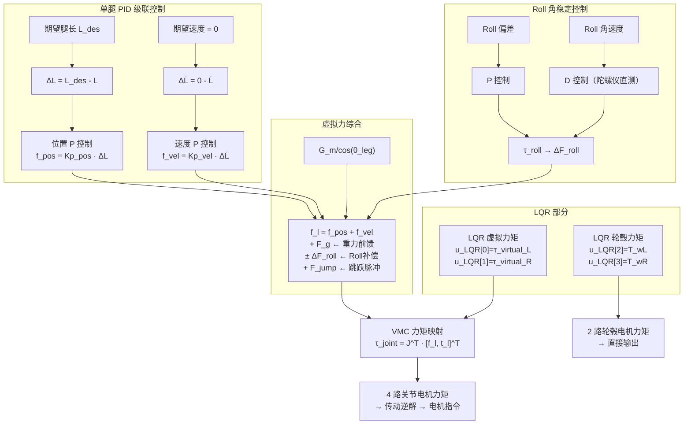

> 上图说明： 完整力控框架包含轴向推力通道和摆腿力矩通道。轴向推力 f_l 由腿长 P-P 级联、重力前馈、Roll 力差和跳跃脉冲组成；摆腿力矩 t_l 由 LQR 的腿部虚拟力矩输出给出。速度环以 P 控制实现，起阻尼作用——等效于位置环的 D 项但避免了数值微分的噪声放大。

**位置环（P 控制）：**

$$f_{pos} = k_{p,pos} \cdot (L_{des} - L_{actual})$$

**速度环（P 控制）：**

$$f_{vel} = k_{p,vel} \cdot (0 - \dot{L}_{actual})$$

**总虚拟力：**

$$f_l = f_{pos} + f_{vel} + F_g,\quad F_g \approx \frac{G_m}{\max(\cos θ_{leg},\epsilon)}$$

速度环起阻尼作用——抑制位置环可能引起的振荡。若 f_l 定义为沿虚拟腿方向的支撑力，重力前馈的量级应按竖直支撑分量折算；实际符号需与 f_l 的正方向和 J^T 映射约定一致。

### <a id="8.2"></a>8.2 Roll 角稳定控制

**Roll 角控制（P+D 控制）：**

$$τ_{roll} = k_{p,roll} \cdot (0 - φ_{roll}) + k_{d,roll} \cdot (0 - \dot{φ}_{roll})$$

Roll 控制器输出的是绕车体前后轴的力矩，需要按左右轮距 b_track 换算为左右腿轴向力差：

$$\Delta F_{roll} = \frac{τ_{roll}}{b_{track}}$$

再以相反符号叠加到左右腿的轴向推力上：

$$f_l += \Delta F_{roll},\quad f_r -= \Delta F_{roll}$$

这意味着当机器人向右倾斜时，右腿施加更大的推力，左腿减小推力，从而产生扶正力矩。

### <a id="8.3"></a>8.3 重力前馈补偿与力控综合

**轴向推力和摆腿力矩应分开计算：**

$$\begin{gathered}
f_L = f_{pos,L} + f_{vel,L} + F_{g,L} + \Delta F_{roll} + F_{jump,L} \\
f_R = f_{pos,R} + f_{vel,R} + F_{g,R} - \Delta F_{roll} + F_{jump,R} \\
t_L = U_{LQR}[0],\quad t_R = U_{LQR}[1]
\end{gathered}$$

其中：
- F_g 为沿虚拟腿方向的重力前馈（由机械质量和姿态决定，需根据实际标定）
- F_jump 为跳跃脉冲力（根据所需起跳加速度设定）
- U_LQR[0], U_LQR[1] 为 LQR 输出的左右腿虚拟力矩，进入 VMC 的 t_l 通道，不与轴向推力直接相加

**VMC 映射后再加上 LQR 的轮毂力矩：**

$$U_{out} = [τ_{hip,L},\ τ_{knee,L},\ τ_{hip,R},\ τ_{knee,R},\ U_{LQR}[2],\ U_{LQR}[3]]^T$$

即 4 个腿部关节力矩（VMC 分配）+ 2 个轮毂力矩（LQR 直接输出）。

### <a id="8.4"></a>8.4 LQR 俯仰方向的附加补偿

§8.3 描述的是沿虚拟腿轴向的力控综合（f_l）。在 LQR 的俯仰控制方向（机体俯仰 θ_B、腿摆角 θ_L/θ_R），还需叠加因质心位置变化引起的重力矩补偿。这些补偿量不进入 VMC 的力通道，而是作为状态目标偏移量的修正，合并到 LQR 控制律 u = -K·(X - X_target) 的目标向量 X_target 中。

常见的附加补偿源包括：

车体高度补偿：随着腿长变化，机体质心高度改变，重力对各广义坐标的力矩随之改变。将补偿量拟合为当前估算高度 h = (L_l + L_r)/2 的多项式函数，通常用三次多项式即可在腿长范围内获得足够的拟合精度。

负载变化补偿：机器人在运行过程中载荷可能发生变化（如云台转动导致质心偏移、弹药消耗导致总质量减少），这些变化同样影响重力矩分布。可分别拟合为对应输入变量（云台俯仰角、剩余弹药数等）的多项式补偿函数，乘以方向因子后叠加到俯仰方向补偿量中。

气弹簧补偿：若腿部安装了物理气弹簧等弹性储能元件，其非线性弹力会随腿长和连杆几何变化。需要在力控通道中单独建立气弹簧的等效轴向力模型（通常为腿长 L 和连杆夹角的非线性函数），作为前馈项注入腿长 PID 输出中。在机器人离地（跳跃空中阶段）时应将该补偿项清零，因为此时气弹簧不再承重，其弹力会成为扰动。

各补偿源的系数需通过实验标定确定（不同腿长下稳态平衡测试，记录偏差并拟合），标定后固定存入嵌入式端的系数数组中，在线运行时根据当前传感器值计算总补偿量。

---

## <a id="9"></a>9. 地面接触检测与悬空控制

### <a id="9-principle"></a>原理

> 概念解释：地面接触力估计 (Ground Reaction Force Estimation)
>
> 基于牛顿第二定律的力观测器：将轮子视为独立刚体，取 z 轴向上。若 F_leg,z 定义为腿对轮子施加的竖直向上力，则垂直方向受力方程为 m_w · z̈_w = F_leg,z + F_n - m_w g，解得 F_n = m_w z̈_w + m_w g - F_leg,z。若工程实现中把 P_l 定义为腿对轮子的向下压力，则等价写成 F_n = m_w z̈_w + m_w g + P_l。关键是统一力的正方向。
>
> 力观测器的信息源： 所需全部量均可从现有传感器和控制器输出获取——F_leg 来自 VMC 输出力矩经 J⁻ᵀ 反算轮端力（或直接从 PID+LQR 的任务空间输出获得），z̈_w 来自电机编码器→传动正解→串联 FK→二阶数值微分。无需额外的力/触觉传感器——这是一个纯软件实现的"虚拟传感器"。
>
> 三种接触状态的判据：
> - 正常接地：F_n > F_threshold → 轮子有效支撑
> - 离地 (airborne)：F_n < F_threshold → 地面支撑力丧失，轮子在空中
> - 卡腿 (stuck)：F_n 异常增大 + 轮速 ≈ 0 + 腿部驱动力矩接近上限 → 轮子被障碍物卡住

**通过牛顿第二定律估算地面法向反力：**

简化模型仅考虑轮端质量在垂直方向的受力平衡：

$$F_{n,l} = m_l \ddot{z}_{wheel,l} + m_l g - F_{leg,z,l}$$

其中 F_leg,z,l 为腿对左轮施加的竖直向上力，m_l 为等效轮质量，z̈_wheel,l 为轮垂向加速度。

更完整的力估计模型应纳入腿部运动引入的全部惯性项。将执行器力（F0）、摆杆力矩（Tp）、IMU 加速度和腿运动学量综合，经轮端动力学展开得到：

$$F_n = (F_0 - G_{comp}) \cos\theta + \frac{T_p \sin\theta}{L_0} + m_{eq} \cdot a_{z,IMU} - m_{eq} \cdot \ddot{L}_0 \cos\theta + 2 m_{eq} \cdot \dot{L}_0 \dot{\theta} \sin\theta + m_{eq} \cdot L_0 \ddot{\theta} \sin\theta + m_{eq} \cdot L_0 \dot{\theta}^2 \cos\theta$$

各项物理含义分别为：执行器力垂直分量、摆杆力矩贡献、IMU 测得的垂直加速度、腿伸缩惯性力、科里奥利力、切向惯性力、向心加速度。其中 dd_L0（腿长加速度）和 dd_theta（腿角加速度）由相应速度量经低通滤波后数值微分得到。对计算结果做滑动均值滤波可进一步抑制微分噪声。

### <a id="9-airborne"></a>离地检测

$$F_{n,l} < F_{threshold} \implies \text{left wheel airborne}$$

此时将 K 矩阵中与该轮相关的所有系数清零，相当于切换到悬空控制模式——LQR 不再控制已离地的轮子，避免对空转轮子施加无意义的力矩。

这是简化但有效的处理方式。更高级的方案（如北理工 MPC+ESO）会设计专门的悬空控制器。

### <a id="9-stuck"></a>卡腿检测与处理

当轮子被障碍物卡住（如台阶棱角、地面突起）时，轮毂电机堵转会导致里程计停滞，同时腿部力矩异常增大。需要在控制层面检测并处理。

检测采用时间累积机制以避免瞬态误触发：当轮毂力矩超过阈值且腿摆角绝对值同时超过阈值时，开始累加持续时间计数器；当腿角回落到较小范围时清零计数器。持续时间超过 BST_THRESHOLD 后正式判定为卡腿状态。

处理采用渐进式补偿策略——卡住时间越长，系统响应越强：
- 补偿力随卡住时间线性增长（有上限），叠加到该腿的 VMC 轴向力通道中，辅助将腿推出卡滞位置
- 腿长目标随卡住时间线性缩短，通过改变腿部几何降低卡滞力矩
- 轮毂电流降低至正常值的约 60%，避免堵转过热
- LQR 层面标记该侧 theta_flag，清零对应侧的偏航增益、加倍该侧的腿-俯仰增益，优先利用姿态恢复帮助脱离卡滞

若上述渐进措施仍无法解除卡滞，应触发更高层级的保护逻辑（如急停或手动遥控辅助）。

### <a id="9-slip"></a>打滑检测与动态卡尔曼滤波

轮子打滑（如光滑地面、急加速）时，轮式里程计读数虚高，直接使用会严重破坏 Kalman 状态估计。

检测分为预判和确认两个阶段。预判条件为以下任一满足且不在旋转模式下：(a) 估算偏航角速率与 IMU 实测偏航角速率之差超过阈值 DBY_THRESHOLD；(b) 任一侧轮速的绝对值与车体速度估值之差超过阈值 DVB_THRESHOLD。预判通过后，比较轮速变化量 dv_wheel（经滑动均值滤波后的相邻周期轮速差）与加速度积分速度变化 dv_acc = |a_x · dt|：若 dv_wheel - dv_acc ≥ DVW_THRESHOLD，则确认打滑，记录此刻的冻结轮速 f_dv_wheel 作为后续恢复判断的参考值。

处理策略分两个层面：
- Kalman 滤波器层面：检测到打滑后将速度观测噪声 R_vel 大幅增大（通常增大两个数量级），同时将速度过程噪声 Q_vel 适度降低，使滤波器更信任恒加速度模型的外推。若使用速度-加速度模型（§7.3），还可将速度观测源从原始轮速切换为上一时刻的滤波速度，形成与打滑轮速完全隔离的纯预测模式
- 执行器层面：打滑期间轮毂电流降低至正常值的约 60%，避免在低附着地面上过度驱动导致打滑加剧

恢复条件：当前轮速回落到冻结值 f_dv_wheel 以下时，认为打滑结束，恢复常规 R 和正常轮毂电流。无打滑时，可依据左右轮速差估算当前转弯半径 R_turn = L_wheel·(wL+wR)/(2·(wL-wR))，用于离心加速度的前馈补偿。

### <a id="9-com"></a>质心偏移补偿

机体质心因电池、云台、弹舱等载荷而产生偏移，导致运动学计算的腿摆角与真实质心位置之间存在系统误差。

**问题表现：**
- 当腿长变化时，腿部质心与轮-髋连线之间的夹角也会变化
- 这导致基于运动学正解算出的 θ_leg 不能准确反映系统的真实质心分布

**补偿方法：**
- 通过实验标定不同腿长下质心偏移对 θ_leg 的影响
- 用多项式拟合 θ_leg 的补偿量随腿长 L 的变化：
 $$\theta_{leg\_comp} = \theta_{leg\_measured} - \delta\theta(L)$$
 其中 δθ(L) 为一个关于腿长 L 的多项式，系数通过标定实验获取
- 将此补偿集成到状态估计中，作为 LQR 反馈的 θ_L/θ_R 状态的修正

质心偏移会改变最优 K 矩阵中与机体俯仰相关的元素，这表明质心位置标定是决定 K 矩阵能否从仿真迁移到实机的关键因素。

### <a id="9-self-rescue"></a>倒地自救援——一种可行方法

当机器人因碰撞、失控等原因翻倒后，需要一套自动化的恢复流程使其重新站立。以下给出一种基于分阶段状态机的可行方案，核心思想是利用腿部的大范围摆动能力，逐步将机体从倒地姿态翻转为竖直姿态。不同平台可根据自身机构的关节运动范围和几何约束设计适合的恢复策略。

翻倒姿态识别：根据 IMU 的俯仰角和滚转角判断摔倒方向。当 |Pitch| ≥ 90° 时判定为完全翻倒；进一步根据 Roll 的符号区分面朝下/背朝下（Roll ≤ 0）与坐姿摔倒（Roll > 0），不同姿态对应不同的腿部初始摆动方向。

前翻恢复流程（机体前倾触地场景）：分为两步——步骤 0 将腿角驱动至一个预设的角度窗口内（例如 [-1.0, 1.26] rad），该窗口确保轮端能接触地面产生支撑力；进入窗口后自动切换至步骤 1，将腿角 PID 归中至竖直姿态附近。双腿 abs_leg_theta 均回到预设的小角度范围内（例如 [-0.4, 0.4] rad）后判定恢复完成。

不对称恢复策略：为避免两侧腿部同时大幅度动作导致的失稳，根据当前绝对偏航角判断哪条腿先启动——偏航角在后半圆的腿优先动作，一侧完成关键步骤后另一侧再跟随。自救援期间强制 Tp = 0、F0 = 0、T_Wheel = 0，腿部完全由摆杆位置 PID 独立控制，不经过 LQR/VMC 链路，避免 LQR 在异常姿态下产生不可预期的输出。

自救援状态的触发判据通常包括摆杆角度超出安全范围或当前位置与目标位置的偏差过大。由于 LQR 控制器引入 Kalman 观测器后构成 LQG 结构，其幅值/相位裕度理论上可能任意小（Doyle, "Guaranteed margins for LQG regulators", 1978），意味着即使在线性模型下闭环稳定的系统，在实际模型误差或外部扰动下也可能突然失稳。因此失稳检测和自救援机制是必要的安全防线，而非可选的锦上添花。

自救援状态机的参数（角度窗口边界、切换阈值、恢复判定角度等）需根据机构具体的关节运动范围和几何约束确定，无通用取值。

### <a id="9-speed-limit"></a>基于腿长的高度分级速度限制

轮腿机器人在不同腿长下的动力学特性差异显著——腿越短、质心越低、系统越稳定但允许的移动速度范围也相应收窄。为防止蹲伏姿态下的高速失稳，可根据当前估算高度 h = (L_l + L_r)/2 将最大平移速度和偏航速率分为多个等级，每级设定不同的上限值。高度越低、限速越严格。分级边界和各级限速值由具体平台的机构参数和实际测试确定。

转弯速度的额外约束：高速转弯时离心力会产生绕外侧轮的外翻力矩。离心力矩与重力恢复力矩的平衡条件给出转弯角速度上限 ω_max ∝ √(g·d/h)，其中 d 为等效轮距决定的力臂，h 为当前质心高度。该限幅应在偏航控制环的输出端执行，将偏航角速度指令钳制在安全范围内。限幅不仅防止翻倒，也能在功率层面避免转弯消耗过多能量。

### <a id="9-yaw"></a>偏航方向管理

10 维 LQR 方案将偏航角 ψ 纳入状态反馈，但偏航目标的设定策略同样影响控制效果。在需要双向移动的场景中，不需要物理调头，而是通过改变"前方"的定义实现反向行驶。

目标偏航角的自动选择：实时计算到预设正前方和正后方的角距离，选取较近的方向作为当前目标偏航，确保机器人总是以最短旋转路径对准最近的合法朝向。当操作手发出反向指令时，仅需切换目标朝向（正前↔正后），控制器自动完成转向。在紧急停止状态下，目标偏航应锁定为当前角度，防止停止瞬间的偏航突变。

偏航控制可区分两种工作模式——角度环和速度环。角度环以 ψ_des 为状态目标，适用于需要绝对朝向保持的场景；速度环以 ψ̇_des 为状态目标，适用于需要灵活转向的场景。两种模式使用相同的 LQR 反馈结构，仅目标状态的通道不同，可在运行时根据操作指令切换。

---

## <a id="10"></a>10. 跳跃控制——一种基于力控状态机的实现方法

轮腿机器人的跳跃控制本质上是一个基于虚拟腿力控的有限状态机。其核心思路是：跳跃不是位置轨迹跟踪，而是通过在不同阶段设定不同的虚拟腿长目标 L_des 和虚拟脉冲力 F_jump，利用高增益 PID 力控驱动腿部完成蓄力、起跳、收腿、着陆的动作序列。空中平衡通过将 LQR 状态反馈降维实现——悬空时仅保留姿态角/角速度反馈项，清零位移/速度项和轮毂力矩，避免对不存在的支撑面施加无效控制。

以下给出一种具体的六阶段状态机设计方案，各阶段的腿长阈值、力脉冲幅值、PID 增益放大系数等参数需根据具体平台的机械尺寸、电机能力、传动比和质量分布重新标定。

### <a id="10.1"></a>10.1 状态定义与转移逻辑

| 阶段 | 名称 | 物理含义 | 接触状态 |
|------|------|---------|---------|
| 0 | READY | 待命，维持站立姿态 | 着地 |
| 1 | CROUCH | 蓄力下蹲，降低质心 | 着地 |
| 2 | LAUNCH | 爆发伸展，产生起跳加速度 | 着地→离地 |
| 3 | TUCK | 空中收腿，减少转动惯量 | 离地 |
| 4 | LANDING | 着陆缓冲，吸收冲击 | 离地→着地 |
| 5 | RECOVER | 恢复站立姿态 | 着地 |

阶段零——READY：维持正常站立姿态（L_des = L_stand），施加较小的正向预载力以补偿腿长 PID 的稳态误差。收到跳跃指令（JumpFlag=1）后转入 CROUCH。

阶段一——CROUCH：将目标腿长瞬间切换为机构允许的最短腿长 L_min，施加向下的脉冲力加速下蹲。增大腿长 PID 的 Kp/Kd 增益（通常提升 2~5 倍），取消积分项以保证快速响应。此阶段仅做参数初始化，立即转移到 LAUNCH 阶段——实际的蓄力到位检测在 LAUNCH 阶段通过腿长阈值完成。

阶段二——LAUNCH：当双腿实际长度均达到蓄力到位阈值 L_crouch_th（略大于 L_min，留出收敛容差）时，将腿长目标瞬间切换为最长腿长 L_max。由于腿长 PID 具有高增益，实际腿长迅速跟踪目标，产生向上的地面反作用力脉冲——当该脉冲超过重力时，机器人质心获得向上的净加速度实现起跳。起跳瞬间将 FlyFlag 置 1，使后续控制立即禁用依赖地面接触的补偿项。当腿长伸展达到 L_extend_th 时转入 TUCK。

阶段三——TUCK：将目标腿长切换回 L_min（或更紧凑的 L_tuck），施加向下的辅助力加速收腿。收腿可减小绕髋关节的转动惯量（I_leg ∝ L²），改善空中姿态控制，同时提高越障净空并为着陆缓冲预留行程。当腿长伸展达到 L_extend_th 时转入 LANDING。

阶段四——LANDING：将腿长预置为半蹲着陆长度 L_land（介于 L_min 和 L_stand 之间），利用腿的剩余行程吸收落地动能。通过计时器确保机器人已在着陆姿态稳定足够长时间后才转入下一阶段，避免收腿过程中腿长短暂经过 L_land 附近的虚假触发。

阶段五——RECOVER：将腿长目标恢复为正常站立长度 L_stand，脉冲力恢复为正常预载力，清除着陆计时器。无条件立即转移回 READY，FlyFlag 清零、恢复全功能控制。

### <a id="10.2"></a>10.2 跳跃状态机与力控框架的衔接

跳跃状态机的轴向力综合沿用 §8.3 的力控框架（f_l = f_pos + f_vel + F_g ± ΔF_roll + F_jump），跳跃期间的差异仅在于各分量的取值和开关逻辑：

- 腿长 PID：Kp/Kd 放大至正常值的 2~5 倍，Ki 清零以保证快速响应。目标腿长 L_des 在各阶段取不同值（L_min → L_max → L_min → L_land → L_stand）
- 跳跃脉冲力 F_jump：各阶段取不同值（负向蓄力 → 清零靠 PID 自然起跳 → 负向辅助收腿 → 负向着陆阻尼 → 恢复预载）
- 气弹簧补偿 F_gas：见 §8.4。FlyFlag=1 时强制清零，因为空中气弹簧不再承重会成为扰动
- 滚转力差 ΔF_roll、离心力补偿等其余分量按正常逻辑运行，不受跳跃状态影响

摆腿方向的虚拟力矩 t_l 由 LQR 独立计算，不与轴向推力通道混合。

### <a id="10.3"></a>10.3 空中 LQR 降维

当机器人离地后，与地面接触相关的控制通道须降级或关闭：
- 虚拟腿力矩：仅保留腿摆角和角速度的反馈，清零位移/速度/偏航通道增益
- 轮毂力矩：直接清零，避免轮子空转并在着地瞬间造成打滑
- 离地判定可采用力观测器（见 §9-principle）或与跳跃飞行标志联合判定

### <a id="10.4"></a>10.4 跳跃参数与整定原则

以下参数为跳跃状态机特有的参数，机构参数（L_min、L_max、L_stand）的定义见 §2.2 和 §5。

| 参数 | 物理含义 | 整定原则 |
|------|---------|---------|
| L_land | 着陆缓冲姿态腿长 | 介于 L_min 和 L_stand 之间 |
| F_crouch | 加速下蹲的辅助力 | 过大导致冲击，过小蓄力时间过长 |
| F_tuck | 加速收腿的辅助力 | 仅需克服腿部惯性和摩擦力 |
| F_land | 着陆缓冲的辅助阻尼 | 帮助吸收冲击，不宜过大 |
| β_p | 跳跃时 Kp 放大倍数 | 通常 2~5 倍，越大起跳越猛烈 |
| β_d | 跳跃时 Kd 放大倍数 | 通常 1.5~3 倍，抑制伸展过冲 |
| L_crouch_th | 蓄力到位判定的腿长阈值 | L_min + ε（机械间隙+控制误差） |
| L_extend_th | 起跳完成判定的腿长阈值 | 通常取 (L_min + L_max)/2 附近 |
| T_land_min | 着陆稳定最短等待时间 | 取决于系统阻尼和冲击大小 |

调试建议：从较低起跳强度开始（降低 L_max 或增加 F_crouch 限制起跳冲量），逐步增加至目标高度。先静态验证跳跃 PID 增益下的腿长阶跃响应（快速无超调），再逐步联调全流程。

---

## <a id="11"></a>11. 仿真平台与对比分析

MuJoCo 是一个可选仿真平台，但并非唯一选择。

> 概念解释：物理仿真引擎 (Physics Engine)
>
> 物理仿真引擎数值求解多刚体动力学方程（DAE 或 ODE 形式），在每个时间步长 Δt 内执行：碰撞检测 → 约束求解（计算接触力）→ 正向动力学积分（q̈ → q̇ → q）。仿真为控制器开发提供了零风险的原型验证环境。
>
> 核心概念与各平台差异：
> - 时间步长与数值积分：显式/半隐式积分在步长过大时可能数值不稳定，隐式积分通常稳定性更好但每步计算更重。MuJoCo 支持 Euler、RK4、implicit、implicitfast 等积分器，官方 XML 参考中 `integrator` 默认值为 Euler；Webots/ODE 常用半隐式 Euler。仿真报告中应明确记录 timestep 和 integrator。
> - 接触模型：MuJoCo 使用软接触（弹簧-阻尼 penalty-based 模型）→ 允许微小穿透 → 计算效率高但对刚度参数敏感。Webots/ODE 和 Bullet 可选硬接触（LCP 约束求解）→ 零穿透但每步需求解线性互补问题（计算成本高）。
> - 传感器保真度：仿真 IMU 默认输出完美数据（零噪声、零偏、零延迟）。从仿真迁移到实机前，必须向仿真传感器注入真实噪声模型（高斯白噪声 + 随机游走零偏 + 量化误差），以验证 Kalman 滤波器对传感器非理想特性的鲁棒性。

### <a id="11.1"></a>11.1 MuJoCo

可作为快速原型验证平台，但不代表唯一或标准的仿真路径。

| 特性 | 说明 |
|------|------|
| 物理引擎 | 约束/软接触参数可配置，需记录 timestep、integrator、solref/solimp 等关键参数 |
| 编程接口 | Python `mujoco` 包 |
| 传感器 | framequat, accelerometer, gyro, actuatorpos/vel/frc |
| 控制频率 | timestep 可配置 |
| 优势 | 速度快，Python 调试方便，适合快速原型验证 |
| 局限 | 软接触不如硬接触真实；完美传感器（无噪声/零偏）；理想力矩源（无电机动力学）；参数可能与实机有显著差异 |

### <a id="11.2"></a>11.2 Webots

RoboMaster 社区最广泛使用的仿真平台。

| 特性 | 说明 |
|------|------|
| 参考项目 | rp_balance (WilliamGwok), 哈工程毕设 (LiuDingchuan/Graduate_Project) |
| 编程接口 | C++/Python 控制器 |
| 物理引擎 | ODE (Open Dynamics Engine) |
| 优势 | 模型导入方便（SolidWorks URDF），RoboMaster 社区支持最成熟 |
| 局限 | ODE 物理不如 MuJoCo 精确，渲染速度较慢 |

**关键项目资源：**
- [LiuDingchuan/Graduate_Project](https://github.com/LiuDingchuan/Graduate_Project) —— 完整的 LQR 仿真，含平地/起伏路段
- [WilliamGwok/RP_Balance](https://github.com/WilliamGwok/RP_Balance) —— RM2024 五连杆建模与仿真
- [Yueyuanh/RoboMasterGym](https://github.com/Yueyuanh/RoboMasterGym) —— IsaacGym 强化学习框架

### <a id="11.3"></a>11.3 其他仿真平台

| 平台 | 特点 | 适用场景 |
|------|------|----------|
| Simulink/Simscape | MATLAB 原生，支持物理建模 | 学术研究，A/B 矩阵导出 |
| IsaacGym/IsaacSim | GPU 加速，支持 RL | 强化学习训练（RoboMasterGym） |
| Gazebo | ROS 集成，支持多种物理引擎 | ROS 开发者 |
| CoppeliaSim (V-REP) | 多物理引擎可选 | 多机器人仿真 |

**推荐策略：**
- 控制算法原型验证：MuJoCo（快速迭代）
- 离线矩阵生成：MATLAB Symbolic Toolbox（商业许可，交互式调试）或 Python/SymPy + MuJoCo（全开源，几何参数自动从仿真模型提取）
- 实机迁移前验证：Webots（社区支持最成熟）
- 强化学习探索：IsaacGym

**仿真平台选型决策树：**

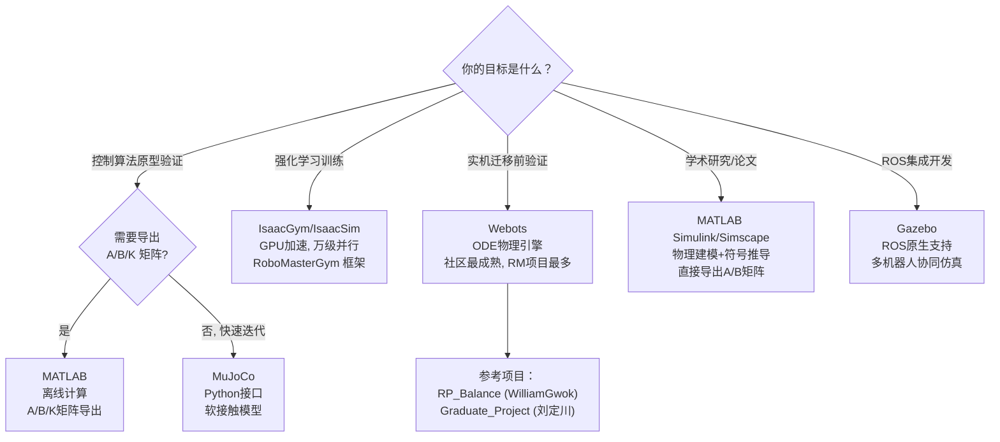

> 上图说明： 可选路径为 MuJoCo (快速原型) → MATLAB 或 Python/SymPy (矩阵导出) → Webots (实机迁移前验证)。离线矩阵生成可选择 MATLAB Symbolic Toolbox（商业许可，交互式调试体验好）或 Python/SymPy + MuJoCo（全开源，支持 MuJoCo 辅助几何参数提取）。没有"最好"的平台，关键是选与你的开发阶段匹配的平台。

---

## <a id="12"></a>12. 离线计算工具链

离线计算在实机开发中扮演关键角色——将符号推导、数值优化和矩阵分解等重计算任务在开发阶段完成，生成嵌入式端可直接使用的数值表和系数。社区中常见的实现路径包括 MATLAB 符号工具箱方案和 Python/SymPy + MuJoCo 混合方案。

> 概念解释：离线计算 vs 在线计算 (Offline vs Online Computation)
>
> 离线计算：在开发阶段（MATLAB/Python 在 PC 上）完成所有符号推导、数值优化和矩阵分解——符号线性化产生 A/B 矩阵、Riccati 方程求解产生 K 矩阵、polyfit 产生多项式系数。在线计算：嵌入式运行时仅执行系数已知的代数运算——Horner 多项式求值、矩阵-向量乘法 u = -Kx、VMC 的 J^T 力矩映射。
>
> 计算复杂度的分离：
> - 离线（一次完成）：符号偏导数计算（O(n³) 符号操作）、Riccati 方程求解（Schur 分解 O(10³) = O(1000) FLOPs）、多项式拟合（最小二乘 O(N·n²)）
> - 在线（每控制周期执行）：Horner 求值（40×n 次乘法加法）、u = -Kx（4×10 次乘法加法）、J^T 力矩映射（2×2 矩阵-向量乘法）
> 
> 离线计算量与在线计算量相差多个数量级——离线阶段的符号推导和 Riccati 求解不适合放到嵌入式实时控制端执行，但结果（多项式系数数组）仅占用较小存储空间，在线求值只需少量浮点运算。

### <a id="12-tasks"></a>核心任务列表

| 任务 | 推荐做法 | 输出 | 用途 |
|------|------------|------|--------|
| 准备系统矩阵 | 从符号推导或数值线性化结果导入 | A, B, C, D | 控制器设计 |
| ZOH 离散化 | `c2d(ss(A,B,C,D), dt, 'zoh')` | Ad, Bd | — |
| 求解 LQR | `[K, P, e] = dlqr(Ad, Bd, Q, R)` | K (4×10) | 离散状态反馈 |
| 变腿长增益计算 | 根据当前腿长查询或计算 K | K (4×10 或 12 维) | 在线状态反馈 |
| 多项式拟合 | 对每个增益元素分别拟合 | 多项式系数 | 在线增益调度 |
| 运动学验证 | 对 FK/IK 与几何约束做交叉验证 | L, θ_leg | 验证运动学实现正确性 |
| 雅可比验证 | 解析雅可比与数值差分对比 | J | 验证 VMC 力矩映射 |
| 闭环极点验证 | `eig(Ad - Bd*K)` | λ_i | 确保 \|λ_i\| < 1 |

### <a id="12-offline-notes"></a>离线计算实现要点

LQR 求解和多项式拟合等离线计算可在 MATLAB、Python 或其他数值工具中完成。若机械参数或平衡点发生变化，需要重新完成：

1. 用符号变量表示系统动力学方程
2. 对每个腿长 L 进行符号雅可比线性化
3. 求解离散 LQR 得到 K
4. 拟合增益调度系数

### <a id="12-python"></a>基于 Python/SymPy 的离线计算路径

当需要全开源工具链或与 MuJoCo 仿真深度集成时，可使用 Python/SymPy/NumPy/SciPy 组合替代 MATLAB。该路径的核心流程如下。

**符号拉格朗日建模（SymPy）：**

使用 SymPy 定义与 MATLAB 路径相同结构的拉格朗日量。动能项保留精确的 sqrt 形式（如 `sqrt(d² + sin²(θ_l)·L_l²)` 的轮距偏航耦合项），势能项保留 atan2 质心偏置角。通过 `sp.linear_eq_to_matrix` 从 Euler-Lagrange 方程中提取质量矩阵 M(q) 的符号表达式和输入分布矩阵 B_q 的符号表达式。

关键的工程步骤是使用 `sp.lambdify` 将符号矩阵编译为 Python 可调用函数：

```python
M_func  = sp.lambdify(param_vars + state_vars, M_sym, 'numpy')
Bq_func = sp.lambdify(param_vars + state_vars, Bq_sym, 'numpy')
V_func  = sp.lambdify(param_vars + q_vars, V, 'numpy')
```

`lambdify` 将 SymPy 符号树转换为 NumPy 数组运算，在线性化循环中避免了重复的符号代换开销。

**数值线性化与离散化：**

对每个腿长采样点，以 `scipy.optimize.fsolve` 求解静态平衡条件 dV/dq = 0，得到平衡角度 (θ_eq, θ_L_eq, θ_R_eq)。在平衡点附近，以有限差分法计算重力劲度矩阵 K_grav = ∂²V/∂q²（二阶中心差分，步长 1e-5，四采样点公式），然后构造连续时间 A 矩阵：

```
A[0:5, 5:10] = I₅          # 运动学积分器
A[5:10, 0:5] = -M⁻¹·K_grav  # 重力劲度动力学
A[5:10, 5:10] = -M⁻¹·D_damp  # 人工阻尼
B[5:10, :]    = M⁻¹·B_q      # 输入分布
```

其中 D_damp 为对角人工阻尼矩阵，用于补偿连续时间拉格朗日模型中省略的关节摩擦和速度相关阻尼项——阻尼系数的选取需通过仿真响应对比标定，使线性模型的阶跃响应与 MuJoCo 非线性模型的响应在幅值和衰减时间上一致。

ZOH 离散化使用 `scipy.linalg.expm` 矩阵指数直接计算：

```python
n, m = A.shape[0], B.shape[1]
M_aug = np.zeros((n+m, n+m))
M_aug[:n, :n] = A; M_aug[:n, n:] = B
M_aug *= dt
E = expm(M_aug)
Ad, Bd = E[:n, :n], E[:n, n:]
```

该方法利用增广矩阵 `[[A, B]; [0, 0]]` 的矩阵指数同时计算 A_d = e^{A·dt} 和 B_d = ∫₀^{dt} e^{Aτ} dτ · B，避免了分别计算矩阵指数和积分的数值误差不匹配问题。

**DARE 求解与收敛验证：**

使用迭代反向求解 DARE，初始 P_0 取为 Q，每步更新：

```python
F = inv(Bdᵀ·P·Bd + R) · (Bdᵀ·P·Ad)
P_next = (Ad - Bd·F)ᵀ·P·(Ad - Bd·F) + Fᵀ·R·F + Q
```

迭代至 Frobenius 范数相对变化小于给定容差时收敛。对于多采样点场景，可通过调大容差或使用 `scipy.linalg.solve_discrete_are` 库函数加速。

**与 MATLAB 路径的对比：**

| 维度 | MATLAB 符号工具箱路径 | Python/SymPy + SciPy 路径 |
|------|----------------------|--------------------------|
| 符号引擎 | Symbolic Math Toolbox（商业许可） | SymPy（BSD 许可） |
| 线性化方式 | `taylor(..., 'Order', 2)` 符号截断 | 有限差分数值 Hessian + 解析质量矩阵 |
| 离散化 | `c2d(ss(A,B,C,D), dt, 'zoh')` | `scipy.linalg.expm` 增广矩阵法 |
| Riccati 求解 | `dlqr(Ad, Bd, Q, R)`（内置 Schur 法） | 反向迭代或 `solve_discrete_are` |
| 多项式拟合 | `polyfit(L, K_ij, n)` | `numpy.linalg.lstsq(A, K_ij)` |
| 与 MuJoCo 集成的便利性 | 需要 .mat 文件作为数据桥 | 直接在同一 Python 进程中调用 MuJoCo API |

### <a id="12-mujoco-geometry"></a>MuJoCo 辅助几何参数提取

在传统的解析线性化路径中，腿部质心位置和转动惯量依赖手工推导的几何近似公式（如将五连杆简化为等效两连杆计算质心）。当机械设计迭代频繁或五连杆各段质量分布复杂时，手工维护这些解析公式的工作量较大且易出错。

MuJoCo 辅助几何提取方法的核心思路是：利用 MuJoCo 模型的几何与质量属性作为唯一参数来源，在线性化过程中实时从 XML 模型中读取所需几何参数，免除手工维护解析几何公式。

**LegPoseSolver 技术方案：**

对于给定的目标腿长 h，通过 MuJoCo 正向运动学求解该腿长对应的五连杆闭环姿态：

1. 构造初始猜测：根据经验公式（前腿角度与腿长的单调关系）通过 `brentq` 一维寻根确定前杆近似角度，设置为 `qpos0` 的初值。
2. 使用 `scipy.optimize.least_squares` 求解闭环约束：残差向量包含 4 个 equality connect site 的位置偏差（缩放因子 100）和 2 个轮子接地点高度约束（缩放因子 20）。优化变量为机体高度和 8 个关节角度（左右各 4 个被动关节 + 2 个前驱动关节），其余角度由闭环关系固定。
3. 收敛后，从 MuJoCo 数据中读取腿部各连杆的质量（`model.body_mass[bid]`）和质心世界坐标（`data.xpos[bid] + data.xipos[bid]`），计算等效腿部质心的极坐标参数 (r_com, c_x)：
   - r_com：髋关节到腿部总质心的径向距离
   - c_x：腿部总质心沿切线方向（x 轴）的偏置

这两个参数替代了 MATLAB 路径中的解析质心近似公式（c_h1, c_x1, θ_p1 等），使线性化模型中的几何参数与 MuJoCo 仿真模型中的质量分布一致。

**适用条件与限制：**

该方法要求线性化阶段能够启动 MuJoCo 模型和求解器——即增加了对 `mujoco` Python 包和 XML 模型文件的依赖。对于仅需要 A/B 矩阵而不运行 MuJoCo 仿真的场景（如向 Simulink 或独立 C 代码传递矩阵），可在首次运行后缓存质心参数表，后续线性化直接查表。

### <a id="12-c-2d"></a>二维增益表的 C 语言导出

当采用二维增益调度方案 K(L_l, L_r) 时，若拟合阶数较高（如 6 阶），单变量的 Horner 四阶多项式格式不再适用。此时需将二维多项式系数以平面数组形式导出为 C 头文件，并附带运行时求值函数。

**系数存储格式：**

对于 n_o 个输出维度（4，对应 u 的四通道）× n_s 个状态维度（10）× n_terms 个单项式（6 阶二维多项式共 28 项），系数以三维数组的扁平化形式存储：

```c
// Auto-generated 6th-order 2D LQR gain table for asymmetric leg lengths.
#define K2D_ORDER 6
#define K2D_N_TERMS 28
#define K2D_N_OUTPUTS 4
#define K2D_N_STATES  10

static const float k_table_2d[4 * 10 * 28] = { /* 1120 个 float32 系数 */ };
```

4×10×28 = 1120 个 float32 系数，总计约 4.375 KB。

**运行时在线求值函数：**

嵌入式端通过预计算腿长幂次和双循环乘积累加实现 K 矩阵的在线计算：

```c
static inline void k_table_2d_eval(float L_left, float L_right, float *k_out) {
    // 预计算幂次 Ll[i] = L_left^i, Lr[i] = L_right^i  (i=0..6)
    float Ll[7], Lr[7];
    Ll[0] = 1.0f; Lr[0] = 1.0f;
    Ll[1] = L_left; Lr[1] = L_right;
    for (int i = 2; i <= 6; i++) {
        Ll[i] = Ll[i-1] * L_left;
        Lr[i] = Lr[i-1] * L_right;
    }
    // 构造 28 个单项式: Ll[d-a] * Lr[a] for d=0..6, a=0..d
    float terms[28];
    int idx = 0;
    for (int d = 0; d <= 6; d++)
        for (int a = 0; a <= d; a++)
            terms[idx++] = Ll[d-a] * Lr[a];
    // 双循环乘累加: K[i][j] = Σ coeff[i][j][t] * terms[t]
    for (int i = 0; i < 4; i++)
        for (int j = 0; j < 10; j++) {
            float sum = 0.0f;
            int base = (i * 10 + j) * 28;
            for (int t = 0; t < 28; t++)
                sum += k_table_2d[base + t] * terms[t];
            k_out[i * 10 + j] = sum;
        }
}
```

与一维方案的对比：

| 特性 | 一维 4 阶多项式 | 二维 6 阶多项式 |
|------|----------------|-----------------|
| 系数存储 | 4×10×5 = 200 个 float（0.78 KB） | 4×10×28 = 1120 个 float（4.375 KB） |
| 在线计算量 | 40×(4mul+4add) ≈ 320 FLOPs | 28 项 + 1120 MAC ≈ 1155 FLOPs |
| 适用工况 | 双腿近似等长（|L_l - L_r| < ε） | 任意腿长组合 |
| 离线计算量 | N 次线性化+LQR | N×N 次线性化+LQR（例如14×14 = 196 次） |
| 拟合精度 | 一维插值误差 < 1% | 二维拟合 RMS 误差通常 < 5% |

工程上，一维方案可满足双腿同步伸缩的常规工况；二维方案在单腿跨越台阶、非对称斜坡站立、转弯侧倾等左右腿长差异显著的场景下提供更精确的交叉耦合增益。建议先以一维方案完成基础调试，确认 LQR 架构和控制管线正确后，再生成二维增益表用于复杂地形场景。

### <a id="12-c-format"></a>实机中的 C 数据格式

**多项式系数以 const 数组形式存入只读存储区：**

```c
// 4x10x5 的三维数组
const float K_coeff[4][10][5] = { /* MATLAB polyfit 输出 */ };
const float theta_coeff[5] = { /* ... */ };
const float e1_coeff[5] = { /* ... */ };
const float e2_coeff[5] = { /* ... */ };
const float e3_coeff[5] = { /* ... */ };

// 在线计算 K 矩阵（Horner 方法）
float get_K_element(int row, int col, float L) {
 const float *c = K_coeff[row][col];
 return (((c[0] * L + c[1]) * L + c[2]) * L + c[3]) * L + c[4];
}
```

---

## <a id="13"></a>13. C 语言嵌入式移植

> 概念解释：FreeRTOS (实时操作系统)
>
> FreeRTOS 是面向微控制器的抢占式实时内核，核心机制包括任务调度器、软件定时器、队列和信号量。在轮腿控制中，实时任务设计的重点是保证控制闭环的确定周期和低抖动。
>
> 实时性验证： 控制任务的周期、抖动和最坏执行时间需要结合目标控制器、RTOS 配置和中断优先级实测确认。

> 概念解释：CAN 总线 (CAN Bus)
>
> CAN 总线是轮腿机器人常见的电机通信总线。协议特点：多主架构、基于消息 ID 的硬件仲裁、差分信号抗干扰能力强。具体位速率、帧格式和载荷长度应根据电机协议与总线负载确定。
>
> 物理层与数据链路层： CAN 使用差分信号和硬件仲裁机制，抗共模噪声能力强。自动重传机制由 CAN 控制器硬件实现——当发送节点检测到错误时自动重发，无需 CPU 干预。每条电机指令帧的字段和编码方式取决于所选电机协议。
>
> 在轮腿控制中的拓扑： 主控通过总线向关节电机和轮毂电机发送控制指令，各电机按设定周期回传角度、角速度、实际力矩、温度等状态。应根据电机数量、回传频率、帧长度和总线速率计算总线负载，避免通信饱和。

> 概念解释：MIT 模式 (MIT Mode / Torque Control Mode)
>
> MIT 模式即力矩控制+阻抗补偿：电机输出 τ_actual = τ_des + K_p·(q_des - q) + K_d·(q̇_des - q̇)。这是电流内环（FOC 的 I_q 控制）上层的力矩接口——电机驱动器内部以高速电流闭环跟踪力矩期望，使电机表现为可控力矩源而非位置伺服。
>
> 三种控制模式的技术对比：
> - 位置模式：电机驱动器以 PID 闭环跟踪 q_des——刚性强但完全绑定位置轨迹，不能叠加力矩扰动
> - 速度模式：电机驱动器以 PI 闭环跟踪 q̇_des——适合恒速运动但不适合力控
> - MIT 模式：力矩为前馈主控项（τ_des），K_p/K_d 为弱增益的被动安全项——力矩控制带宽由电机电气时间常数和驱动器电流环决定，是实现 VMC 力控的常用模式之一
>
> 在轮腿控制中的 MIT 参数选取： τ_des = VMC 映射的关节力矩，q_des 可取当前角度以弱化位置项，q̇_des 可按阻尼目标设定，K_d 用作被动阻尼，具体数值需根据电机、减速比、腿部惯量和实机振动测试确定。

> 概念解释：数学/DSP 库与 float32 精度
>
> 嵌入式移植时，可使用目标平台提供的数学库或 DSP 库加速三角函数、矩阵乘法、FIR/IIR 滤波等计算。具体接口和性能收益取决于所选控制器与工具链，本文档不绑定某一硬件实现。
>
> float32 精度验证： IEEE 754 单精度（float32）的有效数字有限。对于多项式 `K(L) = c₀Lⁿ + c₁Lⁿ⁻¹ + ... + cₙ`，当 L 的工作范围较宽或高阶系数量级较大时，截断误差和舍入误差可能被放大。需在 MATLAB 中用 `single()` 验证拟合残差在 float32 下不显著增大——这是仿真通过而实机可能的隐藏精度陷阱。

### <a id="12.1"></a>12.1 模块划分原则

| 模块 | 职责 | 实现要点 |
|------------|--------|----------|
| 微分与滤波 | 由测量量估计速度或角速度 | 微分后必须配合低通滤波 |
| PID 控制 | 腿长、Roll 等低维通道控制 | 关注饱和、限幅和抗积分饱和 |
| 运动学 | FK/IK 与腿长、摆角计算 | 坐标系、零点和三角函数符号需统一 |
| VMC 映射 | 任务空间力到关节力矩 | 使用雅可比转置并验证极性 |
| 增益调度 | 根据腿长计算 K 矩阵 | 在线用 Horner 方法求值 |
| Kalman 滤波 | 融合 IMU 与轮式里程计 | 明确过程噪声和观测噪声 |
| 姿态与加速度变换 | 四元数、旋转矩阵与世界系加速度 | 明确四元数顺序和坐标轴定义 |

观测器的数据分组建议采用分层结构，按数据来源和计算层级组织为三个子结构体：轮端状态（轮毂编码器直接读取的转速和力矩）、腿端状态（关节编码器→运动学导出的 L0/phi0 及其微分→动力学导出的雅可比元素和地面支持力）、机体状态（IMU→姿态解算→EKF/Kalman 融合后得到的位置和速度）。分层组织便于分模块调试和状态一致性维护。对于运动学导出量的微分（如 dL0、dphi0），若机构几何参数已知且可精确标定，解析微分（利用雅可比链式求导）的结果比数值差分加低通滤波更平滑。

### <a id="12.2"></a>12.2 移植注意事项

1. 四元数顺序：常见的四元数顺序为 [w, x, y, z] 或 [x, y, z, w]，需与 IMU 驱动一致
2. atan2 参数顺序：Python 和 C 都是 `atan2(y, x)`，一致，但需确认坐标轴定义
3. float32 vs float64：Python 的 numpy 默认 float64，C 的 float 为 float32。多项式拟合在 float32 下可能出现精度问题，建议在 MATLAB 中用 single precision 验证
4. 差分放大噪声：微分器在小时间步长下会显著放大测量噪声，实机上必须加低通滤波
5. 左右腿极性：实机上电机安装方向和编码器零点定义可能与仿真不同，需要单独验证每个信号的符号
6. 三角函数的输入范围：使用平台数学库前需确认输入范围和单位约定，必要时先做角度归一化

### <a id="12.3"></a>12.3 推荐软件架构

**实机控制建议采用实时多任务架构：**

**FreeRTOS 任务架构与数据流：**

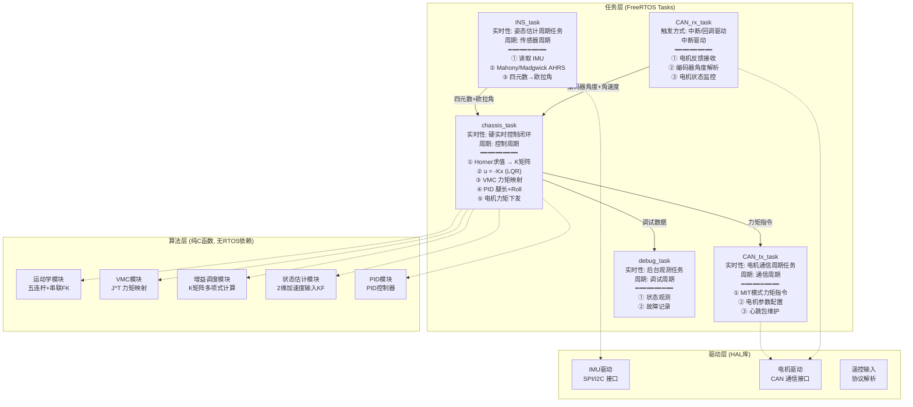

> 上图说明： 三层架构——驱动层（HAL）提供传感器/执行器访问；算法层（纯 C 函数无 RTOS 依赖）提供数学运算；任务层（FreeRTOS）编排调用。核心时序：chassis_task 按控制周期完成一次完整的"读取状态→增益调度→LQR 计算→VMC 映射→力矩下发"循环。

---

## <a id="14"></a>14. 实机调试方法

### <a id="13.1"></a>13.1 分阶段调试流程

> 概念解释：实机调试的核心风险 — 极性验证与逐层隔离
>
> 符号极性错误（sign error）是实机调试中的高风险故障模式：控制器输出符号反转会形成正反馈，使扰动被持续放大。极性可能在多个环节累积反转：坐标系定义（z 向上/向下？）、电机安装方向（镜像对称安装导致正负反转）、雅可比推导（cos/sin 排列错误）、LQR K 矩阵（A/B 定义不一致）。
>
> 分阶段逐层调试方法论：
> 1. 单关节开环验证：逐一发送小力矩指令，目视确认旋转方向与预期一致，记录编码器正方向
> 2. 板凳模型（锁死关节，仅轮子控制）：将所有腿关节锁死（关节电机以高 K_p/K_d 保持在设定位置），仅启用 LQR 的轮毂力矩通道（K[2] 和 K[3] 行）。验证：手动将机器人向前倾 → 轮子应向前加速（把机体推回）。若轮子向后加速 → 轮毂通道极性反号。
> 3. 释放腿部（逐步加入腿部 LQR 通道）：先验证腿角度反馈极性（手动偏转腿部 → 关节力矩应抵抗偏转），再验证交叉耦合项（K[0][2]：机体前倾 → 腿部应产生什么方向的力矩？）
> 4. 增益递增：从较低增益开始，在确认稳定后逐步增加，直到接近设计增益或出现震荡，再回退到稳定裕度更高的增益
>
> 每次仅引入一个新模块（一个 LQR 行、一个新的 K 元素），确认极性正确且系统稳定后再解锁下一个。全模块一次性启用的风险在于：若系统失稳，无法定位是哪个模块的极性反号。

#### 阶段 A：单关节开环测试

目标： 确认每个电机通信正常，编码器方向正确。

- CAN 总线通信验证
- 发送小力矩指令，确认电机转动方向与预期一致
- 手动转动电机，确认编码器读数方向
- 记录零点位置（关节电机零点通常在下限位处）

#### 阶段 B：板凳模型（固定腿部）

目标： 仅调试轮毂 LQR，让机器人在固定腿长下维持平衡。

该步骤通常应优先完成，并作为后续全状态调试的前置验证。

1. 将腿部机械固定（或关节电机施加足够大的保持力矩，等效于"锁死"关节）
2. 禁用 K 矩阵的腿部力矩行（K[0] 和 K[1] 行清零），仅保留轮毂力矩输出（K[2] 和 K[3] 行）
3. 手动扶正机器人，从低增益开始逐步增大 K 矩阵元素
4. 关键：确定每个 LQR 项的正确极性

**极性调试法则（来自社区经验）：**

| LQR 项 | 物理含义 | 正确极性的行为 |
|--------|----------|---------------|
| 轮毂行 × 机体俯仰列（10 维：K[2][2]/K[3][2]；6 维：wheel 行 × φ） | 机体前倾时的轮子响应 | 机体前倾 → 轮子加速前进（把支撑点移到质心下方） |
| 轮毂行 × 腿摆角列（10 维：K[2][3]/K[2][4]/K[3][3]/K[3][4]；6 维：wheel 行 × θ） | 腿前倾时的轮子响应 | 腿前倾 → 轮子响应方向应抵消腿角偏差 |
| 轮毂行 × 位移列（10 维：K[2][0]/K[3][0]；6 维：wheel 行 × x） | 偏离目标位置时的响应 | 机器人位置超前 → 轮子减速或反向拉回 |
| 轮毂行 × 速度列（10 维：K[2][5]/K[3][5]；6 维：wheel 行 × ẋ） | 速度偏差的阻尼 | 速度过大 → 轮子输出应阻碍继续加速 |

不要用“所有项全正/全负”判断极性。K 的符号取决于状态定义、控制输入正方向、矩阵乘法中的负号 `u=-Kx` 以及电机安装方向；正确性应以实际扰动响应为准。10 维方案中左右腿和左右轮还需要分别验证。

#### 阶段 C：释放腿部（二阶倒立摆）

目标： 加入腿部控制，实现完整 10 维 LQR 平衡。

1. 关节电机进入 MIT（力矩）模式
2. 逐步加入腿部 LQR 项（K[0] 和 K[1] 行）
3. 先单独验证腿角度项极性 → 再验证耦合项（θ 对 θ_l/r 的交叉影响）
4. 启用 VMC 力矩映射
5. 启用腿长 PID + Roll PID

#### 阶段 D：移动与转向

1. 发送非零目标速度，观察速度跟踪
2. 调试转向：左右轮差速实现，注意 yaw 轴方向
3. 加入增益调度：在不同腿长下测试平衡稳定性

#### 阶段 E：跳跃与地形适应

1. 验证跳跃状态机的逻辑正确性
2. 测试离地检测是否按预期触发
3. 在斜坡/不平坦地面上测试稳定性

**分阶段调试流程图：**

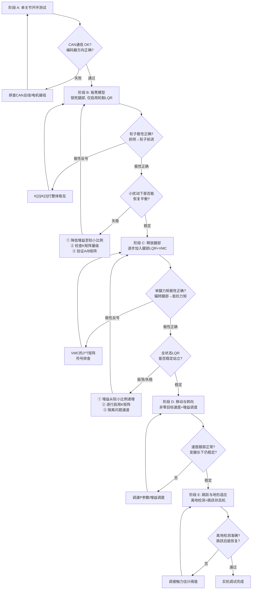

> 上图说明： 每个阶段有明确的"验证标准"和"失败处理路径"。基本原则——每次只引入一个新模块（一个 LQR 行、一个新的 K 元素），确认极性正确且系统稳定后再解锁下一个。全模块一次性启用的风险在于：若系统失稳，无法定位是哪个模块的极性反号。跳过板凳模型直接释放腿部，是实机调试中导致失败的常见原因之一。

### <a id="13.2"></a>13.2 调试工具链

| 工具 | 用途 |
|------|------|
| VOFA+ | 实时波形监控 |
| J-Link/Ozone | 高速变量监控 |
| Keil MDK Debug | 单步调试，逐函数验证 |
| 蓝牙手柄/DR16 遥控器 | 遥控输入 |
| MATLAB | 离线数据分析，对比仿真与实际 |

### <a id="13.3"></a>13.3 失败防护

- 急停逻辑：机体倾斜超过安全阈值时全部电机输出清零
- 硬件急停开关
- 周围放置软垫
- 首次测试从较小比例的额定增益开始

---

## <a id="15"></a>15. RoboMaster 社区资源索引

以下资源按赛季分组。电控资料通常托管于 GitHub/Gitee/Gitea，机械结构通常以论坛帖+网盘形式发布，仿真资料以 GitHub/Gitee 为主。

### <a id="14.1"></a>14.1 2026 赛季

| 项目名称 | 战队/作者 | 类型 | 说明 | 链接 |
|----------|----------|------|------|------|
| SPR 轮腿资料 | 中石大(北京) SPR | 电控 | 轮腿步兵电控资料 | [论坛](https://bbs.robomaster.com/article/1884251) |
| 偏置并联腿整车电控 | 南航金城学院 Born Of Fire | 电控 | 偏置并联腿轮腿机器人整车电控资料 | [论坛](https://bbs.robomaster.com/article/1883510) |
| 考虑质心偏移的轮腿建模 | 香港大学 HerKules | 建模 | 考虑质心偏移的轮腿型机器人动力学建模资料，含完整建模方法论 | [论坛](https://bbs.robomaster.com/article/1448924) |
| 广西大学 ROBOTZ | 广西大学 | 电控+仿真 | 英雄电控、轮腿开发与 MATLAB 仿真资料，含建模、K矩阵运算、VMC解算 | [Gitee](https://gitee.com/organizations/gxu-roboz/projects) |

### <a id="14.2"></a>14.2 2025 赛季

| 项目名称 | 战队/作者 | 类型 | 说明 | 链接 |
|----------|----------|------|------|------|
| 山海机甲平衡步兵 | 山海机甲 | 电控+机械(完整) | 平衡步兵完整机械与电控资料。含完整形态技术文档+软件设计说明，另有半舵步兵及各兵种电控资料 | [论坛 1884132](https://bbs.robomaster.com/article/1884132) / [论坛 810719](https://bbs.robomaster.com/article/810719) / [论坛 811147](https://bbs.robomaster.com/article/811147) |
| 同济 SuperPower | 同济大学 | 机械+技术报告 | 开链四连杆轮腿步兵技术报告。构型未达预期效果但完成了所有功能，含完整的机械设计思路、调试过程、视觉算法经验教训 | [论坛](https://bbs.robomaster.com/article/769697) |
| ACE 技术文档 | ACE 战队(东莞理工) | 机械 | 轮腿技术文档，引用串联腿及跳跃姿态力学分析。另有轮腿关节轴系设计资料 | [论坛 728195](https://bbs.robomaster.com/article/728195) / [论坛 54960](https://bbs.robomaster.com/article/54960) |
| 平衡步兵机器人 | OSHWHub个人 | 机械+电控 | 串联轮腿底盘完整设计，含电机、减速器和双控架构资料，GPL 3.0 | [OSHWHub](https://oshwhub.com/ysl050811/infantry-robot) |
| 轮腿英雄机械 | 个人项目 | 机械 | 多种构型资料，含三维图纸，仅供学习参考 | RoboMaster论坛 |
| 南航金城学院 | 南航金城 Born Of Fire | 视频+电控 | 串联腿调试记录；偏置并联腿整车电控资料 | [论坛](https://bbs.robomaster.com/article/1883510) |

### <a id="14.3"></a>14.3 2024 赛季

| 项目名称 | 战队/作者 | 类型 | 说明 | 链接 |
|----------|----------|------|------|------|
| 港科大 ENTERPRIZE | 香港科技大学 | 机械 | 双连杆串联轮腿完整结构资料，SolidWorks 3D+CNC 2D图纸，效果视频，技术报告，重力补偿计算 | [论坛](https://bbs.robomaster.com/article/54241) |
| 北科 Reborn 底盘 | 北京科技大学 | 电控 | 轮腿步兵底盘控制资料。含电机、IMU、LQR+VMC+Kalman 和 C++ 面向对象实现 | [论坛 17668](https://bbs.robomaster.com/article/17668) / rm_balance仓库 |
| 辽宁科大 COD | 辽宁科技大学 | 电控 | 平衡步兵电控资料，基于商用电机控制器。另有技术报告及雷达站算法 | GitHub / [论坛 9678](https://bbs.robomaster.com/article/9678) |
| COD 电控模板 | 辽宁科大 COD | 电控框架 | 通用嵌入式电控模板 | GitHub 搜索 |
| 东莞理工 ACE | 东莞理工学院 | 机械 | 五连杆并联轮腿机械资料 | [论坛](https://bbs.robomaster.com/article/54974) |
| 武汉工程大学 | 武汉工程大学 | 机械 | 轮腿平衡步兵机械资料 | [论坛](https://bbs.robomaster.com/article/9657) |
| 上科中登 | 上科中登 | 机械 | 并联驱动二连杆轮腿侧面轴系设计 | [论坛](https://bbs.robomaster.com/article/28657) |
| 湖南大学跃鹿 | 湖南大学 | 电控 | 商用电机控制器移植，五连杆轮足底盘 | [Gitee](https://gitee.com/organizations/hnuyuelurm) |

### <a id="14.4"></a>14.4 2023 赛季及更早 / 跨赛季汇总

| 项目名称 | 战队/作者 | 类型 | 说明 | 链接 |
|----------|----------|------|------|------|
| rm_balance | robofish(汇总) | 电控(最完整) | FreeRTOS，LQR+VMC+Kalman+PID，模块化C，YAML配置，CLI调试。支持平衡/运动/跳跃/悬空/急停多模式 | [Gitea](https://gitea.qutrobot.top/robofish/rm_balance) |
| 北工大 PIP | 北京工业大学 | 机械 | 平衡步兵机械资料，含图纸与技术报告 | [论坛](https://bbs.robomaster.com/article/9353) |
| 哈工程创梦之翼(机械) | 哈工程 | 机械 | 双枪平衡步兵机械结构资料，含三维图纸+二维加工图+说明文档 | [论坛](https://bbs.robomaster.com/article/9090) |
| 哈工大(深圳) 陈希峻 | 哈工大(深圳) | 视觉 | RM Award：雷达站点云定位模块资料 | RM Award专栏 |
| 中石大(华东) RPS | 中石大(华东) | 管理 | RM2025 Award：方案、规划、质量、人员、成本管理经验 | RM Award专栏 |

### <a id="14.5"></a>14.5 仿真项目

| 项目名称 | 作者 | 平台 | 语言 | 说明 | 链接 |
|----------|------|------|------|------|------|
| Graduate_Project | 刘定川 | Webots | C++ | 哈工程理论完整复现，SolidWorks模型，MATLAB离线K矩阵多项式拟合，多场景仿真；后续延伸为 DIABLO 六自由度直驱轮腿机器人，发表于 IROS 2024 | [GitHub](https://github.com/LiuDingchuan/Graduate_Project) |
| RP_Balance | WilliamGwok (深圳大学 RobotPilots) | MATLAB+Webots | MATLAB+ C | RM2024五连杆建模与仿真，含哈工程+上交双方案建模、A/B/K矩阵拟合、类MPC补偿。Webots控制器用C编写 | [GitHub](https://github.com/WilliamGwok/RP_Balance) |
| RoboMasterGym | Yueyuanh | IsaacGym | Python | RL训练框架，轮腿模块开发中 | [GitHub](https://github.com/Yueyuanh/RoboMasterGym) |
| 轮足项目 | 达妙科技 | — | C | 多电机轮足配置资料，含3D打印及机加结构件 | Gitee `kit/Wheel-legged` |
| 兰博文 foc-wheel-legged | 兰博文(skythinker) | — | C | 新型轮腿全栈资料：SolidWorks机械+MATLAB仿真+FOC驱动+控制端+图传+Android APP | [Gitee](https://gitee.com/skythinker/foc-wheel-legged-robot) |
| StackForce 大轮足 | StackForce | — | C | VMC系列教程配套资料，LQR平衡+VMC力控制 | Gitee |
| MuJoCo 10维LQR | — | MuJoCo | Python | 10维状态空间LQR+VMC+增益调度+Kalman | — |

### <a id="14.6"></a>14.6 社区教程与文档

| 资源 | 作者/来源 | 内容 | 链接 |
|------|----------|------|------|
| 平衡步兵控制系统设计 | 哈工程创梦之翼 | 最完整的LQR理论推导、状态空间建模与实机效果 | [知乎](https://zhuanlan.zhihu.com/p/563048952) |
| 二轮平衡步兵调试心得及仿真资料 | RoboMaster论坛 | LQR应用历程、MATLAB仿真、实机调试经验 | [论坛](https://bbs.robomaster.com/article/9533) |
| 极客日志轮腿系列 | 星夜雨夜 | 5篇实现详解：硬件选型、软件架构、五连杆VMC、LQR调试、极性判定。基于公开资料与赛事控制板 | [Zeeklog](https://zeeklog.com) |
| 串联轮腿运动与稳定解耦设计 | CSDN | 上交方案详解：运动功能与稳定功能解耦的步兵平台 | [CSDN](https://blog.csdn.net/weixin_36299472/article/details/159027929) |
| 上交云汉交龙干货分享 | 上交交龙(萝马严选) | 串联腿、下供弹云台、倒地自起技术分享 | [萝马严选](https://rcbbs.top/t/topic/3747) |
| WEBOTS并联闭环机构创建 | 博客园 Mcaft | Webots中五连杆并联机构的建模技术 | [博客园](https://www.cnblogs.com/Mcaft/p/18425865) |
| 科创天地 串联腿步兵 | 智能学院 | 串联腿"步兵"机器人技术介绍 | 微信公众号 |
| B站视频系列 | | | |
| 手把手教做平衡步兵轮足 (10集+) | B站 | LQR系统建模、最优控制、VMC足端力→关节扭矩推导 | B站搜索 |
| 上交平衡步兵模型讲解 | B站 | 上交串联腿理论讲解 | B站搜索 |
| 五天速通平衡步兵 | B站 | 快速入门实战 | B站搜索 |
| 平衡步兵调试寄录 | B站(多用户) | 各队真实调试过程记录 | B站搜索 |
| 智能车轮腿组五连杆 | B站 | 平衡轮腿组技术分享 | B站搜索 |
| 上交云汉交龙串联腿技术影响力讨论 | 小红书 | 串联腿技术影响力讨论 | 小红书搜索 |

**社区项目传承图谱（Project Lineage）——谁参考了谁？：**

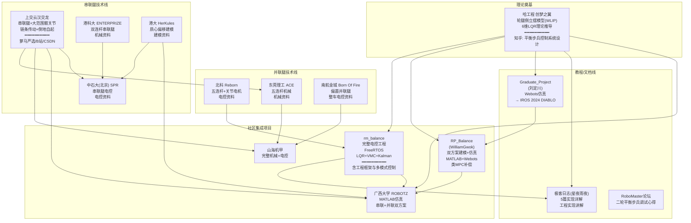

> 上图说明： 线条方向表示技术传承关系。不同项目之间的理论推导、仿真验证和工程框架存在明显继承关系，适合按“理论 → 仿真 → 实机”的顺序梳理。

**按学习阶段推荐的资源导航：**


> 学习路径建议： 先读理论推导理解基本模型，再看实现讲解和仿真验证控制流程，最后结合完整工程实现学习实机调试和模块划分。

---

## <a id="16"></a>16. 学术论文、专利与 RM Award 参考文献

**学术论文与社区项目知识图谱：**

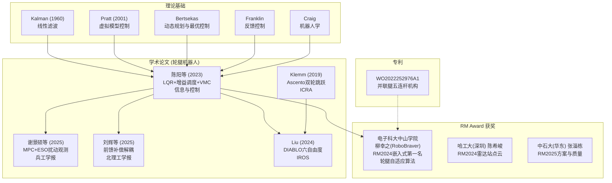

> 上图说明： 箭头方向表示学术引用/技术继承关系。整体脉络是基础理论、应用研究、前沿方法逐步递进。DIABLO (IROS 2024) 是 Graduate_Project 的学术延伸，展示了从 RM 社区仿真到学术论文的完整路径。

### <a id="15-wl"></a>轮腿机器人控制

| 论文/资源 | 出处 | 核心方法 |
|------|------|----------|
| 陈阳等，"轮腿式平衡机器人控制" | 信息与控制, 2023 | LQR + 增益调度 + VMC |
| 谢景硕等，"串联式四轮腿机器人姿态控制" | 兵工学报, 2025 | MPC + ESO 扰动观测器 |
| 刘辉,马嘉勇等,"基于前馈补偿的轮腿式平台多任务复合运动解耦控制" | 北京理工大学学报, 2025 | 前馈补偿 + 任务优先级解耦，质心速度跟踪误差分析 |
| 任晓磊等，"轮腿复合机动平台运动控制" | 兵工学报 | 单刚体动力学 + 二次规划力矩分配 |
| Klemm et al., "Ascento: A Two-Wheeled Jumping Robot" | ICRA 2019 | 双轮跳跃机器人 LQR 控制 |
| Liu et al., "DIABLO: A 6-DoF Wheeled Bipedal Robot" | IROS 2024 | 全直驱轮腿机器人，LQR+WBC，中山大学，Graduate_Project 的学术延伸 |
| WO2022252976A1 | 专利 | 并联腿五连杆轮腿机构专利 |
| 质心偏移建模资料 | RM论坛资料 | 考虑质心偏移的轮腿型机器人动力学建模 |
| 偏置并联腿电控资料 | RM论坛资料 | 偏置并联腿构型的整车电控方案 |
| 上交云汉交龙 | 技术分享 | 串联腿倒地自起、链条传动、下供弹云台 |
| 哈工大(深圳) 陈希峻 | RM2024 Award | 雷达站点云定位模块 |
| 中石大(华东) 张淄栋 | RM2025 Award | 方案规划与质量管理经验 |
| 电子科大中山学院 柳幸之 (RoboBraver) | RM2024 Award (嵌入式方向第一名) | 轮腿平衡步兵自适应算法，社区阅读量/点赞量第一的技术文章 |

### <a id="15-ctrl"></a>控制理论与算法

| 文献 | 具体章节 | 应用 |
|------|----------|------|
| Pratt et al., "Virtual Model Control" | IJRR 2001 | VMC 原始论文 |
| Bertsekas, "Dynamic Programming and Optimal Control" | 第4版 Vol. I/II 相关章节 | 动态规划与离散最优控制理论基础 |
| Kalman, "A New Approach to Linear Filtering" | 1960 | Kalman 滤波原始论文 |
| Franklin et al., "Feedback Control of Dynamic Systems" | 第7-9章 | 状态空间方法与极点配置 |
| Ogata, "Discrete-Time Control Systems" | 第8章 | ZOH 离散化与离散控制器设计 |

### <a id="15-robotics"></a>机器人学

| 文献 | 具体章节 | 应用 |
|------|----------|------|
| Craig, "Introduction to Robotics" | 第3-5章 | DH 参数，正/逆运动学，雅可比 |
| Siciliano et al., "Robotics: Modelling, Planning and Control" | 第7章 | 拉格朗日动力学 |
| Featherstone, "Rigid Body Dynamics Algorithms" | 全书 | 高效刚体动力学算法（RNEA, ABA） |

---

*文档最后更新：2026-07*
